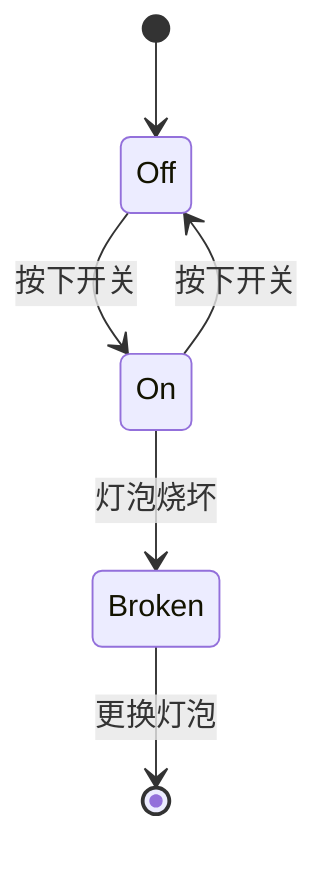
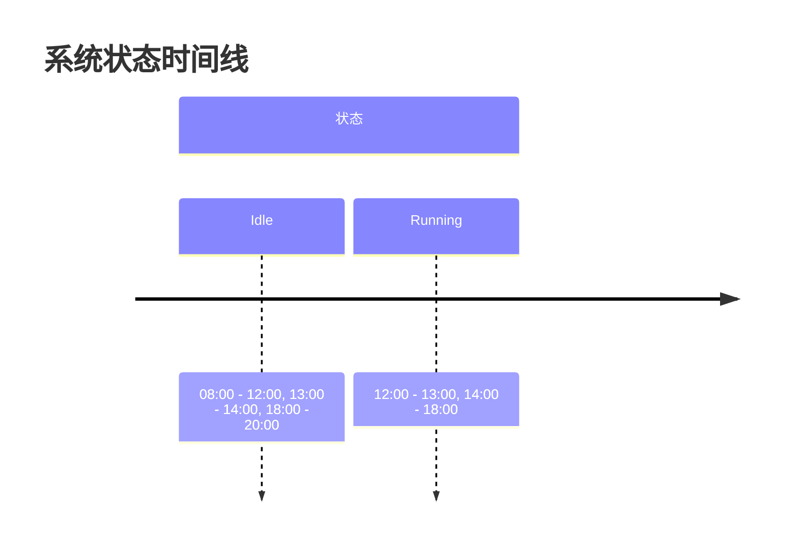

# 状态图与状态时间线

在 Grafana Alloy 中，状态图（State Diagram）和状态时间线（State Timeline）是两种强大的可视化工具，用于监控和分析系统状态的变化。它们能够帮助你直观地理解系统在不同时间点的状态，并识别出潜在的问题或趋势。

## 什么是状态图与状态时间线？

**状态图**是一种图形表示方法，用于展示系统在不同状态之间的转换。它通常用于描述有限状态机（Finite State Machine）的行为，展示系统如何从一个状态转换到另一个状态。

**状态时间线**则是一种时间序列可视化工具，用于展示系统状态随时间的变化。它通常以时间轴为基础，展示系统在不同时间点的状态，帮助你识别状态变化的模式和趋势。

## 状态图的基本概念

状态图由节点（状态）和边（转换）组成。每个节点代表系统的一个状态，而边则表示状态之间的转换。状态图通常用于描述系统的行为，特别是在系统有多个状态且状态之间有明确的转换规则时。

### 状态图的示例

以下是一个简单的状态图示例，展示了一个灯泡的状态转换：

在这个示例中，灯泡有三个状态：`Off`、`On` 和 `Broken`。状态之间的转换由箭头表示，箭头上的标签描述了触发转换的事件。

## 状态时间线的基本概念

状态时间线是一种时间序列可视化工具，用于展示系统状态随时间的变化。它通常以时间轴为基础，展示系统在不同时间点的状态。状态时间线可以帮助你识别状态变化的模式和趋势，特别是在系统状态频繁变化时。

### 状态时间线的示例

假设我们有一个系统，其状态在一天内变化如下：

- 08:00 - 12:00: `Idle`
- 12:00 - 13:00: `Running`
- 13:00 - 14:00: `Idle`
- 14:00 - 18:00: `Running`
- 18:00 - 20:00: `Idle`

我们可以使用状态时间线来可视化这些状态变化：

在这个示例中，时间轴展示了系统在不同时间点的状态变化。你可以清晰地看到系统在 `Idle` 和 `Running` 状态之间的切换。

## 实际应用场景

### 监控服务器状态

假设你正在监控一组服务器的状态，服务器可能处于 `Running`、`Stopped` 或 `Maintenance` 状态。通过状态时间线，你可以轻松地查看每台服务器在不同时间点的状态变化，并识别出异常的停机时间或维护窗口。

### 分析工作流状态

在一个复杂的工作流中，任务可能处于 `Pending`、`In Progress`、`Completed` 或 `Failed` 状态。通过状态图，你可以清晰地展示任务在不同状态之间的转换，并识别出可能导致工作流阻塞的瓶颈。

## 总结

状态图和状态时间线是 Grafana Alloy 中强大的可视化工具，能够帮助你监控和分析系统状态的变化。通过状态图，你可以清晰地展示系统状态之间的转换；通过状态时间线，你可以直观地查看系统状态随时间的变化。这些工具在监控服务器状态、分析工作流状态等实际应用场景中非常有用。

## 附加资源与练习

- **练习 1**: 尝试为你的系统绘制一个状态图，展示系统在不同状态之间的转换。
- **练习 2**: 使用状态时间线可视化你的一天，展示你在不同活动（如工作、休息、娱乐）之间的切换。
- **附加资源**: 阅读 Grafana Alloy 官方文档，了解更多关于状态图和状态时间线的高级用法。

通过不断练习和应用，你将能够更好地掌握状态图与状态时间线的使用，从而更有效地监控和分析系统状态的变化。