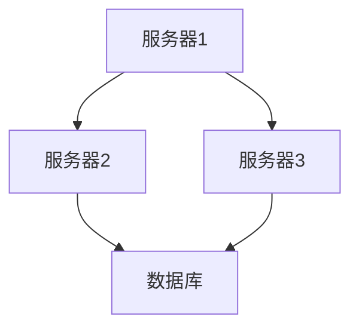

# 节点图与关系图

在数据可视化中，**节点图**和**关系图**是两种强大的工具，用于展示复杂的数据结构和关系。它们通过节点（Node）和边（Edge）的形式，将数据之间的关系直观地呈现出来。在 Grafana Alloy 中，这些图表可以帮助你更好地理解和分析数据流、依赖关系或网络拓扑。

## 什么是节点图与关系图？

**节点图**是一种图形表示方法，其中**节点**代表实体（如服务器、用户、设备等），而**边**代表节点之间的关系或连接（如数据流、通信链路等）。节点图通常用于展示网络拓扑、组织结构或依赖关系。

**关系图**是节点图的一种特殊形式，专注于展示实体之间的关联性。它通常用于社交网络分析、推荐系统或知识图谱中。

### 节点图的基本结构

一个简单的节点图通常包含以下元素：

- **节点（Node）**：表示实体，可以是任何对象，如服务器、用户、设备等。
- **边（Edge）**：表示节点之间的关系或连接。

例如，以下是一个简单的节点图示例：



在这个示例中，`服务器1`、`服务器2`、`服务器3` 和 `数据库` 是节点，箭头表示它们之间的连接关系。

## 在 Grafana Alloy 中创建节点图

Grafana Alloy 提供了强大的工具来创建和自定义节点图。以下是一个简单的示例，展示如何使用 Grafana Alloy 创建一个节点图。

### 示例：服务器拓扑图

假设我们有一个简单的服务器拓扑结构，包含三台服务器和一个数据库。我们可以使用 Grafana Alloy 的配置语言来定义这个拓扑。

```yaml
nodes:
  - id: server1
    label: 服务器1
  - id: server2
    label: 服务器2
  - id: server3
    label: 服务器3
  - id: database
    label: 数据库

edges:
  - from: server1
    to: server2
  - from: server1
    to: server3
  - from: server2
    to: database
  - from: server3
    to: database
```

在这个配置中，我们定义了四个节点和三组边。Grafana Alloy 会根据这个配置生成一个节点图，展示服务器之间的连接关系。

### 可视化结果

生成的节点图将如下所示：


## 实际应用场景

### 1. 网络拓扑监控

在 IT 运维中，节点图常用于监控网络拓扑。通过将服务器、路由器和交换机表示为节点，连接关系表示为边，运维团队可以快速识别网络中的瓶颈或故障点。

### 2. 社交网络分析

在社交网络中，节点图可以用于分析用户之间的关系。每个用户是一个节点，用户之间的互动（如关注、点赞）是边。通过分析这些关系，可以发现关键用户或社区结构。

### 3. 知识图谱

知识图谱是一种特殊的关系图，用于展示实体之间的关联性。例如，在推荐系统中，知识图谱可以用于展示用户、产品和品牌之间的关系，从而提供个性化的推荐。

## 总结

节点图和关系图是数据可视化中的重要工具，能够帮助我们从复杂的数据中提取有价值的信息。在 Grafana Alloy 中，你可以轻松地创建和自定义这些图表，以展示网络拓扑、社交关系或知识图谱。

### 附加资源

- [Grafana Alloy 官方文档](https://grafana.com/docs/alloy/)
- [Mermaid 图表语法指南](https://mermaid-js.github.io/mermaid/)
- [数据可视化最佳实践](https://www.tableau.com/learn/whitepapers/data-visualization-best-practices)

### 练习

1. 尝试在 Grafana Alloy 中创建一个包含 5 个节点和 4 条边的节点图。
2. 使用 Mermaid 语法绘制一个简单的社交网络图，包含 3 个用户及其互动关系。

通过实践这些练习，你将更好地掌握节点图和关系图的概念与应用。