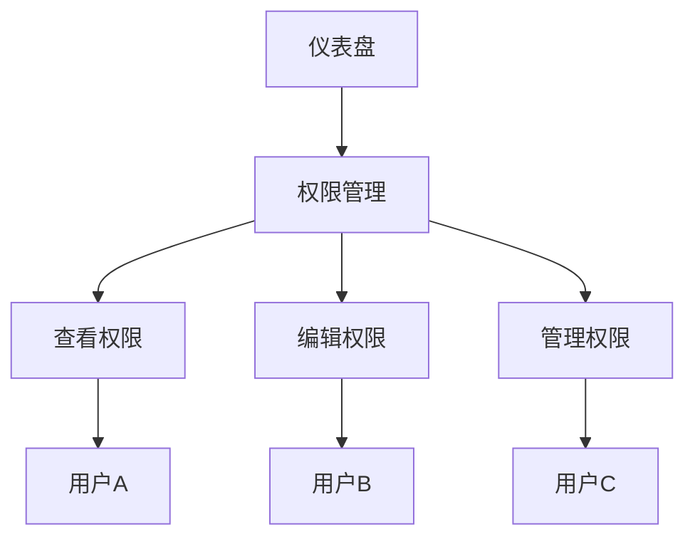

# 仪表盘权限管理

在 Grafana Alloy 中，仪表盘权限管理是一个非常重要的功能，它允许你控制谁可以查看、编辑或管理你的仪表盘。通过合理的权限管理，你可以确保数据的安全性，并防止未经授权的用户访问敏感信息。

## 什么是仪表盘权限管理？

仪表盘权限管理是指在 Grafana Alloy 中设置和管理用户或用户组对特定仪表盘的访问权限。这些权限可以包括查看、编辑、管理仪表盘等操作。通过权限管理，你可以确保只有授权的用户才能访问和操作仪表盘。

## 权限类型

在 Grafana Alloy 中，仪表盘的权限主要分为以下几种：

1. **查看权限（View）**：允许用户查看仪表盘的内容，但不能进行任何修改。
2. **编辑权限（Edit）**：允许用户编辑仪表盘的内容，包括添加、删除和修改面板。
3. **管理权限（Admin）**：允许用户管理仪表盘的权限设置，包括添加或删除用户权限。

## 如何设置仪表盘权限

### 1. 访问仪表盘设置

首先，打开你想要设置权限的仪表盘。点击仪表盘右上角的齿轮图标，进入仪表盘设置页面。

### 2. 进入权限管理页面

在仪表盘设置页面中，选择“Permissions”选项卡。这里你可以看到当前仪表盘的权限设置。

### 3. 添加用户或用户组

点击“Add Permission”按钮，你可以选择添加用户或用户组。在弹出的对话框中，输入用户或用户组的名称，并选择相应的权限级别（View、Edit 或 Admin）。

```mdx
:::note
确保你已经正确配置了用户和用户组，否则无法正确添加权限。
:::
```

### 4. 保存设置

完成权限设置后，点击“Save”按钮保存更改。此时，你添加的用户或用户组将拥有相应的权限。

## 实际案例

假设你有一个名为“Sales Dashboard”的仪表盘，你希望销售团队的所有成员都能查看该仪表盘，但只有销售经理能够编辑和管理它。

1. 打开“Sales Dashboard”仪表盘，进入设置页面。
2. 在“Permissions”选项卡中，点击“Add Permission”。
3. 选择“Sales Team”用户组，并设置权限为“View”。
4. 再次点击“Add Permission”，选择“Sales Manager”用户，并设置权限为“Admin”。
5. 保存设置。

现在，销售团队的所有成员都可以查看“Sales Dashboard”，而销售经理则可以编辑和管理它。

## 总结

仪表盘权限管理是 Grafana Alloy 中确保数据安全性和访问控制的重要功能。通过合理的权限设置，你可以控制谁可以查看、编辑或管理你的仪表盘。希望本文能帮助你更好地理解和使用 Grafana Alloy 的权限管理功能。

## 附加资源

- [Grafana 官方文档](https://grafana.com/docs/)
- [Grafana Alloy 权限管理指南](https://grafana.com/docs/grafana/latest/permissions/dashboard_permissions/)

## 练习

1. 创建一个新的仪表盘，并为其设置不同的权限级别。
2. 尝试添加多个用户和用户组，并观察他们的权限如何影响仪表盘的访问和操作。



通过以上步骤和练习，你将能够熟练掌握 Grafana Alloy 中的仪表盘权限管理功能。祝你学习愉快！