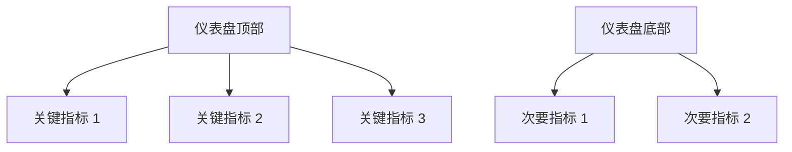

# 仪表盘最佳实践

仪表盘是数据可视化的核心工具，能够帮助用户快速理解复杂的数据集。Grafana Alloy 是一个强大的仪表盘设计工具，但如何设计一个高效、直观的仪表盘呢？本文将为你介绍仪表盘设计的最佳实践，帮助你从初学者成长为仪表盘设计高手。

## 什么是仪表盘？

仪表盘是一种数据可视化工具，用于展示关键指标和数据的实时状态。它通常由多个面板组成，每个面板显示一个特定的数据集或指标。通过仪表盘，用户可以快速获取信息并做出决策。

## 仪表盘设计的基本原则

在设计仪表盘时，遵循以下基本原则可以帮助你创建出高效、直观的仪表盘：

1. **明确目标**：在设计仪表盘之前，明确它的主要目标是什么。是为了监控系统性能，还是为了分析业务数据？明确目标有助于确定需要展示的关键指标。

2. **简洁明了**：避免在仪表盘上展示过多的信息。过多的信息会让用户感到困惑，难以快速获取关键信息。每个面板应该只展示一个关键指标。

3. **一致性**：保持仪表盘的设计风格一致。使用相同的颜色、字体和布局，可以帮助用户更快地理解数据。

4. **可操作性**：仪表盘不仅仅是用来展示数据的，还应该允许用户进行交互。例如，添加过滤器、时间选择器等交互元素，可以让用户更灵活地探索数据。

## 仪表盘设计的最佳实践

### 1. 选择合适的图表类型

不同的数据类型适合不同的图表类型。以下是一些常见的图表类型及其适用场景：

- **折线图**：适用于展示数据随时间变化的趋势。
- **柱状图**：适用于比较不同类别的数据。
- **饼图**：适用于展示数据的比例关系。
- **表格**：适用于展示详细的数据列表。

例如，如果你想展示某个指标在一段时间内的变化趋势，可以使用折线图：

```json
{
  "type": "line",
  "title": "CPU 使用率",
  "data": {
    "labels": ["2023-10-01", "2023-10-02", "2023-10-03"],
    "datasets": [
      {
        "label": "CPU 使用率",
        "data": [30, 50, 70]
      }
    ]
  }
}
```

### 2. 使用颜色和标签增强可读性

颜色和标签是增强仪表盘可读性的重要工具。使用颜色来区分不同的数据集或指标，但要避免使用过多的颜色，以免造成视觉混乱。标签可以帮助用户快速理解数据的含义。

:::tip
使用对比色来突出显示关键指标，但不要使用过多的颜色，以免分散用户的注意力。
:::

### 3. 添加交互元素

交互元素可以让用户更灵活地探索数据。例如，添加时间选择器可以让用户查看不同时间段的数据，添加过滤器可以让用户筛选特定的数据集。

```json
{
  "type": "timepicker",
  "options": {
    "from": "now-7d",
    "to": "now"
  }
}
```

### 4. 优化仪表盘的布局

仪表盘的布局应该简洁明了，重要的信息应该放在显眼的位置。通常，仪表盘的顶部应该放置最重要的指标，次要的指标可以放在下方。



### 5. 定期更新和优化

仪表盘的设计不是一成不变的。随着业务需求的变化，仪表盘也需要定期更新和优化。定期检查仪表盘的使用情况，收集用户反馈，并根据反馈进行优化。

## 实际案例

假设你正在为一个电商网站设计一个仪表盘，用于监控网站的销售情况。你可以设计一个包含以下面板的仪表盘：

1. **总销售额**：使用折线图展示每日的销售额变化趋势。
2. **订单数量**：使用柱状图展示每日的订单数量。
3. **热门商品**：使用饼图展示最畅销的商品。
4. **用户活跃度**：使用表格展示每日的活跃用户数。

```json
{
  "panels": [
    {
      "type": "line",
      "title": "总销售额",
      "data": {
        "labels": ["2023-10-01", "2023-10-02", "2023-10-03"],
        "datasets": [
          {
            "label": "销售额",
            "data": [1000, 1500, 2000]
          }
        ]
      }
    },
    {
      "type": "bar",
      "title": "订单数量",
      "data": {
        "labels": ["2023-10-01", "2023-10-02", "2023-10-03"],
        "datasets": [
          {
            "label": "订单数量",
            "data": [50, 75, 100]
          }
        ]
      }
    }
  ]
}
```

## 总结

设计一个高效、直观的仪表盘需要遵循一些基本原则和最佳实践。通过选择合适的图表类型、使用颜色和标签增强可读性、添加交互元素、优化布局以及定期更新和优化，你可以创建出满足用户需求的仪表盘。

## 附加资源

- [Grafana 官方文档](https://grafana.com/docs/)
- [数据可视化最佳实践](https://www.tableau.com/learn/whitepapers/tableau-visual-guidebook)
- [仪表盘设计案例研究](https://www.dashboardinsight.com/case-studies)

## 练习

1. 设计一个用于监控服务器性能的仪表盘，展示 CPU 使用率、内存使用率和磁盘 I/O。
2. 为你的仪表盘添加一个时间选择器，允许用户查看不同时间段的数据。
3. 使用颜色和标签优化你的仪表盘，使其更易于理解。

通过不断练习和应用这些最佳实践，你将能够设计出高效、直观的仪表盘，帮助用户更好地理解数据。