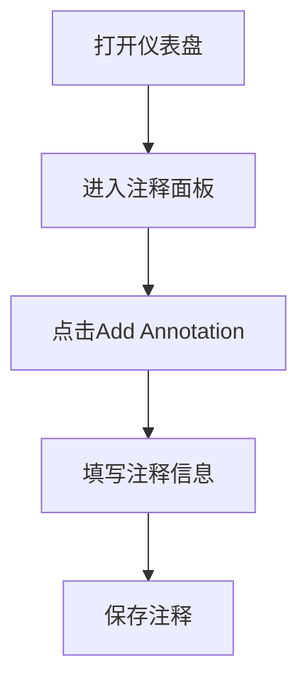

# 仪表盘注释功能

在数据可视化中，注释（Annotations）是一种强大的工具，用于为图表添加额外的上下文信息。通过注释，您可以在特定时间点或时间段内标记重要事件，帮助用户更好地理解数据的变化原因。Grafana Alloy 提供了灵活的注释功能，允许您在仪表盘中轻松添加和管理注释。

## 什么是仪表盘注释？

仪表盘注释是 Grafana Alloy 中的一种功能，允许您在图表上添加标记，以突出显示特定时间点或时间段内发生的事件。这些事件可以是系统故障、部署、警报触发等。注释通常以垂直线或区域的形式显示在图表上，并附带描述性文本。

### 注释的类型

在 Grafana Alloy 中，注释主要分为两种类型：

1. **时间点注释**：在特定时间点添加的注释，通常以垂直线表示。
2. **时间段注释**：在特定时间段内添加的注释，通常以区域表示。

## 如何添加注释

在 Grafana Alloy 中，您可以通过以下步骤为仪表盘添加注释：

1. **打开仪表盘**：首先，打开您想要添加注释的仪表盘。
2. **进入注释面板**：在仪表盘的顶部工具栏中，点击“Annotations”按钮。
3. **创建注释**：在注释面板中，点击“Add Annotation”按钮，填写注释的名称、时间范围（或时间点）以及描述信息。
4. **保存注释**：完成填写后，点击“Save”按钮，注释将自动显示在图表上。

### 示例：添加时间点注释

假设您想要在图表上标记一次系统故障的时间点，可以按照以下步骤操作：

1. 打开仪表盘并进入注释面板。
2. 点击“Add Annotation”按钮。
3. 在“Name”字段中输入“系统故障”。
4. 在“Time”字段中选择故障发生的时间点。
5. 在“Description”字段中输入“系统在此时发生故障，导致服务中断”。
6. 点击“Save”按钮。

### 示例：添加时间段注释

如果您想要标记一次系统升级的时间段，可以按照以下步骤操作：

1. 打开仪表盘并进入注释面板。
2. 点击“Add Annotation”按钮。
3. 在“Name”字段中输入“系统升级”。
4. 在“Time Range”字段中选择升级的开始和结束时间。
5. 在“Description”字段中输入“系统在此期间进行了升级，可能导致性能波动”。
6. 点击“Save”按钮。

## 注释的实际应用场景

注释功能在许多实际场景中都非常有用。以下是一些常见的应用场景：

1. **故障排查**：当系统发生故障时，您可以在图表上标记故障时间点，帮助团队快速定位问题。
2. **版本发布**：在发布新版本时，您可以在图表上标记发布时间段，观察新版本对系统性能的影响。
3. **警报触发**：当某个指标触发警报时，您可以在图表上标记警报时间点，分析警报触发的原因。

### 案例：故障排查

假设您的系统在某个时间点发生了性能下降，您可以通过注释功能标记该时间点，并在描述中记录可能的原因。这样，团队成员在查看图表时，可以快速了解性能下降的背景信息。

## 总结

仪表盘注释功能是 Grafana Alloy 中一个非常有用的工具，能够帮助您为数据可视化添加上下文信息。通过注释，您可以更好地理解数据变化的原因，并在团队协作中提供更多的背景信息。无论是标记故障时间点，还是记录版本发布时间段，注释功能都能为您提供强大的支持。

## 附加资源与练习

- **练习**：尝试在您的 Grafana Alloy 仪表盘中添加一个时间点注释和一个时间段注释，观察它们在图表上的显示效果。
- **进一步学习**：阅读 Grafana 官方文档，了解更多关于注释功能的高级用法，例如通过 API 自动添加注释。

:::tip
注释功能不仅适用于系统监控，还可以用于任何需要标记时间点或时间段的数据分析场景。尝试在您的项目中灵活运用这一功能，提升数据可视化的效果。
:::