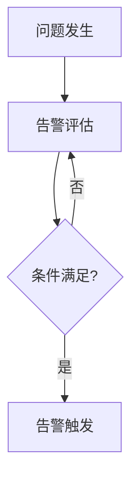

# 告警评估间隔配置

在 Grafana Alloy 中，告警评估间隔（Evaluation Interval）是一个关键配置项，它决定了告警规则被评估的频率。正确配置评估间隔可以帮助你及时发现潜在问题，同时避免因过于频繁的评估而导致系统资源浪费或误报。

## 什么是告警评估间隔？

告警评估间隔是指告警规则被周期性评估的时间间隔。例如，如果你将评估间隔设置为 `1m`（1 分钟），那么告警规则将每分钟被评估一次。评估间隔的设置直接影响告警的响应速度和系统的负载。

:::note
评估间隔越短，告警响应速度越快，但系统负载也会增加。因此，需要根据实际需求平衡响应速度和系统性能。
:::

## 如何配置告警评估间隔？

在 Grafana Alloy 中，告警评估间隔可以通过配置文件进行设置。以下是一个简单的配置示例：

```yaml
alerting:
  evaluation_interval: 1m
```

在这个示例中，`evaluation_interval` 被设置为 `1m`，表示告警规则将每分钟评估一次。

### 配置项说明

- `evaluation_interval`: 定义告警规则的评估间隔。支持的时间单位包括 `s`（秒）、`m`（分钟）、`h`（小时）等。

## 实际案例

假设你正在监控一个 Web 服务的响应时间，并希望在响应时间超过 500 毫秒时触发告警。你可以配置如下告警规则：

```yaml
groups:
- name: web_service
  rules:
  - alert: HighResponseTime
    expr: http_request_duration_seconds{job="web_service"} > 0.5
    for: 5m
    labels:
      severity: critical
    annotations:
      summary: "High response time detected"
      description: "The response time of the web service is above 500ms."
```

在这个案例中，`for: 5m` 表示告警规则需要连续 5 分钟满足条件才会触发告警。结合 `evaluation_interval: 1m`，告警规则将每分钟评估一次，并在连续 5 次评估都满足条件时触发告警。

:::tip
在实际应用中，建议根据业务需求调整 `evaluation_interval` 和 `for` 的值，以确保告警系统既能及时响应，又不会因过于频繁的评估而导致误报。
:::

## 评估间隔与告警延迟

评估间隔的设置还会影响告警的延迟。例如，如果评估间隔为 `1m`，那么告警的延迟最多为 1 分钟。这意味着从问题发生到告警触发，最多需要 1 分钟的时间。



在这个流程中，告警评估间隔决定了从问题发生到告警触发的最大延迟。

## 总结

告警评估间隔是 Grafana Alloy 中一个重要的配置项，它直接影响告警的响应速度和系统的负载。通过合理配置评估间隔，你可以在确保告警及时响应的同时，避免系统资源的浪费和误报的发生。

## 附加资源

- [Grafana Alloy 官方文档](https://grafana.com/docs/alloy/latest/)
- [Prometheus 告警规则配置指南](https://prometheus.io/docs/prometheus/latest/configuration/alerting_rules/)

## 练习

1. 尝试在你的 Grafana Alloy 配置文件中设置不同的 `evaluation_interval` 值，观察告警触发的延迟和系统负载的变化。
2. 结合 `for` 字段，配置一个告警规则，要求连续 3 次评估都满足条件时才触发告警。

通过以上练习，你将更好地理解告警评估间隔的作用和配置方法。