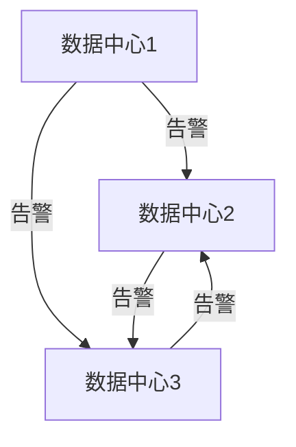

# 高可用告警设置

在现代监控系统中，告警是确保系统稳定性和及时响应问题的关键组件。然而，告警系统本身也可能成为单点故障。为了避免这种情况，Grafana Alloy 提供了高可用（High Availability, HA）告警设置功能，确保即使在部分组件故障的情况下，告警系统仍能正常运行。

本文将逐步介绍如何在 Grafana Alloy 中配置高可用告警系统，并通过实际案例展示其应用场景。

## 什么是高可用告警？

高可用告警是指在告警系统中引入冗余机制，确保即使某个组件或节点发生故障，告警仍能正常触发和处理。Grafana Alloy 通过分布式架构和冗余配置来实现这一目标。

## 配置高可用告警

### 1. 多实例部署

首先，您需要在不同的服务器上部署多个 Grafana Alloy 实例。这些实例将共同工作，确保即使其中一个实例宕机，其他实例仍能继续处理告警。

```yaml
# 示例：Grafana Alloy 配置文件
instances:
  - name: instance-1
    address: "http://instance1.example.com"
  - name: instance-2
    address: "http://instance2.example.com"
```

### 2. 配置告警路由

在 Grafana Alloy 中，您可以通过配置告警路由来确保告警消息被分发到多个实例。以下是一个简单的告警路由配置示例：

```yaml
# 示例：告警路由配置
alerting:
  receivers:
    - name: 'default-receiver'
      email_configs:
        - to: 'team@example.com'
  route:
    receiver: 'default-receiver'
    group_by: ['alertname', 'cluster']
    group_wait: 30s
    group_interval: 5m
    repeat_interval: 3h
```

### 3. 启用高可用模式

在 Grafana Alloy 中，您可以通过设置 `ha_enabled` 参数来启用高可用模式。启用后，Grafana Alloy 将自动处理实例之间的故障转移。

```yaml
# 示例：启用高可用模式
ha:
  enabled: true
  cluster_size: 3
```

## 实际案例

假设您有一个由三个 Grafana Alloy 实例组成的集群，分别部署在不同的数据中心。当其中一个数据中心发生网络故障时，其他两个实例将自动接管告警处理任务，确保告警不会丢失。



## 总结

通过配置高可用告警系统，您可以显著提高告警系统的可靠性和稳定性。Grafana Alloy 提供了强大的工具和配置选项，帮助您轻松实现这一目标。

## 附加资源

- [Grafana Alloy 官方文档](https://grafana.com/docs/alloy/latest/)
- [高可用性设计模式](https://en.wikipedia.org/wiki/High_availability)

## 练习

1. 尝试在本地环境中部署两个 Grafana Alloy 实例，并配置高可用告警系统。
2. 模拟一个实例故障，观察告警系统是否能够正常处理告警。

通过以上步骤，您将能够更好地理解高可用告警系统的工作原理，并在实际项目中应用这些知识。