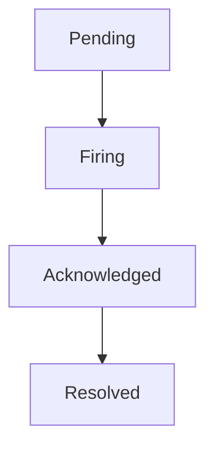

# 告警状态管理

在监控系统中，告警状态管理是确保系统稳定性和可靠性的关键环节。Grafana Alloy 提供了强大的告警管理功能，帮助用户实时监控告警状态，并及时采取相应的措施。本文将详细介绍 Grafana Alloy 中的告警状态管理，并通过实际案例展示其应用。

## 什么是告警状态管理？

告警状态管理是指在监控系统中，对告警的生成、触发、确认、解决等状态进行有效管理的过程。通过告警状态管理，用户可以清晰地了解当前系统的告警情况，及时处理问题，避免系统故障。

在 Grafana Alloy 中，告警状态管理主要包括以下几个方面：
- **告警生成**：当监控指标达到预设的阈值时，系统会自动生成告警。
- **告警触发**：告警生成后，系统会根据配置的规则触发告警通知。
- **告警确认**：用户可以对告警进行确认，表示已经注意到该问题。
- **告警解决**：当问题解决后，用户可以标记告警为已解决。

## 告警状态的生命周期

告警状态的生命周期通常包括以下几个阶段：

1. **Pending**：告警已经生成，但尚未达到触发条件。
2. **Firing**：告警已经触发，系统正在发送通知。
3. **Acknowledged**：用户已经确认告警，但问题尚未解决。
4. **Resolved**：问题已经解决，告警状态标记为已解决。



## 告警状态管理的实际应用

### 1. 告警生成与触发

在 Grafana Alloy 中，告警的生成和触发是通过配置告警规则来实现的。以下是一个简单的告警规则配置示例：

```yaml
groups:
- name: example
  rules:
  - alert: HighRequestLatency
    expr: job:request_latency_seconds:mean5m{job="myjob"} > 0.5
    for: 10m
    labels:
      severity: page
    annotations:
      summary: "High request latency detected"
      description: "The request latency for {{ $labels.job }} is above 0.5 seconds."
```

在这个示例中，当 `request_latency_seconds` 指标的平均值在 5 分钟内超过 0.5 秒时，系统会生成一个名为 `HighRequestLatency` 的告警。如果该状态持续 10 分钟，告警将被触发。

### 2. 告警确认与解决

当告警触发后，用户可以通过 Grafana 界面或 API 对告警进行确认和解决。以下是一个通过 API 确认告警的示例：

```bash
curl -X POST http://localhost:9093/api/v2/alerts -d '[
  {
    "labels": {
      "alertname": "HighRequestLatency",
      "severity": "page"
    },
    "status": "acknowledged"
  }
]'
```

在这个示例中，我们通过 API 将 `HighRequestLatency` 告警的状态标记为 `acknowledged`，表示已经注意到该问题。

### 3. 告警状态查询

用户可以通过 Grafana 界面或 API 查询当前的告警状态。以下是一个通过 API 查询告警状态的示例：

```bash
curl http://localhost:9093/api/v2/alerts
```

该命令将返回当前所有告警的状态信息，包括告警名称、状态、触发时间等。

## 实际案例

假设我们有一个在线电商网站，需要监控其订单处理系统的延迟情况。我们配置了一个告警规则，当订单处理延迟超过 1 秒时触发告警。以下是告警规则的配置：

```yaml
groups:
- name: order_processing
  rules:
  - alert: HighOrderProcessingLatency
    expr: job:order_processing_latency_seconds:mean5m{job="order_processing"} > 1
    for: 5m
    labels:
      severity: critical
    annotations:
      summary: "High order processing latency detected"
      description: "The order processing latency for {{ $labels.job }} is above 1 second."
```

当订单处理延迟超过 1 秒时，系统会生成 `HighOrderProcessingLatency` 告警。运维团队可以通过 Grafana 界面或 API 确认告警，并在问题解决后标记告警为已解决。

## 总结

告警状态管理是监控系统中不可或缺的一部分。通过 Grafana Alloy，用户可以有效地管理告警状态，确保系统的稳定性和可靠性。本文介绍了告警状态管理的基本概念、生命周期以及实际应用案例，希望能够帮助初学者更好地理解和应用这一重要功能。

## 附加资源与练习

- **练习**：尝试在 Grafana Alloy 中配置一个简单的告警规则，并模拟告警的生成、触发、确认和解决过程。
- **资源**：阅读 [Grafana Alloy 官方文档](https://grafana.com/docs/alloy/latest/) 以获取更多关于告警管理的详细信息。

:::tip
提示：在实际应用中，建议定期审查和优化告警规则，避免误报和漏报，确保告警系统的有效性。
:::