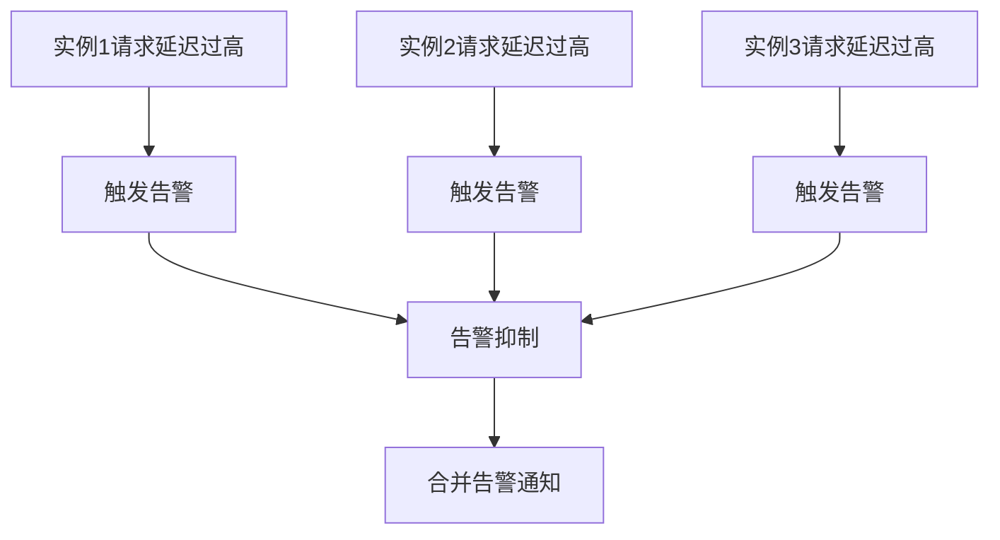

# 多实例告警联动

在现代分布式系统中，告警系统通常需要处理多个实例的监控数据。多实例告警联动是指当多个实例同时触发告警时，系统能够智能地处理这些告警，避免重复通知或遗漏关键信息。本文将详细介绍如何在 Grafana Alloy 中实现多实例告警联动，并通过实际案例展示其应用场景。

## 什么是多实例告警联动？

多实例告警联动是指在分布式系统中，多个实例同时触发告警时，系统能够将这些告警进行关联处理。例如，当一个服务有多个实例运行时，如果其中一个实例出现问题，可能会影响到其他实例。通过多实例告警联动，系统可以识别出这些关联的告警，并采取相应的措施，如合并告警、抑制重复告警等。

## 实现多实例告警联动的步骤

### 1. 配置告警规则

首先，我们需要在 Grafana Alloy 中配置告警规则。告警规则定义了在什么条件下触发告警。以下是一个简单的告警规则示例：

```yaml
groups:
- name: example
  rules:
  - alert: HighRequestLatency
    expr: job:request_latency_seconds:mean5m{job="myjob"} > 0.5
    for: 10m
    labels:
      severity: critical
    annotations:
      summary: "High request latency detected"
      description: "The request latency for {{ $labels.instance }} is above 0.5 seconds."
```

### 2. 配置告警抑制规则

为了避免重复告警，我们可以配置告警抑制规则。抑制规则定义了当一个告警触发时，哪些其他告警应该被抑制。以下是一个抑制规则的示例：

```yaml
inhibit_rules:
- source_match:
    severity: 'critical'
  target_match:
    severity: 'warning'
  equal: ['alertname', 'job']
```

在这个示例中，如果有一个严重级别为 `critical` 的告警触发，那么所有相同 `alertname` 和 `job` 的 `warning` 级别告警将被抑制。

### 3. 配置告警分组

告警分组可以将多个相关的告警合并为一个通知。以下是一个告警分组的配置示例：

```yaml
route:
  group_by: ['alertname', 'job']
  group_wait: 30s
  group_interval: 5m
  repeat_interval: 3h
```

在这个配置中，Grafana Alloy 会将具有相同 `alertname` 和 `job` 的告警分组，并在 30 秒内等待更多相关告警，然后发送一个合并的通知。

## 实际案例

假设我们有一个分布式系统，其中有三个实例运行相同的服务。我们配置了告警规则来监控每个实例的请求延迟。当其中一个实例的请求延迟超过阈值时，Grafana Alloy 会触发告警。由于我们配置了告警抑制规则和分组规则，系统会自动抑制其他实例的重复告警，并将所有相关告警合并为一个通知发送给运维团队。



## 总结

多实例告警联动是分布式系统中告警管理的重要功能。通过合理配置告警规则、抑制规则和分组规则，我们可以有效地减少重复告警，并确保关键告警能够及时通知到运维团队。Grafana Alloy 提供了强大的工具来实现这些功能，帮助我们在复杂的分布式系统中更好地管理告警。

## 附加资源

- [Grafana Alloy 官方文档](https://grafana.com/docs/alloy/latest/)
- [Prometheus 告警规则配置指南](https://prometheus.io/docs/prometheus/latest/configuration/alerting_rules/)
- [分布式系统中的告警管理最佳实践](https://www.example.com/distributed-alerting-best-practices)

## 练习

1. 在你的 Grafana Alloy 环境中配置一个多实例告警联动规则，并测试其效果。
2. 尝试修改告警抑制规则，观察不同配置下的告警行为。
3. 研究如何在告警通知中包含更多上下文信息，以便运维团队能够更快地定位问题。
