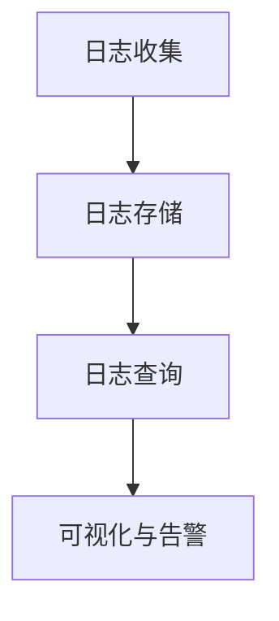

# 大规模日志分析策略

在现代分布式系统中，日志数据是理解系统行为、排查问题和优化性能的关键。然而，随着系统规模的扩大，日志数据量呈指数级增长，如何高效地收集、存储和分析这些日志成为了一个巨大的挑战。本文将介绍大规模日志分析的核心策略，并结合 Grafana Alloy 的实际应用，帮助初学者掌握这一重要技能。

---

## 什么是大规模日志分析？

大规模日志分析是指从海量日志数据中提取有价值的信息，以支持系统监控、故障排查、性能优化等任务。由于日志数据通常是非结构化的，且数据量庞大，传统的分析方法往往难以应对。因此，我们需要采用高效的策略和工具来处理这些数据。

---

## 核心策略

### 1. 日志收集与聚合

日志收集是日志分析的第一步。在大规模系统中，日志通常分布在多个节点上，因此需要一种集中化的方式来收集这些日志。常见的日志收集工具包括 Fluentd、Logstash 和 Promtail。

**示例：使用 Promtail 收集日志**

```yaml
server:
  http_listen_port: 9080
  grpc_listen_port: 0

positions:
  filename: /tmp/positions.yaml

clients:
  - url: http://loki:3100/loki/api/v1/push

scrape_configs:
  - job_name: system
    static_configs:
      - targets:
          - localhost
        labels:
          job: varlogs
          __path__: /var/log/*.log
```

**输入：** 日志文件 `/var/log/*.log`  
**输出：** 日志数据被发送到 Loki 进行存储和分析。

---

### 2. 日志存储与索引

日志存储需要兼顾性能和成本。常见的存储方案包括 Elasticsearch、Loki 和 ClickHouse。这些工具通过索引和压缩技术，能够高效地存储和检索日志数据。

**示例：Loki 的日志存储**

Loki 是一个轻量级的日志聚合系统，专为大规模日志分析设计。它使用标签（labels）对日志进行索引，从而支持高效的查询。

```yaml
auth_enabled: false

server:
  http_listen_port: 3100

common:
  storage:
    filesystem:
      directory: /tmp/loki
  replication_factor: 1
  ring:
    kvstore:
      store: inmemory
```

---

### 3. 日志查询与分析

日志查询是大规模日志分析的核心。通过高效的查询语言（如 LogQL），我们可以从海量日志中快速提取所需信息。

**示例：使用 LogQL 查询日志**

```logql
{job="varlogs"} |= "error" | logfmt | duration > 1s
```

**解释：**  
- `{job="varlogs"}`：筛选出标签为 `job=varlogs` 的日志。  
- `|= "error"`：过滤出包含 "error" 的日志行。  
- `logfmt`：解析日志格式。  
- `duration > 1s`：筛选出持续时间超过 1 秒的日志。

---

### 4. 可视化与告警

可视化工具（如 Grafana）能够将日志数据转化为直观的图表，帮助我们更好地理解系统行为。同时，告警机制可以及时通知我们潜在的问题。

**示例：Grafana 中的日志可视化**



---

## 实际案例：电商系统的日志分析

假设我们有一个电商系统，每天产生数百万条日志。为了监控系统健康状态，我们需要：

1. **收集日志：** 使用 Promtail 收集所有节点的日志并发送到 Loki。  
2. **存储日志：** 在 Loki 中存储日志，并使用标签对日志进行分类。  
3. **查询日志：** 使用 LogQL 查询错误日志和慢请求日志。  
4. **可视化：** 在 Grafana 中创建仪表盘，展示错误率和请求延迟。  
5. **告警：** 设置告警规则，当错误率超过阈值时发送通知。

---

## 总结

大规模日志分析是现代系统运维的重要组成部分。通过合理的日志收集、存储、查询和可视化策略，我们可以从海量日志中提取有价值的信息，从而提升系统的可靠性和性能。

---

## 附加资源与练习

- **练习 1：** 使用 Promtail 和 Loki 搭建一个简单的日志收集系统，并尝试查询日志。  
- **练习 2：** 在 Grafana 中创建一个仪表盘，展示日志的关键指标。  
- **资源：**  
  - [Loki 官方文档](https://grafana.com/docs/loki/latest/)  
  - [Grafana 官方文档](https://grafana.com/docs/grafana/latest/)  
  - [LogQL 查询语言指南](https://grafana.com/docs/loki/latest/logql/)