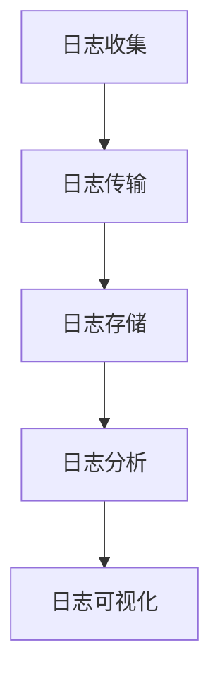

# 日志聚合分析

在现代软件开发和运维中，日志是系统运行状态的重要信息来源。随着系统规模的扩大，日志数据量也会急剧增加。如何高效地收集、存储和分析这些日志数据，成为了一个关键问题。**日志聚合分析**正是为了解决这一问题而诞生的技术。

## 什么是日志聚合分析？

日志聚合分析是指将来自不同来源的日志数据集中存储，并通过统一的工具和方法进行分析的过程。通过日志聚合，我们可以更高效地监控系统状态、排查问题，并从中提取有价值的信息。

:::note
日志聚合的核心目标是将分散的日志数据集中管理，以便于分析和可视化。
:::

## 日志聚合的基本流程

日志聚合通常包括以下几个步骤：

1. **日志收集**：从不同的服务器、应用程序或设备中收集日志数据。
2. **日志传输**：将收集到的日志数据传输到中央存储系统。
3. **日志存储**：将日志数据存储在高效的存储系统中，如 Elasticsearch、Loki 等。
4. **日志分析**：使用工具对日志数据进行查询、过滤和分析。
5. **日志可视化**：将分析结果以图表或仪表盘的形式展示，便于理解。



## 日志聚合工具

目前，有许多工具可以帮助我们实现日志聚合分析。以下是一些常用的工具：

- **Grafana Loki**：轻量级的日志聚合系统，专注于高效的日志存储和查询。
- **Elasticsearch + Kibana**：强大的日志存储和可视化组合，适合大规模日志分析。
- **Fluentd**：开源的日志收集和传输工具，支持多种输入和输出插件。

## 实际案例：使用 Grafana Loki 进行日志聚合分析

假设我们有一个分布式系统，运行在多台服务器上。我们需要将这些服务器的日志集中存储，并通过 Grafana 进行可视化分析。

### 1. 安装和配置 Loki

首先，我们需要安装 Loki 和 Promtail。Loki 是日志存储和查询引擎，而 Promtail 是日志收集代理。

```bash
# 使用 Docker 安装 Loki 和 Promtail
docker run -d --name=loki -p 3100:3100 grafana/loki:latest
docker run -d --name=promtail -v /path/to/logs:/var/log --link loki grafana/promtail:latest -config.file=/etc/promtail/config.yml
```

### 2. 配置 Promtail 收集日志

在 Promtail 的配置文件 `config.yml` 中，指定日志文件的路径和 Loki 的地址。

```yaml
server:
  http_listen_port: 9080
  grpc_listen_port: 0

positions:
  filename: /tmp/positions.yaml

clients:
  - url: http://loki:3100/loki/api/v1/push

scrape_configs:
  - job_name: system
    static_configs:
      - targets:
          - localhost
        labels:
          job: varlogs
          __path__: /var/log/*.log
```

### 3. 在 Grafana 中配置 Loki 数据源

在 Grafana 中，添加 Loki 作为数据源，并配置其地址为 `http://localhost:3100`。

### 4. 查询和可视化日志

在 Grafana 中，使用 LogQL 查询语言对日志进行查询。例如，查询所有包含 "error" 的日志：

```logql
{job="varlogs"} |= "error"
```

查询结果可以通过 Grafana 的日志面板进行可视化。

## 总结

日志聚合分析是现代系统运维中不可或缺的一部分。通过集中管理和分析日志数据，我们可以更高效地监控系统状态、排查问题，并从中提取有价值的信息。本文介绍了日志聚合的基本概念、流程和工具，并通过一个实际案例展示了如何使用 Grafana Loki 进行日志聚合分析。

:::tip
如果你对日志聚合分析感兴趣，可以尝试在自己的环境中部署 Loki 和 Promtail，并探索更多的 LogQL 查询功能。
:::

## 附加资源

- [Grafana Loki 官方文档](https://grafana.com/docs/loki/latest/)
- [Elasticsearch 官方文档](https://www.elastic.co/guide/en/elasticsearch/reference/current/index.html)
- [Fluentd 官方文档](https://docs.fluentd.org/)

## 练习

1. 在你的本地环境中安装 Loki 和 Promtail，并尝试收集和分析日志。
2. 使用 LogQL 查询语言，编写一个查询来查找特定时间范围内的日志。
3. 在 Grafana 中创建一个仪表盘，展示日志中的错误数量和趋势。