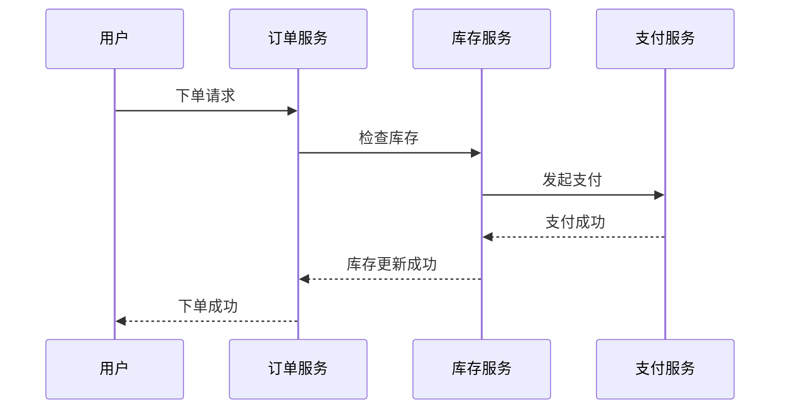

# 分布式追踪基础概念

在现代分布式系统中，应用程序通常由多个微服务组成，这些微服务可能分布在不同的服务器或容器中。当用户发起一个请求时，这个请求可能会经过多个服务的处理。为了理解请求的完整路径以及每个服务的性能表现，我们需要一种机制来追踪请求的流动。这就是**分布式追踪**的核心目标。

## 什么是分布式追踪？

分布式追踪是一种用于监控和诊断分布式系统的技术。它通过记录请求在系统中的流动路径，帮助开发者理解请求的生命周期、识别性能瓶颈以及调试问题。分布式追踪的核心思想是**追踪请求的完整路径**，并记录每个服务处理请求的时间、状态和上下文信息。

### 分布式追踪的核心组件

1. **Trace（追踪）**：一个 Trace 代表一个完整的请求路径。它由多个 Span 组成，每个 Span 代表请求在某个服务中的处理过程。
2. **Span（跨度）**：Span 是分布式追踪的基本单元。它记录了请求在某个服务中的开始时间、结束时间、操作名称、上下文信息等。
3. **Context（上下文）**：上下文信息用于在服务之间传递追踪数据，确保同一个请求的所有 Span 能够关联起来。

## 分布式追踪的工作原理

当一个请求进入系统时，分布式追踪系统会生成一个唯一的 Trace ID，并将这个 ID 传递给所有参与处理请求的服务。每个服务在处理请求时，会创建一个 Span，并将 Span 的信息（包括 Trace ID、Span ID、操作名称等）记录下来。这些 Span 信息会被发送到一个中央存储系统（如 Grafana Alloy），用于后续的分析和可视化。

### 代码示例

以下是一个简单的分布式追踪示例，展示了如何在 Python 中使用 OpenTelemetry 进行分布式追踪：

```python
from opentelemetry import trace
from opentelemetry.sdk.trace import TracerProvider
from opentelemetry.sdk.trace.export import ConsoleSpanExporter, SimpleSpanProcessor

# 设置 TracerProvider
trace.set_tracer_provider(TracerProvider())
tracer = trace.get_tracer(__name__)

# 添加 ConsoleSpanExporter 以便在控制台输出 Span 信息
trace.get_tracer_provider().add_span_processor(
    SimpleSpanProcessor(ConsoleSpanExporter())
)

# 创建一个 Span
with tracer.start_as_current_span("example-span"):
    print("This is a span example.")
```

**输出：**
```
{
    "name": "example-span",
    "context": {
        "trace_id": "abc123",
        "span_id": "def456"
    },
    "start_time": "2023-10-01T12:00:00Z",
    "end_time": "2023-10-01T12:00:01Z"
}
```

在这个示例中，我们创建了一个名为 `example-span` 的 Span，并将其信息输出到控制台。每个 Span 都包含一个唯一的 `trace_id` 和 `span_id`，用于标识请求的追踪路径。

## 分布式追踪的实际应用场景

分布式追踪在以下场景中非常有用：

1. **性能监控**：通过分析 Span 的时间信息，可以识别出系统中的性能瓶颈。
2. **故障排查**：当请求失败时，可以通过追踪路径快速定位问题所在的服务。
3. **服务依赖分析**：通过可视化 Trace，可以了解系统中各个服务之间的依赖关系。

### 实际案例

假设我们有一个电商系统，用户下单的请求会经过以下服务：`订单服务` -> `库存服务` -> `支付服务`。通过分布式追踪，我们可以追踪整个下单流程，并记录每个服务的处理时间。如果发现 `支付服务` 的处理时间过长，我们可以进一步分析该服务的性能问题。



在这个案例中，分布式追踪帮助我们理解了下单请求的完整路径，并能够识别出每个服务的性能表现。

## 总结

分布式追踪是理解和优化分布式系统的强大工具。通过记录请求的流动路径，开发者可以更好地监控系统性能、排查故障以及分析服务依赖关系。对于初学者来说，掌握分布式追踪的基本概念是进入分布式系统领域的重要一步。

### 附加资源

- [OpenTelemetry 官方文档](https://opentelemetry.io/docs/)
- [Grafana Alloy 分布式追踪指南](https://grafana.com/docs/alloy/latest/tracing/)
- [分布式系统设计与实践](https://www.oreilly.com/library/view/designing-distributed-systems/9781491983638/)

### 练习

1. 使用 OpenTelemetry 在你的本地环境中实现一个简单的分布式追踪示例。
2. 尝试在微服务架构中集成分布式追踪，并分析请求的流动路径。
3. 使用 Grafana Alloy 可视化你的追踪数据，并识别系统中的性能瓶颈。
