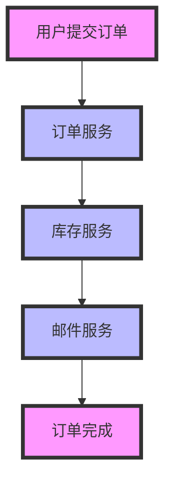

## 介绍

在分布式系统中，追踪请求的路径和行为是确保系统稳定性和性能的关键。**异常追踪识别**是分布式追踪中的一个重要环节，它帮助开发者和运维人员快速定位和解决系统中的异常问题。通过 Grafana Alloy，我们可以高效地实现分布式追踪，并识别出系统中的异常行为。

本文将逐步介绍如何使用 Grafana Alloy 进行异常追踪识别，包括基本概念、实现方法以及实际应用场景。

## 什么是异常追踪识别？

异常追踪识别是指在分布式系统中，通过追踪请求的路径和行为，识别出系统中的异常情况。这些异常可能包括请求超时、错误响应、资源耗尽等。通过识别这些异常，我们可以快速定位问题的根源，并采取相应的措施。

## 实现方法

### 1. 配置 Grafana Alloy

首先，我们需要配置 Grafana Alloy 以收集分布式追踪数据。以下是一个简单的配置示例：

```yaml
tracing:
  enabled: true
  exporter:
    type: jaeger
    endpoint: "http://jaeger:14268/api/traces"
```

在这个配置中，我们启用了追踪功能，并将数据导出到 Jaeger。

### 2. 添加追踪代码

接下来，我们需要在代码中添加追踪逻辑。以下是一个使用 OpenTelemetry 的示例：

```python
from opentelemetry import trace
from opentelemetry.sdk.trace import TracerProvider
from opentelemetry.sdk.trace.export import BatchSpanProcessor
from opentelemetry.exporter.jaeger.thrift import JaegerExporter

# 设置追踪提供者
trace.set_tracer_provider(TracerProvider())

# 创建 Jaeger 导出器
jaeger_exporter = JaegerExporter(
    agent_host_name="jaeger",
    agent_port=6831,
)

# 添加批处理处理器
trace.get_tracer_provider().add_span_processor(
    BatchSpanProcessor(jaeger_exporter)
)

# 获取追踪器
tracer = trace.get_tracer(__name__)

# 示例函数
def example_function():
    with tracer.start_as_current_span("example-span"):
        # 模拟一些工作
        print("Doing some work...")
```

在这个示例中，我们使用 OpenTelemetry 创建了一个追踪器，并在 `example_function` 中添加了一个追踪 span。

### 3. 查看追踪数据

配置完成后，我们可以通过 Grafana Alloy 查看追踪数据。以下是一个简单的查询示例：

```sql
SELECT * FROM traces WHERE status = 'error'
```

这个查询将返回所有状态为 `error` 的追踪数据，帮助我们快速识别系统中的异常。

## 实际案例

### 案例：电商网站的订单处理系统

假设我们有一个电商网站的订单处理系统，用户在提交订单后，系统需要处理订单、扣减库存、发送确认邮件等。在这个过程中，可能会出现订单处理超时、库存扣减失败等问题。

通过 Grafana Alloy 的分布式追踪功能，我们可以追踪每个订单的处理过程，并识别出异常情况。例如，如果某个订单的处理时间超过了预期，我们可以通过追踪数据快速定位到具体的服务或数据库查询，从而进行优化。



在这个案例中，如果库存服务出现异常，我们可以通过追踪数据快速定位到问题，并进行修复。

## 总结

异常追踪识别是分布式系统中不可或缺的一部分。通过 Grafana Alloy，我们可以高效地实现分布式追踪，并识别出系统中的异常行为。本文介绍了异常追踪识别的基本概念、实现方法以及实际应用场景，希望能帮助你更好地理解和应用这一技术。

## 附加资源

- [Grafana Alloy 官方文档](https://grafana.com/docs/alloy/latest/)
- [OpenTelemetry 官方文档](https://opentelemetry.io/docs/)
- [Jaeger 官方文档](https://www.jaegertracing.io/docs/)

## 练习

1. 在你的本地环境中配置 Grafana Alloy，并尝试收集一些追踪数据。
2. 编写一个简单的 Python 程序，使用 OpenTelemetry 添加追踪逻辑，并查看追踪数据。
3. 尝试在 Grafana Alloy 中编写查询，识别出系统中的异常情况。