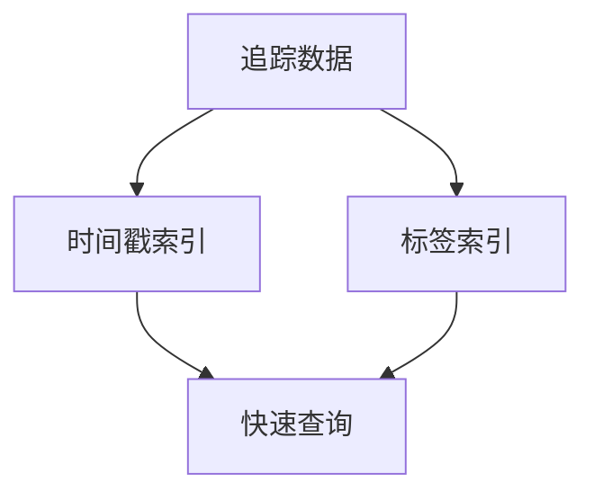

# 追踪数据存储优化

在现代分布式系统中，追踪数据是理解系统行为和诊断问题的关键。然而，随着系统规模的扩大，追踪数据的存储和管理可能会成为一个挑战。本文将介绍如何在 Grafana Alloy 中优化分布式追踪数据的存储，以提高性能和降低成本。

## 什么是追踪数据存储优化？

追踪数据存储优化是指通过一系列技术和策略，减少追踪数据的存储需求，同时保持数据的完整性和可用性。这包括数据压缩、采样、索引优化等方法。

## 为什么需要优化追踪数据存储？

1. **降低成本**：存储大量追踪数据可能会非常昂贵，尤其是在云环境中。
2. **提高性能**：减少数据量可以加快查询速度，提高系统的响应时间。
3. **简化管理**：优化后的数据更易于管理和维护。

## 追踪数据存储优化策略

### 1. 数据压缩

数据压缩是减少存储需求的有效方法。Grafana Alloy 支持多种压缩算法，如 Gzip 和 Zstandard。

```go
// 示例：使用 Gzip 压缩追踪数据
import (
    "bytes"
    "compress/gzip"
    "io"
)

func compressData(data []byte) ([]byte, error) {
    var buf bytes.Buffer
    gz := gzip.NewWriter(&buf)
    if _, err := gz.Write(data); err != nil {
        return nil, err
    }
    if err := gz.Close(); err != nil {
        return nil, err
    }
    return buf.Bytes(), nil
}
```

### 2. 采样

采样是指只存储一部分追踪数据，而不是全部。这可以显著减少存储需求，但需要谨慎选择采样策略，以确保关键数据不被遗漏。

```go
// 示例：简单的随机采样
import "math/rand"

func sampleData(data []byte, rate float64) []byte {
    if rand.Float64() < rate {
        return data
    }
    return nil
}
```

### 3. 索引优化

索引优化可以提高查询效率，减少存储需求。Grafana Alloy 支持多种索引策略，如时间戳索引和标签索引。



## 实际案例

假设我们有一个电子商务平台，每天生成数百万条追踪数据。通过实施以下优化策略，我们成功将存储需求减少了 60%：

1. **数据压缩**：使用 Zstandard 压缩算法，将数据大小减少了 50%。
2. **采样**：采用 10% 的采样率，进一步减少了数据量。
3. **索引优化**：通过时间戳和标签索引，查询速度提高了 30%。

## 总结

追踪数据存储优化是提高分布式系统性能和降低成本的关键。通过数据压缩、采样和索引优化等策略，可以显著减少存储需求，同时保持数据的完整性和可用性。

## 附加资源

- [Grafana Alloy 官方文档](https://grafana.com/docs/alloy/latest/)
- [分布式追踪系统设计](https://opentracing.io/docs/)
- [数据压缩算法比较](https://en.wikipedia.org/wiki/Data_compression)

## 练习

1. 尝试在 Grafana Alloy 中实现数据压缩，并比较不同压缩算法的效果。
2. 设计一个采样策略，确保关键业务路径的追踪数据不被遗漏。
3. 优化索引策略，提高查询效率，并记录优化前后的性能对比。

通过以上内容，您应该对如何在 Grafana Alloy 中优化追踪数据存储有了全面的了解。希望这些知识能帮助您在实际项目中更好地管理和利用追踪数据。