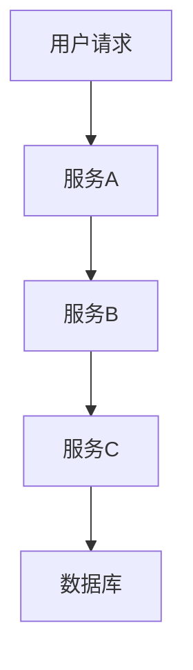
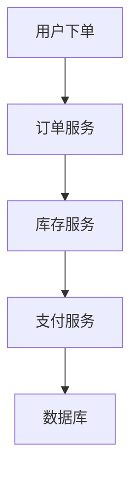

# 微服务追踪最佳实践

在现代微服务架构中，分布式追踪是确保系统可观测性和性能优化的关键工具。随着服务数量的增加，追踪请求在多个服务之间的流动变得尤为重要。本文将介绍如何使用 Grafana Alloy 实现分布式追踪，并分享一些微服务追踪的最佳实践。

## 什么是分布式追踪？

分布式追踪是一种监控技术，用于跟踪请求在分布式系统中的流动。它通过记录请求在不同服务之间的传递路径和时间，帮助开发人员识别性能瓶颈、调试错误并优化系统性能。

在微服务架构中，一个请求可能会经过多个服务，每个服务都可能对请求进行处理或转发。分布式追踪通过为每个请求生成唯一的追踪 ID，并在每个服务中记录相关信息，从而构建出完整的请求路径。

## 为什么需要分布式追踪？

1. **性能优化**：通过追踪请求的路径和时间，可以识别出哪些服务或操作导致了延迟。
2. **错误调试**：当请求失败时，分布式追踪可以帮助快速定位问题所在的服务。
3. **系统可观测性**：追踪数据提供了系统的全局视图，帮助开发人员理解系统的运行状态。

## Grafana Alloy 中的分布式追踪

Grafana Alloy 是一个强大的工具，支持分布式追踪的收集、存储和可视化。它能够与多种追踪系统（如 Jaeger、Zipkin）集成，并提供丰富的分析功能。

### 配置 Grafana Alloy 进行追踪

以下是一个简单的配置示例，展示如何在 Grafana Alloy 中启用分布式追踪：

```yaml
tracing:
  enabled: true
  exporter:
    type: jaeger
    endpoint: "http://jaeger:14268/api/traces"
```

在这个配置中，我们启用了追踪功能，并将追踪数据导出到 Jaeger 服务器。

### 追踪数据的可视化

Grafana Alloy 提供了强大的可视化工具，可以将追踪数据以图形化的方式展示出来。以下是一个简单的追踪图表示例：



在这个示例中，请求从用户开始，经过服务 A、服务 B 和服务 C，最后到达数据库。通过这种可视化方式，开发人员可以清晰地看到请求的流动路径。

## 微服务追踪的最佳实践

### 1. 为每个请求生成唯一的追踪 ID

在微服务架构中，每个请求都应该有一个唯一的追踪 ID。这个 ID 应该在请求进入系统时生成，并在请求经过的每个服务中传递。这样可以确保追踪数据的完整性和一致性。

```python
import uuid

def generate_trace_id():
    return str(uuid.uuid4())
```

### 2. 记录关键操作的时间戳

在每个服务中，记录关键操作的时间戳是非常重要的。这些时间戳可以帮助开发人员分析请求在每个服务中的处理时间，从而识别性能瓶颈。

```python
import time

def log_timestamp(operation_name):
    print(f"{operation_name} started at: {time.time()}")
```

### 3. 使用上下文传递追踪信息

在微服务之间传递追踪信息时，使用上下文（context）是一种常见的做法。上下文可以包含追踪 ID、时间戳等信息，并确保这些信息在服务之间正确传递。

```python
from flask import request

def handle_request():
    trace_id = request.headers.get('X-Trace-ID')
    # 处理请求并传递追踪信息
```

### 4. 设置合理的采样率

在高流量的系统中，记录每个请求的追踪数据可能会导致存储和性能问题。因此，设置合理的采样率是非常重要的。例如，可以只记录 1% 的请求追踪数据。

```yaml
tracing:
  sampling_rate: 0.01
```

### 5. 监控和告警

除了记录追踪数据，设置监控和告警也是非常重要的。通过监控追踪数据中的关键指标（如请求延迟、错误率等），可以及时发现并解决问题。

```yaml
monitoring:
  alerts:
    - name: high_latency
      condition: latency > 1000
      severity: critical
```

## 实际案例

假设我们有一个电商系统，用户在下单时，请求会经过订单服务、库存服务和支付服务。通过分布式追踪，我们可以清晰地看到请求在每个服务中的处理时间，并识别出支付服务是导致延迟的主要原因。



通过优化支付服务的处理逻辑，我们成功将整个请求的处理时间从 2 秒降低到了 1 秒。

## 总结

分布式追踪是微服务架构中不可或缺的工具，它帮助开发人员理解系统的运行状态、识别性能瓶颈并优化系统性能。通过 Grafana Alloy，我们可以轻松地实现分布式追踪，并利用其强大的可视化功能进行分析。

## 附加资源

- [Grafana Alloy 官方文档](https://grafana.com/docs/alloy/latest/)
- [Jaeger 官方文档](https://www.jaegertracing.io/docs/)
- [微服务架构中的可观测性](https://microservices.io/patterns/observability/)

## 练习

1. 在你的微服务项目中启用分布式追踪，并记录一个请求的完整路径。
2. 使用 Grafana Alloy 可视化追踪数据，并分析请求的处理时间。
3. 设置一个采样率为 5% 的追踪配置，并观察系统的性能变化。

希望本文能帮助你更好地理解微服务追踪的最佳实践，并在实际项目中应用这些知识。如果你有任何问题或建议，欢迎在评论区留言！