# 追踪可视化与分析

在现代分布式系统中，追踪（Tracing）是理解系统行为、诊断性能问题的重要工具。通过追踪，我们可以记录请求在系统中的流转路径，分析每个环节的耗时和状态。然而，追踪数据本身是复杂的，如何将这些数据可视化并进行分析，是提升系统可观测性的关键。

本文将介绍如何使用 **Grafana Alloy** 实现分布式追踪的可视化与分析，帮助初学者掌握追踪数据的展示与解读。

---

## 什么是追踪可视化与分析？

追踪可视化是指将分布式追踪数据以图形化的方式展示出来，帮助开发者直观地理解请求在系统中的流转路径。追踪分析则是对这些可视化数据进行深入挖掘，找出性能瓶颈、错误来源等关键信息。

在 Grafana Alloy 中，追踪数据通常以 **Trace** 的形式存储，每个 Trace 包含多个 **Span**，Span 是追踪的最小单位，代表一个操作或事件。通过可视化工具，我们可以将这些 Span 以时间轴的形式展示出来，并分析它们之间的关系。

---

## 追踪可视化的基本概念

### 1. Trace 与 Span
- **Trace**：一个完整的请求路径，包含多个 Span。
- **Span**：一个操作或事件，包含开始时间、结束时间、操作名称等信息。

### 2. 时间轴视图
时间轴视图是追踪可视化的核心，它将 Span 按照时间顺序排列，展示请求在系统中的流转路径。

### 3. 依赖图
依赖图展示系统中各个服务之间的调用关系，帮助理解系统的整体架构。

---

## 使用 Grafana Alloy 实现追踪可视化

Grafana Alloy 提供了强大的追踪可视化功能，支持多种数据源（如 Jaeger、Zipkin 等）。以下是一个简单的示例，展示如何将追踪数据导入 Grafana Alloy 并进行可视化。

### 1. 配置数据源
首先，需要在 Grafana Alloy 中配置追踪数据源。以下是一个 Jaeger 数据源的配置示例：

```yaml
tracing:
  jaeger:
    enabled: true
    url: http://jaeger:16686
```

### 2. 导入追踪数据
假设我们有一个简单的追踪数据，包含两个 Span：

```json
{
  "traceID": "abc123",
  "spans": [
    {
      "spanID": "span1",
      "operationName": "serviceA",
      "startTime": 1698765432000,
      "duration": 100
    },
    {
      "spanID": "span2",
      "operationName": "serviceB",
      "startTime": 1698765432100,
      "duration": 50
    }
  ]
}
```

### 3. 可视化追踪数据
在 Grafana Alloy 中，可以通过以下步骤查看追踪数据：
1. 打开 Grafana Alloy 的追踪面板。
2. 输入 Trace ID（如 `abc123`）。
3. 查看时间轴视图和依赖图。

以下是一个时间轴视图的示例：

```mermaid
gantt
    title Trace 时间轴
    dateFormat  X
    axisFormat %s
    section serviceA
    span1 :a1, 1698765432000, 100
    section serviceB
    span2 :a2, 1698765432100, 50
```



---

## 实际案例：分析性能瓶颈

假设我们有一个电商系统，用户下单时请求变慢。通过追踪可视化，我们可以发现以下问题：
1. **数据库查询耗时过长**：某个 Span 显示数据库查询耗时 500ms。
2. **服务间调用延迟**：两个服务之间的调用延迟高达 200ms。

通过分析这些数据，我们可以优化数据库查询、减少服务间调用的延迟，从而提升系统性能。

---

## 总结

追踪可视化与分析是理解分布式系统行为的重要工具。通过 Grafana Alloy，我们可以轻松地将追踪数据可视化，并从中发现性能瓶颈和错误来源。希望本文能帮助你掌握追踪可视化的基本概念和实践方法。

---

## 附加资源与练习

### 资源
- [Grafana Alloy 官方文档](https://grafana.com/docs/alloy/)
- [Jaeger 追踪入门指南](https://www.jaegertracing.io/docs/)

### 练习
1. 尝试在本地部署 Grafana Alloy，并导入一个简单的追踪数据。
2. 使用时间轴视图分析追踪数据，找出可能的性能瓶颈。
3. 探索依赖图功能，理解系统中各个服务之间的调用关系。