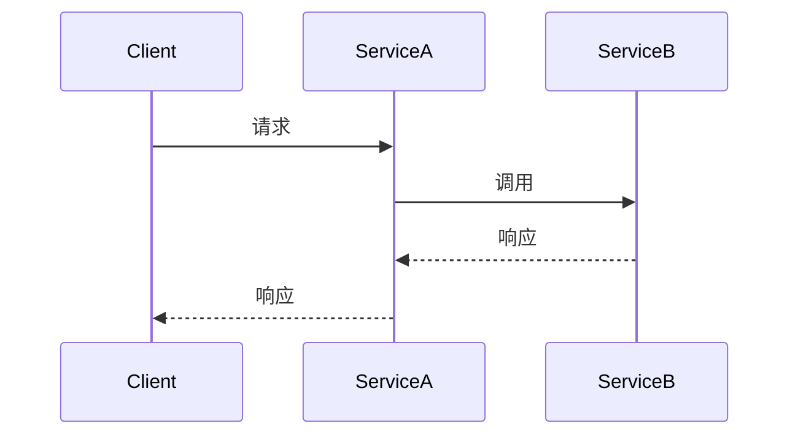

# 追踪与日志关联

在现代分布式系统中，追踪（Tracing）和日志（Logging）是两种重要的监控手段。追踪帮助我们理解请求在系统中的流动路径，而日志则记录了系统运行时的详细信息。将追踪与日志关联起来，可以让我们更高效地排查问题，理解系统的行为。

## 什么是追踪与日志关联？

追踪与日志关联是指将分布式追踪中的请求标识符（Trace ID）与日志中的相关信息关联起来。通过这种方式，我们可以在查看追踪数据时，快速找到与该请求相关的日志，从而更全面地了解请求的处理过程。

### 为什么需要追踪与日志关联？

在分布式系统中，一个请求可能会经过多个服务，每个服务都会生成自己的日志。如果没有追踪与日志的关联，我们很难将这些分散的日志串联起来，理解请求的完整处理过程。通过追踪与日志的关联，我们可以：

- 快速定位问题：通过追踪 ID 找到相关的日志，快速定位问题的根源。
- 提高排查效率：减少在不同日志文件中查找相关信息的时间。
- 全面理解系统行为：通过追踪和日志的结合，全面了解请求的处理流程和系统的运行状态。

## 如何在 Grafana Alloy 中实现追踪与日志关联？

在 Grafana Alloy 中，我们可以通过配置来实现追踪与日志的关联。以下是一个简单的示例，展示如何在 Alloy 中配置追踪与日志的关联。

### 1. 配置追踪

首先，我们需要在 Alloy 中配置分布式追踪。以下是一个简单的配置示例：

```yaml
tracing:
  enabled: true
  exporter:
    type: jaeger
    endpoint: "http://jaeger:14268/api/traces"
```

在这个配置中，我们启用了追踪，并配置了 Jaeger 作为追踪数据的导出器。

### 2. 配置日志

接下来，我们需要配置日志系统，确保日志中包含追踪 ID。以下是一个简单的日志配置示例：

```yaml
logging:
  level: info
  format: json
  fields:
    trace_id: "${trace_id}"
```

在这个配置中，我们设置了日志的格式为 JSON，并添加了一个 `trace_id` 字段，该字段将自动填充为当前请求的追踪 ID。

### 3. 查看追踪与日志

配置完成后，当请求经过系统时，Alloy 会自动将追踪 ID 注入到日志中。我们可以在 Jaeger 中查看追踪数据，并通过追踪 ID 快速找到相关的日志。

例如，假设我们有一个请求的追踪 ID 为 `abc123`，我们可以在 Jaeger 中查看该请求的追踪数据，并通过 `trace_id=abc123` 在日志系统中搜索相关的日志。

## 实际案例

假设我们有一个简单的微服务系统，包含两个服务：`Service A` 和 `Service B`。`Service A` 接收请求后，会调用 `Service B` 进行处理。以下是该系统的追踪与日志关联的示例。

### 1. 请求流程



### 2. 日志示例

在 `Service A` 和 `Service B` 中，日志可能如下所示：

```json
// Service A 日志
{
  "level": "info",
  "message": "Received request",
  "trace_id": "abc123",
  "service": "Service A"
}

// Service B 日志
{
  "level": "info",
  "message": "Processing request",
  "trace_id": "abc123",
  "service": "Service B"
}
```

通过追踪 ID `abc123`，我们可以在日志系统中快速找到这两个日志条目，从而理解请求的处理过程。

## 总结

追踪与日志关联是分布式系统中非常重要的监控手段。通过将追踪 ID 注入到日志中，我们可以快速定位问题、提高排查效率，并全面理解系统的行为。在 Grafana Alloy 中，我们可以通过简单的配置实现追踪与日志的关联，从而更好地监控和管理我们的系统。

## 附加资源

- [Grafana Alloy 官方文档](https://grafana.com/docs/alloy/latest/)
- [Jaeger 官方文档](https://www.jaegertracing.io/docs/)
- [分布式追踪与日志关联的最佳实践](https://opentelemetry.io/docs/concepts/observability-primer/)

## 练习

1. 在你的本地环境中配置 Grafana Alloy，并尝试实现追踪与日志的关联。
2. 创建一个简单的微服务系统，模拟请求流程，并查看追踪与日志的关联效果。
3. 尝试在 Jaeger 中查看追踪数据，并通过追踪 ID 查找相关的日志。

通过以上练习，你将更深入地理解追踪与日志关联的概念，并掌握在实际项目中应用的能力。