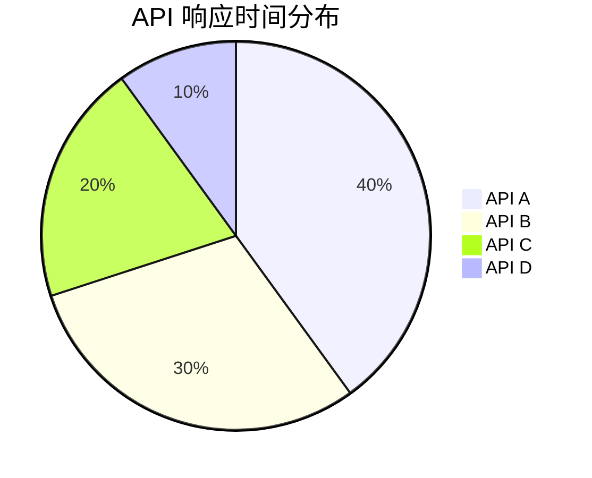

# 服务性能指标

在现代分布式系统中，服务性能指标是监控和优化应用程序性能的关键工具。通过收集和分析这些指标，开发者和运维团队可以更好地理解系统的行为，识别瓶颈，并采取相应的优化措施。本文将介绍服务性能指标的基本概念，并通过实际案例展示如何在 Grafana Alloy 分布式追踪中使用这些指标。

## 什么是服务性能指标？

服务性能指标（Service Performance Metrics）是用于衡量服务在特定时间段内表现的一组量化数据。这些指标通常包括响应时间、吞吐量、错误率等，帮助开发者和运维团队了解服务的健康状况和性能表现。

### 常见的服务性能指标

1. **响应时间（Response Time）**：服务处理请求并返回响应所需的时间。
2. **吞吐量（Throughput）**：单位时间内服务处理的请求数量。
3. **错误率（Error Rate）**：服务在处理请求时发生错误的比率。
4. **请求率（Request Rate）**：单位时间内服务接收到的请求数量。
5. **资源利用率（Resource Utilization）**：服务在运行过程中对 CPU、内存、磁盘等资源的占用情况。

## 如何在 Grafana Alloy 中收集服务性能指标

Grafana Alloy 是一个强大的分布式追踪工具，可以帮助你收集和分析服务性能指标。以下是一个简单的示例，展示如何在 Grafana Alloy 中配置和收集这些指标。

### 示例：配置 Grafana Alloy 收集响应时间

```yaml
tracing:
  enabled: true
  exporters:
    - name: jaeger
      endpoint: "http://jaeger:14268/api/traces"
  processors:
    - name: response_time
      type: histogram
      buckets: [0.1, 0.5, 1, 2, 5]
```

在这个配置中，我们启用了分布式追踪，并配置了一个 Jaeger 导出器来发送追踪数据。我们还定义了一个名为 `response_time` 的处理器，用于收集响应时间数据并将其存储在直方图中。

### 示例：查看响应时间数据

在 Grafana 中，你可以使用以下查询来查看服务的响应时间：

```promql
histogram_quantile(0.95, sum(rate(response_time_bucket[5m])) by (le))
```

这个查询将返回 95% 的请求的响应时间。

## 实际案例：优化电子商务网站的响应时间

假设你正在运营一个电子商务网站，用户反馈页面加载速度较慢。通过 Grafana Alloy 收集的响应时间数据，你发现某些 API 的响应时间明显高于其他 API。

### 步骤 1：识别瓶颈

首先，你可以在 Grafana 中查看各个 API 的响应时间分布：



从图中可以看出，`API A` 的响应时间占比最高，可能是性能瓶颈。

### 步骤 2：优化代码

通过进一步分析，你发现 `API A` 的数据库查询效率较低。你可以通过优化查询语句或增加缓存来减少响应时间。

### 步骤 3：验证优化效果

优化后，你再次查看响应时间数据，发现 `API A` 的响应时间显著下降，整体页面加载速度也有所提升。

## 总结

服务性能指标是监控和优化分布式系统性能的重要工具。通过 Grafana Alloy，你可以轻松收集和分析这些指标，识别性能瓶颈，并采取相应的优化措施。希望本文能帮助你更好地理解和使用服务性能指标。

## 附加资源

- [Grafana Alloy 官方文档](https://grafana.com/docs/alloy/latest/)
- [Prometheus 查询语言（PromQL）指南](https://prometheus.io/docs/prometheus/latest/querying/basics/)
- [分布式追踪入门指南](https://opentracing.io/docs/)

## 练习

1. 在你的本地环境中配置 Grafana Alloy，并尝试收集和查看服务性能指标。
2. 使用 PromQL 查询语言，编写一个查询来查看服务的错误率。
3. 尝试优化一个简单的 API，并使用 Grafana Alloy 验证优化效果。