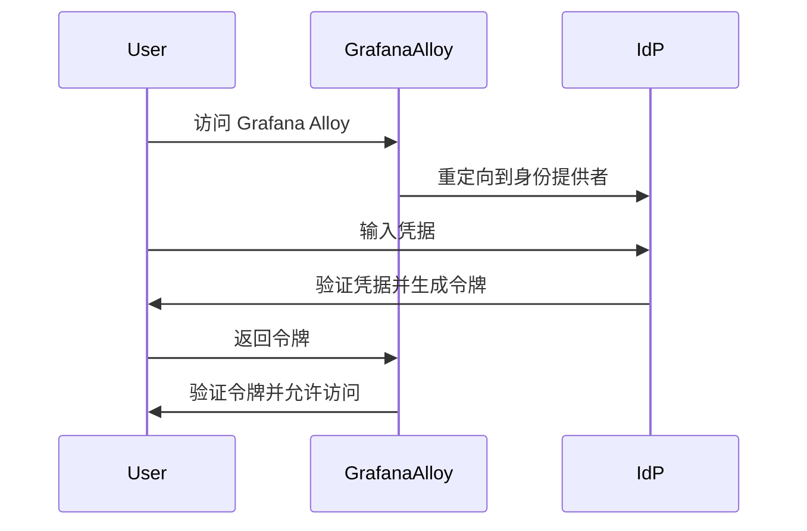

# 单点登录集成

在现代应用程序中，单点登录（Single Sign-On，简称 SSO）是一种重要的身份验证机制，它允许用户通过一次登录访问多个系统或服务。对于 Grafana Alloy 这样的监控和可视化工具，SSO 集成可以显著简化用户与团队管理流程，同时提高安全性。

本文将逐步介绍如何在 Grafana Alloy 中实现单点登录集成，并通过实际案例展示其应用场景。

## 什么是单点登录（SSO）？

单点登录是一种身份验证机制，允许用户使用一组凭据（如用户名和密码）登录多个系统或服务。SSO 的核心思想是通过一个中央身份提供者（Identity Provider，简称 IdP）来管理用户的身份验证，而不是在每个系统中单独管理。

在 Grafana Alloy 中，SSO 集成可以帮助管理员集中管理用户权限，减少重复登录的麻烦，并提高系统的安全性。

## 单点登录的工作原理

SSO 的工作原理通常涉及以下几个步骤：

1. **用户访问应用程序**：用户尝试访问 Grafana Alloy。
2. **重定向到身份提供者**：Grafana Alloy 将用户重定向到配置的身份提供者（如 Okta、Auth0 或 Google）。
3. **用户登录**：用户在身份提供者处输入凭据进行登录。
4. **身份验证**：身份提供者验证用户凭据，并生成一个令牌（通常是 JWT）。
5. **返回令牌**：身份提供者将令牌返回给 Grafana Alloy。
6. **验证令牌**：Grafana Alloy 验证令牌的有效性，并允许用户访问。



## 在 Grafana Alloy 中配置 SSO

以下是如何在 Grafana Alloy 中配置 SSO 的步骤：

### 1. 选择身份提供者

首先，你需要选择一个身份提供者。常见的身份提供者包括 Okta、Auth0、Google 和 Azure AD。每个身份提供者都有其独特的配置步骤，但基本流程相似。

### 2. 配置身份提供者

在身份提供者的管理控制台中，创建一个新的应用程序，并配置以下信息：

- **回调 URL**：这是 Grafana Alloy 在用户登录后接收令牌的 URL。通常格式为 `https://<your-grafana-alloy-domain>/login/callback`。
- **客户端 ID** 和 **客户端密钥**：这些是 Grafana Alloy 与身份提供者通信所需的凭据。

### 3. 在 Grafana Alloy 中配置 SSO

在 Grafana Alloy 的配置文件中，添加以下配置：

```yaml
auth:
  sso:
    enabled: true
    provider: "okta"  # 或其他身份提供者
    client_id: "your-client-id"
    client_secret: "your-client-secret"
    callback_url: "https://<your-grafana-alloy-domain>/login/callback"
```

### 4. 重启 Grafana Alloy

保存配置文件后，重启 Grafana Alloy 以使更改生效。

## 实际案例

假设你是一家公司的 IT 管理员，负责管理多个团队的 Grafana Alloy 实例。通过配置 SSO，你可以让所有员工使用公司统一的身份提供者（如 Okta）登录 Grafana Alloy，而无需为每个团队单独管理用户账户。

### 场景描述

- **用户**：公司员工
- **身份提供者**：Okta
- **目标**：简化 Grafana Alloy 的用户管理

### 实施步骤

1. 在 Okta 中创建一个新的应用程序，并配置回调 URL。
2. 在 Grafana Alloy 中配置 SSO，使用 Okta 提供的客户端 ID 和客户端密钥。
3. 重启 Grafana Alloy，并通知员工使用 Okta 登录。

### 结果

员工现在可以使用他们的 Okta 凭据登录 Grafana Alloy，而无需记住额外的用户名和密码。管理员可以通过 Okta 集中管理用户权限，确保只有授权用户能够访问 Grafana Alloy。

## 总结

单点登录（SSO）是一种强大的身份验证机制，可以显著简化用户与团队管理流程。通过在 Grafana Alloy 中配置 SSO，你可以提高系统的安全性，同时为用户提供更便捷的登录体验。

## 附加资源

- [Grafana Alloy 官方文档](https://grafana.com/docs/alloy/latest/)
- [Okta 开发者文档](https://developer.okta.com/docs/)
- [Auth0 官方文档](https://auth0.com/docs)

## 练习

1. 尝试在 Grafana Alloy 中配置 SSO，使用你选择的身份提供者。
2. 创建一个新的用户组，并配置不同的权限级别，观察 SSO 如何简化用户管理。
3. 探索其他身份提供者（如 Google 或 Azure AD）的配置步骤，并比较它们与 Okta 的异同。

:::tip
如果你在配置过程中遇到问题，可以参考 Grafana Alloy 的官方文档或社区论坛，获取更多帮助。
:::