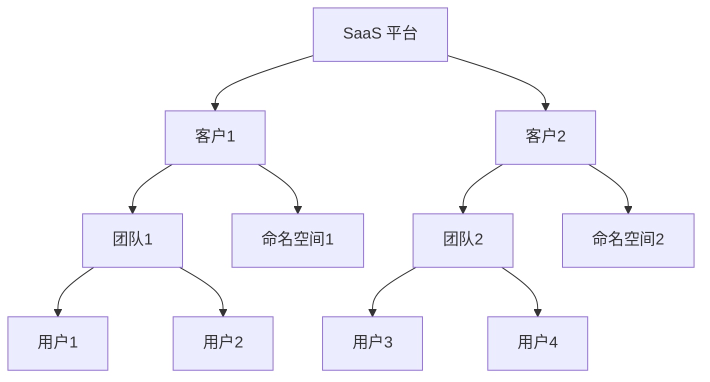

# 多租户管理

在现代应用程序和系统中，**多租户管理**是一个关键概念，尤其是在需要为多个用户或团队提供独立资源和服务的情况下。Grafana Alloy 提供了强大的多租户管理功能，允许管理员为不同的用户和团队分配独立的资源，并确保数据隔离和权限控制。

本文将逐步介绍如何在 Grafana Alloy 中实现多租户管理，并通过实际案例帮助您理解其应用场景。

## 什么是多租户管理？

多租户管理是指在一个共享的系统中，为多个用户或团队（租户）提供独立的资源和服务。每个租户的数据和配置都是隔离的，确保不同租户之间不会相互干扰。这种架构在 SaaS（软件即服务）平台中非常常见，因为它允许服务提供商高效地管理多个客户。

在 Grafana Alloy 中，多租户管理通过以下方式实现：
- **用户与团队管理**：为不同的用户和团队分配独立的权限和资源。
- **数据隔离**：确保每个租户的数据只能被授权的用户访问。
- **资源分配**：为每个租户分配独立的计算、存储和网络资源。

## 多租户管理的实现步骤

### 1. 创建用户和团队

首先，您需要为每个租户创建用户和团队。Grafana Alloy 提供了简单的 API 和界面来管理用户和团队。

```yaml
# 创建用户
apiVersion: v1
kind: User
metadata:
  name: user1
spec:
  email: user1@example.com
  teams:
    - team1

# 创建团队
apiVersion: v1
kind: Team
metadata:
  name: team1
spec:
  members:
    - user1
```

### 2. 分配资源

接下来，您需要为每个团队分配独立的资源。例如，您可以为每个团队分配独立的命名空间或数据库。

```yaml
# 为团队分配命名空间
apiVersion: v1
kind: Namespace
metadata:
  name: team1-namespace
spec:
  team: team1
```

### 3. 配置权限

确保每个团队只能访问其分配的资源。Grafana Alloy 提供了基于角色的访问控制（RBAC）来实现这一点。

```yaml
# 配置角色和权限
apiVersion: v1
kind: Role
metadata:
  name: team1-role
  namespace: team1-namespace
rules:
  - apiGroups: [""]
    resources: ["pods"]
    verbs: ["get", "list", "watch"]
```

### 4. 数据隔离

通过配置数据隔离策略，确保每个团队的数据只能被授权的用户访问。例如，您可以为每个团队配置独立的数据库实例。

```yaml
# 配置数据隔离
apiVersion: v1
kind: Database
metadata:
  name: team1-db
spec:
  team: team1
  isolationPolicy: strict
```

## 实际案例

假设您正在开发一个 SaaS 平台，为多个客户提供监控服务。每个客户都需要独立的监控数据和配置。通过 Grafana Alloy 的多租户管理功能，您可以为每个客户创建独立的团队和命名空间，并分配独立的资源。



在这个案例中，客户1和客户2的数据和配置是完全隔离的，确保他们不会相互干扰。

## 总结

多租户管理是 Grafana Alloy 中一个强大的功能，允许您为多个用户和团队提供独立的资源和服务。通过创建用户和团队、分配资源、配置权限和数据隔离，您可以确保每个租户的数据和配置都是安全的。

:::tip
如果您想进一步了解多租户管理，可以参考以下资源：
- [Grafana Alloy 官方文档](https://grafana.com/docs/alloy/latest/)
- [多租户架构设计指南](https://www.example.com/multi-tenant-architecture)
:::

:::caution
在实际应用中，请确保为每个租户配置足够的资源，以避免资源争用问题。
:::

## 附加练习

1. 尝试在 Grafana Alloy 中创建一个新的团队，并为其分配独立的命名空间和资源。
2. 配置一个角色，确保该团队只能访问其分配的资源。
3. 测试数据隔离策略，确保不同团队之间的数据不会相互干扰。