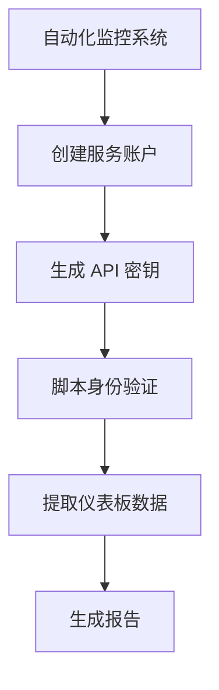

# 服务账户设置

在 Grafana Alloy 中，服务账户（Service Accounts）是一种特殊的账户类型，用于自动化任务和系统集成。与普通用户账户不同，服务账户通常用于程序或脚本访问 Grafana Alloy 的 API 或执行特定任务。通过服务账户，您可以更好地控制权限分配，确保系统的安全性和可管理性。

## 什么是服务账户？

服务账户是一种无用户交互的账户类型，通常用于自动化任务。它们可以拥有特定的权限，并且可以通过 API 密钥或令牌进行身份验证。服务账户的主要用途包括：

- 自动化数据收集和监控
- 集成第三方工具
- 执行定期任务或脚本

## 创建服务账户

在 Grafana Alloy 中创建服务账户非常简单。以下是逐步指南：

1. **登录 Grafana Alloy**：使用管理员账户登录到 Grafana Alloy 控制台。
2. **导航到用户管理**：在左侧导航栏中，点击“用户与团队管理”。
3. **创建服务账户**：点击“服务账户”选项卡，然后点击“新建服务账户”按钮。
4. **填写服务账户信息**：输入服务账户的名称和描述，并选择适当的权限。
5. **生成 API 密钥**：创建服务账户后，系统会生成一个 API 密钥。请妥善保存此密钥，因为它将用于身份验证。

```yaml
# 示例：创建服务账户的 YAML 配置
service_account:
  name: "monitoring-bot"
  description: "用于自动化监控的服务账户"
  permissions:
    - "read:dashboards"
    - "write:alerts"
```

## 管理服务账户权限

服务账户的权限管理是确保系统安全的关键。您可以根据需要为服务账户分配不同的权限。以下是一些常见的权限：

- `read:dashboards`：允许读取仪表板数据
- `write:dashboards`：允许创建或修改仪表板
- `read:alerts`：允许读取警报
- `write:alerts`：允许创建或修改警报

:::tip
建议遵循最小权限原则，即只授予服务账户完成任务所需的最低权限。
:::

## 使用服务账户进行身份验证

创建服务账户后，您可以使用生成的 API 密钥进行身份验证。以下是一个使用 Python 脚本通过 API 密钥访问 Grafana Alloy 的示例：

```python
import requests

url = "https://your-grafana-alloy-instance/api/dashboards"
headers = {
    "Authorization": "Bearer YOUR_API_KEY"
}

response = requests.get(url, headers=headers)
print(response.json())
```

## 实际应用场景

假设您有一个自动化监控系统，需要定期从 Grafana Alloy 中提取仪表板数据并生成报告。您可以通过以下步骤实现：

1. 创建一个名为 `reporting-bot` 的服务账户，并授予 `read:dashboards` 权限。
2. 使用生成的 API 密钥在脚本中进行身份验证。
3. 编写脚本定期提取数据并生成报告。



## 总结

服务账户是 Grafana Alloy 中管理自动化任务和系统集成的强大工具。通过合理配置服务账户和权限，您可以确保系统的安全性和高效性。希望本文能帮助您更好地理解和使用服务账户。

## 附加资源

- [Grafana Alloy 官方文档](https://grafana.com/docs/alloy/latest/)
- [API 密钥管理最佳实践](https://grafana.com/docs/grafana/latest/administration/api-keys/)

## 练习

1. 创建一个名为 `backup-bot` 的服务账户，并授予 `read:dashboards` 和 `read:alerts` 权限。
2. 编写一个 Python 脚本，使用 API 密钥从 Grafana Alloy 中提取警报数据并保存到本地文件。