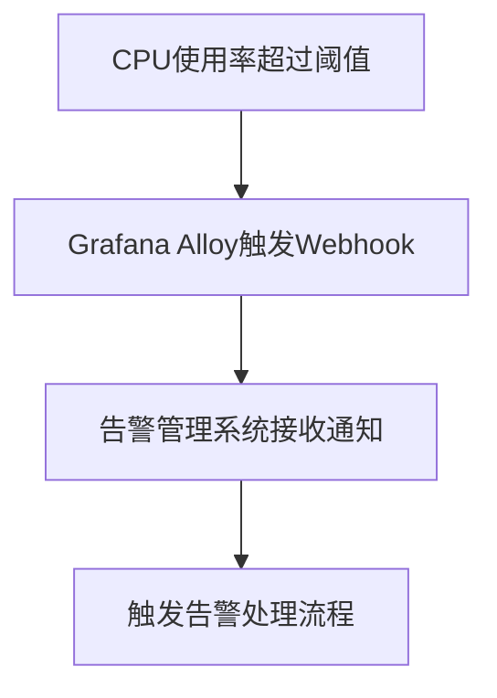
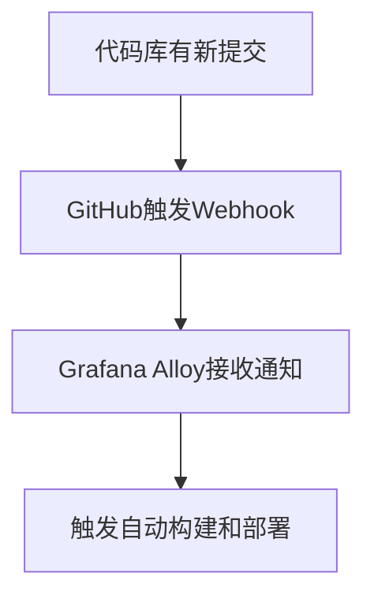

# Webhook集成

在现代应用程序和系统中，Webhook是一种常见的机制，用于实现系统间的实时通信和数据传输。通过Webhook，一个系统可以在特定事件发生时，自动向另一个系统发送HTTP请求，从而触发相应的操作或更新。本文将详细介绍如何在Grafana Alloy中使用Webhook集成，并通过实际案例展示其应用场景。

## 什么是Webhook？

Webhook是一种基于HTTP的回调机制，允许一个系统在特定事件发生时，向另一个系统发送实时通知。与传统的轮询机制不同，Webhook采用“推送”模式，即事件触发后立即发送数据，从而减少了不必要的资源消耗和延迟。

:::tip
Webhook通常用于自动化工作流、实时数据同步和事件驱动的应用程序中。
:::

## 在Grafana Alloy中配置Webhook

Grafana Alloy提供了强大的API和集成功能，使得配置Webhook变得非常简单。以下是一个基本的Webhook配置示例：

```yaml
webhook_configs:
  - url: "https://example.com/webhook"
    method: "POST"
    headers:
      Content-Type: "application/json"
    body: |
      {
        "event": "{{ .Event }}",
        "timestamp": "{{ .Timestamp }}",
        "data": "{{ .Data }}"
      }
```

### 配置解析

- **url**: Webhook的目标URL，即接收通知的服务器地址。
- **method**: HTTP请求方法，通常为`POST`。
- **headers**: 请求头，用于指定内容类型或其他自定义头部信息。
- **body**: 请求体，包含要发送的数据。可以使用模板语法动态生成内容。

### 示例输入与输出

假设我们有一个事件触发了Webhook，以下是可能的输入和输出：

**输入事件：**
```json
{
  "Event": "alert_fired",
  "Timestamp": "2023-10-01T12:00:00Z",
  "Data": {
    "alert_name": "High CPU Usage",
    "severity": "critical"
  }
}
```

**Webhook发送的请求：**
```json
{
  "event": "alert_fired",
  "timestamp": "2023-10-01T12:00:00Z",
  "data": {
    "alert_name": "High CPU Usage",
    "severity": "critical"
  }
}
```

## 实际应用场景

### 场景1：监控告警通知

假设你正在使用Grafana Alloy监控服务器的CPU使用率。当CPU使用率超过阈值时，Grafana Alloy可以通过Webhook向你的告警管理系统发送通知，触发相应的告警处理流程。



### 场景2：自动化部署

在持续集成/持续部署（CI/CD）流程中，Webhook可以用于自动化部署。例如，当代码库中有新的提交时，GitHub可以通过Webhook通知Grafana Alloy，触发自动构建和部署流程。



## 总结

Webhook是一种强大的工具，能够实现系统间的实时通信和自动化操作。通过Grafana Alloy的Webhook集成功能，你可以轻松地将监控告警、自动化部署等场景与外部系统无缝连接。希望本文能帮助你理解并掌握Webhook的基本概念和配置方法。

## 附加资源与练习

- **练习1**: 尝试在Grafana Alloy中配置一个Webhook，用于接收和处理来自GitHub的推送事件。
- **练习2**: 创建一个Webhook，当服务器磁盘空间不足时，自动发送通知到你的Slack频道。

:::note
更多关于Grafana Alloy的Webhook配置和API文档，请参考[官方文档](https://grafana.com/docs/alloy/latest/)。
:::