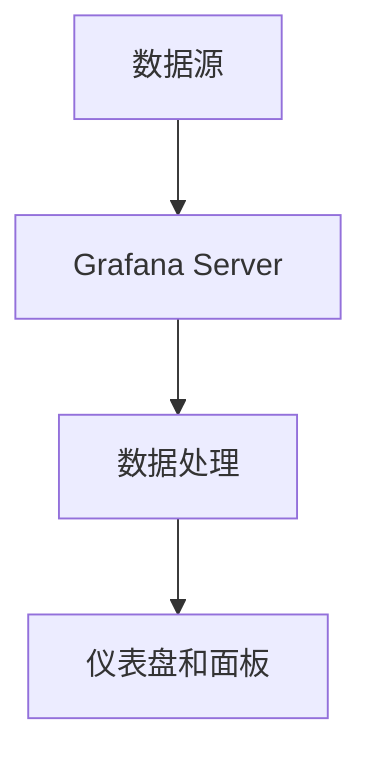

# Grafana 架构概述

Grafana 是一个开源的监控和可视化工具，广泛用于实时监控、分析和展示时间序列数据。它支持多种数据源，如 Prometheus、InfluxDB、Elasticsearch 等，并提供了丰富的可视化选项，帮助用户更好地理解数据。本文将介绍 Grafana 的基本架构，帮助初学者理解其工作原理。

## Grafana 的核心组件

Grafana 的架构主要由以下几个核心组件组成：

1. **Grafana Server**：这是 Grafana 的核心服务，负责处理用户的请求、渲染仪表盘、管理数据源等。
2. **数据源（Data Sources）**：Grafana 支持多种数据源，用户可以通过配置数据源来连接不同的数据库或监控系统。
3. **仪表盘（Dashboards）**：仪表盘是 Grafana 中用于展示数据的界面，用户可以通过拖拽组件来创建自定义的监控视图。
4. **面板（Panels）**：面板是仪表盘中的基本单元，用于展示特定的数据或图表。
5. **插件（Plugins）**：Grafana 支持插件扩展，用户可以通过安装插件来增加新的数据源、面板类型或功能。

## Grafana 的数据流

Grafana 的数据流可以简单描述为以下几个步骤：

1. **数据采集**：数据从各种数据源（如 Prometheus、InfluxDB 等）中采集。
2. **数据传输**：采集到的数据通过 HTTP 或其他协议传输到 Grafana Server。
3. **数据处理**：Grafana Server 对数据进行处理，并根据用户配置的查询条件过滤和聚合数据。
4. **数据展示**：处理后的数据通过仪表盘和面板展示给用户。

## 实际应用场景

假设你正在监控一个 Web 应用的性能，你可能会使用 Prometheus 来采集应用的指标数据，然后通过 Grafana 来展示这些数据。以下是一个简单的配置示例：

1. **配置 Prometheus 数据源**：
   - 在 Grafana 中，进入 "Configuration" -> "Data Sources"。
   - 点击 "Add data source"，选择 "Prometheus"。
   - 输入 Prometheus 服务器的 URL，然后点击 "Save & Test"。

2. **创建仪表盘**：
   - 进入 "Dashboards" -> "New Dashboard"。
   - 点击 "Add new panel"，选择 "Graph" 面板。
   - 在查询编辑器中输入 PromQL 查询语句，例如 `rate(http_requests_total[1m])`，然后点击 "Apply"。

3. **查看数据**：
   - 保存仪表盘后，你可以在面板中看到实时的 HTTP 请求速率图表。

## 总结

Grafana 是一个功能强大的监控和可视化工具，其架构设计简单而灵活，能够支持多种数据源和插件扩展。通过理解 Grafana 的核心组件和数据流，你可以更好地利用它来监控和分析你的系统。

## 附加资源

- [Grafana 官方文档](https://grafana.com/docs/)
- [Prometheus 官方文档](https://prometheus.io/docs/)
- [InfluxDB 官方文档](https://docs.influxdata.com/influxdb/)

## 练习

1. 尝试在 Grafana 中配置一个新的数据源，例如 InfluxDB。
2. 创建一个新的仪表盘，并使用不同的面板类型（如 Table、Stat 等）来展示数据。
3. 安装一个 Grafana 插件，并尝试使用它来扩展 Grafana 的功能。

:::tip
如果你在配置过程中遇到问题，可以参考 Grafana 的官方文档或社区论坛，那里有丰富的资源和解决方案。
:::