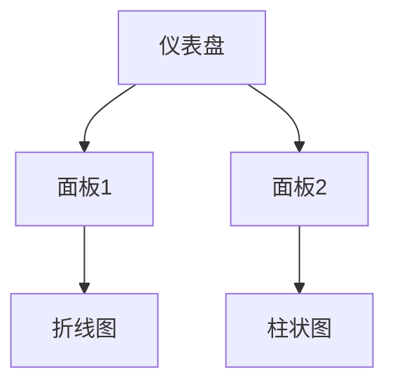

## 介绍

Grafana 是一个开源的可视化和监控平台，广泛用于实时数据分析和展示。无论您是监控服务器性能、分析应用程序日志，还是跟踪业务指标，Grafana 都能为您提供强大的可视化工具。本文将带您全面了解 Grafana 的用户界面，帮助您快速上手。

## Grafana 界面概览

Grafana 的用户界面设计简洁直观，主要由以下几个部分组成：

1. **侧边栏（Sidebar）**
2. **仪表盘（Dashboard）**
3. **面板（Panel）**
4. **导航栏（Navigation Bar）**
5. **工具栏（Toolbar）**

### 1. 侧边栏（Sidebar）

侧边栏是 Grafana 界面的核心导航区域，位于屏幕左侧。它提供了快速访问仪表盘、数据源、插件和管理功能的方式。

- **仪表盘（Dashboards）**：点击此处可以查看和管理您的仪表盘。
- **数据源（Data Sources）**：配置和管理 Grafana 连接的数据源，如 Prometheus、InfluxDB 等。
- **插件（Plugins）**：安装和管理 Grafana 插件，扩展其功能。
- **管理（Administration）**：系统设置、用户管理和权限控制。

:::tip
您可以通过点击侧边栏顶部的 Grafana 图标来折叠或展开侧边栏，以便获得更大的工作空间。
:::

### 2. 仪表盘（Dashboard）

仪表盘是 Grafana 的核心功能之一，用于展示和监控数据。每个仪表盘可以包含多个面板，每个面板可以显示不同的数据可视化图表。

- **创建仪表盘**：点击侧边栏中的 "Dashboards"，然后选择 "New Dashboard" 即可创建一个新的仪表盘。
- **编辑仪表盘**：在仪表盘页面，点击右上角的 "Edit" 按钮，可以进入编辑模式，添加或修改面板。

### 3. 面板（Panel）

面板是仪表盘的基本构建块，用于显示数据可视化图表。Grafana 支持多种类型的面板，包括折线图、柱状图、饼图、表格等。

- **添加面板**：在编辑模式下，点击 "Add Panel" 按钮，选择您需要的图表类型。
- **配置面板**：每个面板都可以配置数据源、查询、显示选项等。例如，您可以选择从 Prometheus 查询 CPU 使用率，并将其显示为折线图。

### 4. 导航栏（Navigation Bar）

导航栏位于屏幕顶部，提供了全局搜索、用户设置、帮助文档等功能的快捷入口。

- **搜索**：通过搜索栏，您可以快速查找仪表盘、面板或数据源。
- **用户设置**：点击用户图标，可以访问个人资料、偏好设置和退出登录。
- **帮助**：点击问号图标，可以访问 Grafana 的官方文档和社区支持。

### 5. 工具栏（Toolbar）

工具栏位于仪表盘页面的顶部，提供了仪表盘操作的相关功能。

- **保存（Save）**：保存当前仪表盘的更改。
- **分享（Share）**：生成仪表盘的分享链接或嵌入代码。
- **刷新（Refresh）**：手动刷新仪表盘中的数据。
- **时间范围（Time Range）**：设置仪表盘显示的时间范围，如最近 1 小时、最近 24 小时等。

## 实际案例

假设您正在监控一个 Web 服务器的性能，您可以使用 Grafana 创建一个仪表盘来展示以下指标：

1. **CPU 使用率**：使用折线图显示服务器的 CPU 使用率。
2. **内存使用情况**：使用柱状图显示服务器的内存使用情况。
3. **请求响应时间**：使用表格显示每个请求的响应时间。

通过 Grafana 的界面，您可以轻松配置这些面板，并实时监控服务器的性能。

## 总结

Grafana 的用户界面设计简洁直观，功能强大。通过本文的介绍，您应该已经对 Grafana 的界面有了基本的了解。接下来，您可以尝试创建一个自己的仪表盘，并探索更多高级功能。

## 附加资源

- [Grafana 官方文档](https://grafana.com/docs/)
- [Grafana 社区论坛](https://community.grafana.com/)
- [Grafana 插件库](https://grafana.com/grafana/plugins/)

## 练习

1. 创建一个新的仪表盘，并添加一个折线图面板，显示 CPU 使用率。
2. 配置一个数据源，连接到 Prometheus 或 InfluxDB。
3. 尝试使用不同的时间范围，观察数据的变化。

祝您在 Grafana 的学习之旅中取得成功！