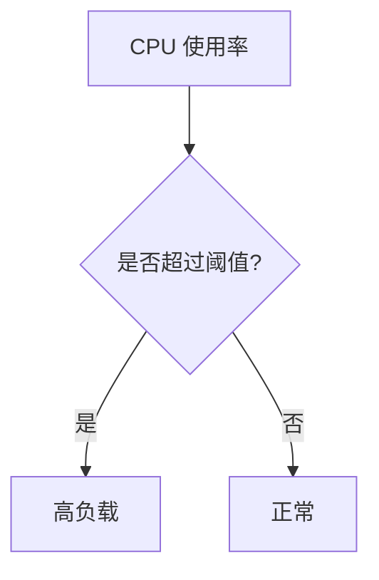

# 高负载处理

在高负载情况下，Grafana 可能会面临性能瓶颈，导致响应时间变慢甚至服务中断。本文将介绍如何识别和处理 Grafana 的高负载问题，并提供一些优化建议和实际案例。

## 什么是高负载？

高负载通常指的是系统资源（如 CPU、内存、磁盘 I/O 或网络带宽）的使用率接近或达到其最大容量。对于 Grafana 来说，高负载可能表现为：

- 仪表板加载缓慢
- 查询响应时间增加
- 数据源连接超时
- 服务崩溃或重启

## 识别高负载

### 1. 监控系统资源

使用 Grafana 自带的监控功能或外部工具（如 Prometheus）来监控系统资源的使用情况。重点关注以下指标：

- CPU 使用率
- 内存使用率
- 磁盘 I/O
- 网络带宽



### 2. 分析日志

检查 Grafana 的日志文件，查找可能的错误或警告信息。常见的日志路径为 `/var/log/grafana/grafana.log`。

```bash
tail -f /var/log/grafana/grafana.log
```

### 3. 使用 Grafana 的仪表板

Grafana 提供了内置的仪表板来监控其自身的性能。通过查看这些仪表板，可以快速识别潜在的性能问题。

## 处理高负载

### 1. 优化查询

高负载的一个常见原因是复杂的查询。优化查询可以减少对系统资源的消耗。

#### 示例：优化 Prometheus 查询

原始查询：
```promql
rate(http_requests_total[1m])
```

优化后的查询：
```promql
rate(http_requests_total[1m])[5m:1m]
```

### 2. 增加资源

如果系统资源不足，可以考虑增加 CPU、内存或存储资源。对于云环境，可以轻松地扩展实例。

### 3. 使用缓存

启用 Grafana 的缓存功能可以减少对数据源的频繁查询，从而降低负载。

```yaml
[grafana.ini]
[cache]
enabled = true
```

### 4. 分布式部署

对于大规模部署，可以考虑将 Grafana 部署在多个节点上，使用负载均衡器分发请求。

## 实际案例

### 案例 1：电商平台的 Grafana 高负载

某电商平台在促销活动期间，Grafana 的 CPU 使用率飙升至 90% 以上，导致仪表板加载缓慢。通过以下步骤解决了问题：

1. **优化查询**：简化了 Prometheus 查询，减少了不必要的计算。
2. **增加资源**：将 Grafana 实例的 CPU 和内存资源翻倍。
3. **启用缓存**：启用了 Grafana 的缓存功能，减少了数据源的查询频率。

### 案例 2：金融系统的 Grafana 高负载

某金融系统的 Grafana 在高频交易时段出现服务中断。通过以下步骤解决了问题：

1. **分布式部署**：将 Grafana 部署在多个节点上，使用负载均衡器分发请求。
2. **监控日志**：定期检查日志，及时发现并处理潜在问题。

## 总结

处理 Grafana 的高负载问题需要综合运用多种策略，包括优化查询、增加资源、使用缓存和分布式部署。通过监控系统资源和日志，可以及时发现并解决高负载问题，确保 Grafana 的稳定运行。

## 附加资源

- [Grafana 官方文档](https://grafana.com/docs/)
- [Prometheus 查询优化指南](https://prometheus.io/docs/prometheus/latest/querying/basics/)
- [Grafana 缓存配置](https://grafana.com/docs/grafana/latest/administration/configuration/#cache)

## 练习

1. 在你的 Grafana 实例中启用缓存，并观察性能变化。
2. 尝试优化一个复杂的 Prometheus 查询，记录优化前后的性能差异。
3. 部署一个分布式 Grafana 环境，并使用负载均衡器进行测试。

:::tip
在处理高负载问题时，建议逐步实施优化措施，并持续监控系统性能，以确保每个步骤都有效果。
:::