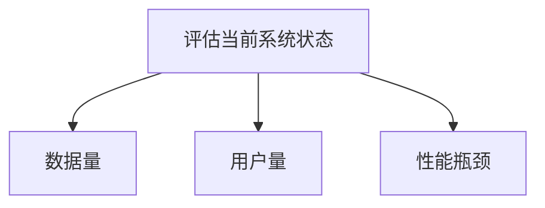

# 扩展性规划

在 Grafana 运维管理中，**扩展性规划**是一个至关重要的概念。它指的是通过合理的设计和配置，确保系统能够随着数据量、用户量或业务需求的增长而高效运行。无论是监控大规模分布式系统，还是处理海量数据，扩展性规划都能帮助您避免性能瓶颈和资源浪费。

## 什么是扩展性规划？

扩展性规划的核心目标是确保系统能够在不显著增加成本或复杂性的情况下，应对未来的增长需求。这通常涉及以下几个方面：

1. **水平扩展**：通过增加更多的节点或实例来分担负载。
2. **垂直扩展**：通过提升单个节点的硬件性能（如 CPU、内存）来应对更高的负载。
3. **架构优化**：通过优化系统架构（如数据分片、缓存策略）来提高整体性能。

:::tip
扩展性规划不仅仅是技术问题，还需要考虑业务需求、预算限制和运维团队的技能水平。
:::

## 为什么扩展性规划重要？

在 Grafana 运维管理中，扩展性规划的重要性体现在以下几个方面：

- **应对数据增长**：随着业务的发展，监控数据量可能会急剧增加。如果没有扩展性规划，系统可能会因为数据过载而崩溃。
- **支持更多用户**：随着用户数量的增加，Grafana 的查询负载也会增加。扩展性规划可以确保系统在高并发情况下依然稳定运行。
- **降低成本**：通过合理的扩展性规划，可以避免不必要的资源浪费，从而降低运维成本。

## 扩展性规划的关键步骤

### 1. 评估当前系统状态

在开始扩展性规划之前，首先需要评估当前系统的状态。这包括：

- **数据量**：当前系统处理的数据量是多少？未来预计会增长到多少？
- **用户量**：当前有多少用户在使用 Grafana？未来预计会增加多少？
- **性能瓶颈**：当前系统是否存在性能瓶颈？如果有，是什么原因导致的？



### 2. 选择合适的扩展策略

根据评估结果，选择合适的扩展策略。常见的扩展策略包括：

- **水平扩展**：适用于需要处理大量并发请求的场景。例如，可以通过增加 Grafana 实例的数量来分担查询负载。
- **垂直扩展**：适用于单个节点性能不足的场景。例如，可以通过升级服务器的 CPU 或内存来提高性能。
- **混合扩展**：结合水平扩展和垂直扩展，以应对复杂的业务需求。

:::caution
在选择扩展策略时，务必考虑成本和运维复杂度。水平扩展虽然灵活，但可能会增加运维难度。
:::

### 3. 实施扩展性规划

在确定了扩展策略后，接下来就是实施扩展性规划。以下是一个简单的示例，展示如何通过水平扩展来增加 Grafana 实例的数量：

```bash
# 启动多个 Grafana 实例
docker run -d --name grafana1 -p 3000:3000 grafana/grafana
docker run -d --name grafana2 -p 3001:3000 grafana/grafana
```

通过这种方式，您可以将查询负载分散到多个 Grafana 实例上，从而提高系统的整体性能。

### 4. 监控和优化

扩展性规划并不是一次性的工作，而是一个持续的过程。在实施扩展性规划后，您需要持续监控系统的性能，并根据实际情况进行优化。

例如，您可以使用 Prometheus 和 Grafana 本身来监控系统的性能指标：

```yaml
# Prometheus 配置文件示例
scrape_configs:
  - job_name: 'grafana'
    static_configs:
      - targets: ['grafana1:3000', 'grafana2:3000']
```

通过这种方式，您可以实时了解系统的运行状态，并及时发现潜在的性能问题。

## 实际案例：电商平台的 Grafana 扩展性规划

假设您正在为一个电商平台运维 Grafana 系统。随着业务的增长，平台的监控数据量和用户量都在快速增加。为了确保系统能够稳定运行，您需要进行扩展性规划。

1. **评估当前系统状态**：当前系统每天处理 1TB 的监控数据，有 100 个活跃用户。预计未来一年内，数据量将增长到 5TB，用户量将增加到 500 人。
2. **选择合适的扩展策略**：由于数据量和用户量都在快速增长，您决定采用水平扩展策略，增加 Grafana 实例的数量。
3. **实施扩展性规划**：您通过 Docker 启动了 5 个 Grafana 实例，并使用负载均衡器将查询请求分散到这些实例上。
4. **监控和优化**：您使用 Prometheus 和 Grafana 监控系统的性能，并根据监控数据调整实例数量和配置。

通过这种方式，您成功地为电商平台的 Grafana 系统进行了扩展性规划，确保了系统的稳定运行。

## 总结

扩展性规划是 Grafana 运维管理中的一个关键环节。通过合理的扩展性规划，您可以确保系统能够随着业务需求的增长而高效运行。无论是水平扩展、垂直扩展还是混合扩展，都需要根据实际情况进行选择和实施。

:::note
扩展性规划是一个持续的过程，需要不断监控和优化。只有这样，才能确保系统始终处于最佳状态。
:::

## 附加资源

- [Grafana 官方文档](https://grafana.com/docs/)
- [Prometheus 官方文档](https://prometheus.io/docs/)
- [Docker 官方文档](https://docs.docker.com/)

## 练习

1. 尝试在本地环境中启动多个 Grafana 实例，并使用负载均衡器将查询请求分散到这些实例上。
2. 使用 Prometheus 和 Grafana 监控系统的性能，并根据监控数据调整实例数量和配置。
3. 思考如何在您的业务场景中应用扩展性规划，并制定一个详细的扩展性规划方案。