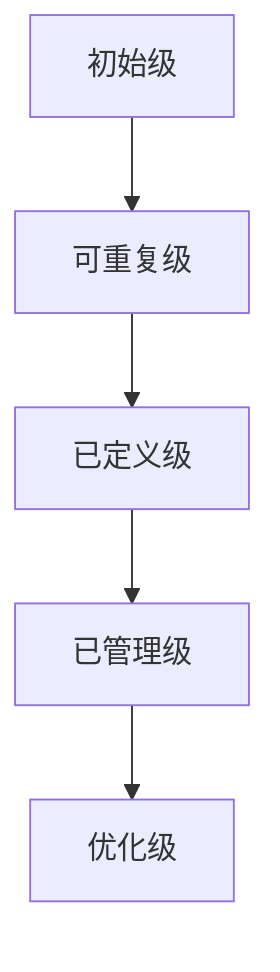

# 可观测性成熟度评估

在现代软件开发和运维中，**可观测性**（Observability）是一个至关重要的概念。它不仅仅是监控的延伸，更是一种通过数据理解系统行为的能力。为了确保系统的可观测性达到预期水平，我们需要对其进行**成熟度评估**。本文将详细介绍可观测性成熟度评估的概念、方法以及实际应用。

## 什么是可观测性成熟度评估？

可观测性成熟度评估是一种系统化的方法，用于衡量一个系统在可观测性方面的成熟度。它帮助团队了解当前系统的可观测性水平，并识别改进的机会。成熟度评估通常包括以下几个维度：

1. **数据收集**：系统是否能够收集足够的数据？
2. **数据存储**：数据是否被有效地存储和管理？
3. **数据分析**：是否能够从数据中提取有用的信息？
4. **可视化**：数据是否以易于理解的方式呈现？
5. **告警与自动化**：系统是否能够自动检测问题并发出告警？

## 可观测性成熟度模型

为了更系统地评估可观测性成熟度，我们可以使用一个简单的成熟度模型。以下是一个常见的五级模型：



1. **初始级**：系统几乎没有可观测性工具或流程。
2. **可重复级**：系统开始使用基本的监控工具，但缺乏一致性。
3. **已定义级**：系统建立了可观测性标准，并开始使用更高级的工具。
4. **已管理级**：系统能够有效地管理和分析数据，并具备一定的自动化能力。
5. **优化级**：系统持续优化可观测性流程，并能够预测和预防问题。

## 实际案例：评估一个微服务架构的可观测性

假设我们有一个基于微服务架构的电子商务平台。我们将使用上述成熟度模型来评估其可观测性。

### 1. 数据收集

在初始级，我们可能只收集了基本的系统指标，如 CPU 和内存使用率。随着成熟度的提升，我们开始收集更多的业务指标，如订单处理时间和用户登录成功率。

```python
# 示例：收集订单处理时间
def collect_order_processing_time(order_id):
    start_time = time.time()
    process_order(order_id)
    end_time = time.time()
    processing_time = end_time - start_time
    return processing_time
```

### 2. 数据存储

在可重复级，我们可能将数据存储在本地文件中。随着成熟度的提升，我们开始使用集中化的存储解决方案，如 Prometheus 或 Elasticsearch。

```bash
# 示例：将数据存储到 Prometheus
prometheus_metric = "order_processing_time_seconds"
prometheus_value = processing_time
prometheus_labels = {"order_id": order_id}
```

### 3. 数据分析

在已定义级，我们开始使用工具如 Grafana 来可视化数据，并通过查询语言（如 PromQL）来分析数据。

```promql
# 示例：查询平均订单处理时间
avg(order_processing_time_seconds)
```

### 4. 可视化

在已管理级，我们使用 Grafana 创建仪表盘，实时监控关键指标。


### 5. 告警与自动化

在优化级，我们设置告警规则，并在检测到异常时自动触发修复流程。

```yaml
# 示例：Prometheus 告警规则
groups:
- name: order_processing
  rules:
  - alert: HighOrderProcessingTime
    expr: avg(order_processing_time_seconds) > 5
    for: 5m
    labels:
      severity: critical
    annotations:
      summary: "High order processing time detected"
```

## 总结

可观测性成熟度评估是确保系统可观测性达到预期水平的关键步骤。通过使用成熟度模型，我们可以系统地评估和改进系统的可观测性。希望本文的内容能够帮助你更好地理解和应用这一概念。

## 附加资源与练习

- **练习**：尝试评估你当前项目的可观测性成熟度，并制定改进计划。
- **资源**：
  - [Grafana 官方文档](https://grafana.com/docs/)
  - [Prometheus 官方文档](https://prometheus.io/docs/)
  - [可观测性最佳实践](https://www.oreilly.com/library/view/distributed-systems-observability/9781492033431/)

:::tip
**提示**：在实际应用中，可观测性成熟度评估是一个持续的过程。定期评估和改进是确保系统可观测性持续优化的关键。
:::