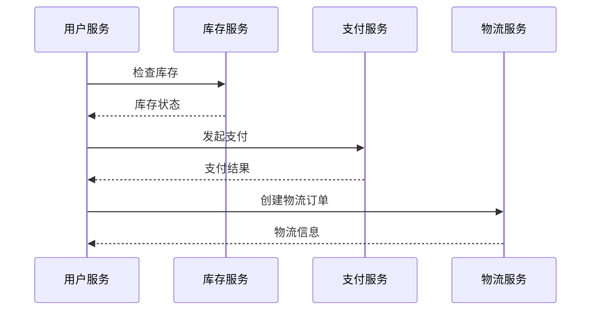

# 分布式追踪配置

在现代的微服务架构中，应用程序通常由多个独立的服务组成，这些服务分布在不同的服务器或容器中。为了有效地监控和调试这些分布式系统，分布式追踪（Distributed Tracing）成为了一个不可或缺的工具。本文将详细介绍如何配置分布式追踪，并展示其在实际应用中的使用场景。

## 什么是分布式追踪？

分布式追踪是一种用于监控和调试分布式系统的技术。它通过记录请求在系统中的传播路径，帮助开发人员理解请求在不同服务之间的流动情况。每个请求都会被分配一个唯一的追踪ID，并在系统中传播，从而形成一个完整的调用链。

## 为什么需要分布式追踪？

在微服务架构中，一个请求可能会经过多个服务，每个服务都可能对请求进行处理或转发。如果没有分布式追踪，开发人员将难以定位性能瓶颈或调试错误。分布式追踪可以帮助我们：

- 识别性能瓶颈
- 调试复杂的调用链
- 监控系统的健康状况

## 配置分布式追踪

### 1. 选择追踪工具

目前市面上有许多分布式追踪工具，如 [Jaeger](https://www.jaegertracing.io/)、[Zipkin](https://zipkin.io/)、[OpenTelemetry](https://opentelemetry.io/) 等。本文将以 OpenTelemetry 为例，介绍如何配置分布式追踪。

### 2. 安装 OpenTelemetry SDK

首先，我们需要在应用程序中安装 OpenTelemetry SDK。以 Python 为例，可以使用以下命令安装：

```bash
pip install opentelemetry-api opentelemetry-sdk opentelemetry-instrumentation
```

### 3. 配置 OpenTelemetry

接下来，我们需要配置 OpenTelemetry 以启用分布式追踪。以下是一个简单的配置示例：

```python
from opentelemetry import trace
from opentelemetry.sdk.trace import TracerProvider
from opentelemetry.sdk.trace.export import BatchSpanProcessor, ConsoleSpanExporter

# 设置 TracerProvider
trace.set_tracer_provider(TracerProvider())

# 创建 ConsoleSpanExporter，将追踪信息输出到控制台
exporter = ConsoleSpanExporter()

# 创建 BatchSpanProcessor，并将 exporter 添加到其中
span_processor = BatchSpanProcessor(exporter)

# 将 span_processor 添加到 TracerProvider
trace.get_tracer_provider().add_span_processor(span_processor)

# 获取 Tracer
tracer = trace.get_tracer(__name__)
```

### 4. 创建追踪

现在，我们可以使用 `tracer` 来创建追踪。以下是一个简单的示例：

```python
with tracer.start_as_current_span("example-span"):
    # 在这里执行一些操作
    print("This is a traced operation")
```

### 5. 查看追踪信息

运行上述代码后，你将在控制台中看到类似以下的输出：

```plaintext
{
    "name": "example-span",
    "context": {
        "trace_id": "0x1234567890abcdef1234567890abcdef",
        "span_id": "0x1234567890abcdef",
        "trace_state": "[]"
    },
    "kind": "INTERNAL",
    "start_time": "2023-10-01T12:00:00Z",
    "end_time": "2023-10-01T12:00:01Z",
    "status": {
        "status_code": "OK"
    }
}
```

## 实际应用场景

### 案例：电商网站的订单处理

假设我们有一个电商网站，订单处理流程涉及多个服务：用户服务、库存服务、支付服务和物流服务。通过分布式追踪，我们可以监控订单在整个系统中的流动情况。



通过分布式追踪，我们可以清晰地看到每个服务的调用顺序和耗时，从而快速定位性能瓶颈或错误。

## 总结

分布式追踪是监控和调试分布式系统的强大工具。通过配置 OpenTelemetry，我们可以轻松地在应用程序中启用分布式追踪，并监控请求在系统中的流动情况。本文介绍了如何配置 OpenTelemetry，并展示了其在电商网站订单处理中的应用场景。

## 附加资源

- [OpenTelemetry 官方文档](https://opentelemetry.io/docs/)
- [Jaeger 官方文档](https://www.jaegertracing.io/docs/)
- [Zipkin 官方文档](https://zipkin.io/pages/quickstart.html)

## 练习

1. 在你的本地环境中安装 OpenTelemetry SDK，并尝试配置分布式追踪。
2. 创建一个简单的微服务应用，并使用分布式追踪监控请求的流动情况。
3. 尝试使用 Jaeger 或 Zipkin 作为追踪后端，并将追踪数据可视化。

:::tip
在配置分布式追踪时，确保所有服务都使用相同的追踪工具和配置，以保证追踪数据的完整性和一致性。
:::