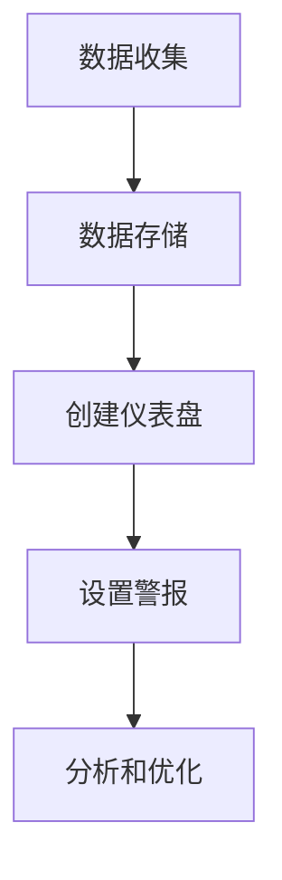

# 业务指标监控

在现代业务环境中，监控业务指标是确保业务健康运行的关键。通过监控关键业务指标（KPI），团队可以快速识别问题、优化流程并做出数据驱动的决策。Grafana 是一个强大的工具，可以帮助你实现这一目标。本文将介绍如何使用 Grafana 监控业务指标，并通过实际案例展示其应用。

## 什么是业务指标监控？

业务指标监控是指通过收集、分析和可视化关键业务数据，来评估业务健康状况的过程。这些指标通常包括收入、用户增长率、转化率、客户满意度等。通过实时监控这些指标，团队可以快速发现问题并采取行动。

## 为什么需要业务指标监控？

1. **实时洞察**：通过实时监控，团队可以快速响应业务变化。
2. **数据驱动决策**：基于数据的决策通常更准确和有效。
3. **问题预警**：通过设置阈值和警报，团队可以在问题发生前采取预防措施。
4. **优化流程**：通过分析历史数据，团队可以识别流程中的瓶颈并进行优化。

## 如何使用 Grafana 监控业务指标？

### 1. 数据收集

首先，你需要收集业务数据。这些数据可以来自数据库、API、日志文件等。例如，假设你有一个电子商务网站，你可能需要监控以下指标：

- 每日销售额
- 用户注册数
- 购物车放弃率

### 2. 数据存储

将收集到的数据存储在时间序列数据库（如 Prometheus）或关系型数据库（如 MySQL）中。Grafana 支持多种数据源，可以轻松连接到这些数据库。

### 3. 创建仪表盘

在 Grafana 中，你可以创建仪表盘来可视化业务指标。以下是一个简单的示例，展示如何创建一个显示每日销售额的仪表盘。

```sql
SELECT
  DATE(order_date) AS order_day,
  SUM(order_amount) AS daily_sales
FROM
  orders
GROUP BY
  order_day
ORDER BY
  order_day;
```

### 4. 设置警报

Grafana 允许你为关键指标设置警报。例如，如果每日销售额低于某个阈值，你可以设置一个警报通知团队。

```yaml
alert:
  - name: Low Daily Sales
    conditions:
      - query:
          params:
            - A
            - 5m
            - now
          refId: A
        reducer:
          type: avg
        evaluator:
          params:
            - 1000
          type: lt
        operator:
          type: and
    notifications:
      - uid: notify-team
```

### 5. 分析和优化

通过分析仪表盘上的数据，团队可以识别趋势和异常。例如，如果购物车放弃率突然上升，团队可以调查原因并采取相应措施。

## 实际案例

假设你运营一个在线教育平台，你需要监控以下业务指标：

- 课程购买量
- 用户活跃度
- 课程完成率

你可以在 Grafana 中创建一个仪表盘，显示这些指标的实时数据。通过设置警报，你可以在课程购买量下降或用户活跃度降低时立即收到通知。



## 总结

业务指标监控是确保业务健康运行的关键。通过使用 Grafana，你可以轻松收集、存储、可视化和分析业务数据，并设置警报以快速响应问题。希望本文能帮助你理解如何使用 Grafana 监控业务指标，并为你的业务带来实际价值。

## 附加资源

- [Grafana 官方文档](https://grafana.com/docs/)
- [Prometheus 官方文档](https://prometheus.io/docs/)
- [时间序列数据分析指南](https://www.timescale.com/blog/time-series-data-analysis/)

## 练习

1. 创建一个 Grafana 仪表盘，监控你所在公司的关键业务指标。
2. 设置一个警报，当某个关键指标低于阈值时通知团队。
3. 分析历史数据，识别业务中的瓶颈并提出优化建议。

:::tip
提示：在设置警报时，确保阈值合理，以避免误报。
:::