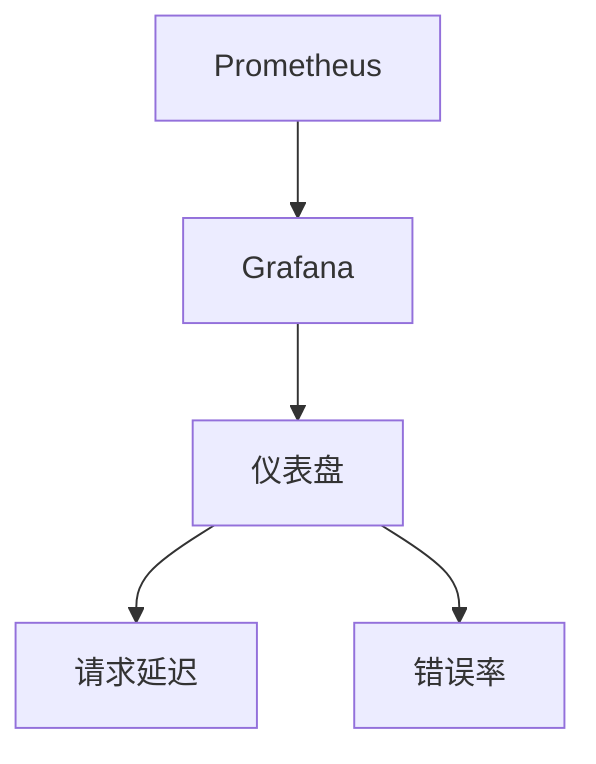
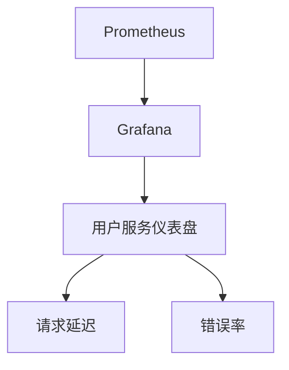

# 云原生监控原则

云原生监控是现代云原生应用开发和运维中不可或缺的一部分。它不仅仅是收集指标和日志，更是确保应用在动态、分布式环境中稳定运行的关键。本文将深入探讨云原生监控的核心原则，并通过实际案例帮助你理解如何在实际场景中应用这些原则。

## 什么是云原生监控？

云原生监控是指在云原生环境中，通过自动化、可扩展的工具和方法，实时监控应用和基础设施的状态、性能和健康状况。云原生应用通常运行在容器化、微服务架构中，具有动态扩展、快速迭代的特点，因此传统的监控方法往往无法满足需求。

云原生监控的核心目标是：
- **实时性**：快速发现问题并响应。
- **可扩展性**：能够处理大规模、动态变化的监控数据。
- **自动化**：减少人工干预，实现自动化的监控和告警。
- **可视化**：通过直观的仪表盘展示监控数据，帮助团队快速理解系统状态。

## 云原生监控的核心原则

### 1. 以应用为中心

在云原生环境中，监控的重点应该放在应用本身，而不仅仅是基础设施。这意味着你需要监控应用的性能、可用性、错误率等关键指标，而不仅仅是 CPU、内存等资源使用情况。

:::tip
**示例**：在 Kubernetes 中，你可以使用 Prometheus 来监控应用的 HTTP 请求延迟、错误率等指标。
:::

```yaml
apiVersion: monitoring.coreos.com/v1
kind: ServiceMonitor
metadata:
  name: example-app
  labels:
    team: frontend
spec:
  selector:
    matchLabels:
      app: example-app
  endpoints:
  - port: web
    interval: 30s
```

### 2. 自动化监控

云原生环境中的服务数量庞大且动态变化，手动配置监控是不可行的。因此，自动化是云原生监控的关键。通过自动化工具，你可以自动发现新服务、自动配置监控规则，并自动生成告警。

:::note
**示例**：Prometheus Operator 可以自动发现 Kubernetes 中的服务，并为其配置监控。
:::

```yaml
apiVersion: monitoring.coreos.com/v1
kind: Prometheus
metadata:
  name: prometheus
spec:
  serviceAccountName: prometheus
  serviceMonitorSelector:
    matchLabels:
      team: frontend
```

### 3. 多维度的监控数据

云原生应用通常由多个微服务组成，每个微服务可能运行在不同的容器或节点上。因此，监控数据需要从多个维度进行收集和分析，包括：
- **基础设施层**：CPU、内存、网络等。
- **应用层**：请求延迟、错误率、吞吐量等。
- **业务层**：用户行为、交易成功率等。

:::caution
**注意**：多维度的监控数据可以帮助你更全面地理解系统的健康状况，但也可能带来数据爆炸的问题。因此，合理的数据聚合和过滤策略非常重要。
:::

### 4. 实时告警与自动化响应

监控的最终目的是为了快速发现问题并采取行动。因此，实时告警和自动化响应是云原生监控的重要组成部分。你需要设置合理的告警规则，并在触发告警时自动执行修复操作。

:::warning
**示例**：使用 Alertmanager 配置告警规则，并在告警触发时自动重启服务。
:::

```yaml
apiVersion: monitoring.coreos.com/v1
kind: Alertmanager
metadata:
  name: alertmanager
spec:
  replicas: 3
  route:
    receiver: 'default-receiver'
    group_wait: 30s
    group_interval: 5m
    repeat_interval: 3h
  receivers:
  - name: 'default-receiver'
    webhook_configs:
    - url: 'http://alert-handler:5000/'
```

### 5. 可视化与仪表盘

监控数据的可视化是帮助团队快速理解系统状态的关键。通过仪表盘，你可以直观地查看系统的健康状况、性能趋势和潜在问题。

:::tip
**示例**：使用 Grafana 创建仪表盘，展示应用的请求延迟和错误率。
:::



## 实际案例：电商平台的云原生监控

假设你正在为一个电商平台构建云原生监控系统。该平台由多个微服务组成，包括用户服务、订单服务、支付服务等。你需要监控每个服务的性能、可用性和错误率，并在发现问题时自动触发告警。

### 步骤 1：配置 Prometheus 监控

首先，你需要在 Kubernetes 集群中部署 Prometheus，并配置 ServiceMonitor 来自动发现和监控各个微服务。

```yaml
apiVersion: monitoring.coreos.com/v1
kind: ServiceMonitor
metadata:
  name: user-service
  labels:
    team: backend
spec:
  selector:
    matchLabels:
      app: user-service
  endpoints:
  - port: web
    interval: 30s
```

### 步骤 2：设置告警规则

接下来，你需要为每个服务设置告警规则。例如，当用户服务的错误率超过 5% 时，触发告警。

```yaml
apiVersion: monitoring.coreos.com/v1
kind: PrometheusRule
metadata:
  name: user-service-rules
spec:
  groups:
  - name: user-service
    rules:
    - alert: HighErrorRate
      expr: rate(http_requests_total{job="user-service", status="500"}[5m]) > 0.05
      for: 5m
      labels:
        severity: critical
      annotations:
        summary: "High error rate on user service"
        description: "The error rate on user service is above 5%."
```

### 步骤 3：创建 Grafana 仪表盘

最后，你可以在 Grafana 中创建仪表盘，展示各个服务的性能指标。例如，你可以创建一个仪表盘，展示用户服务的请求延迟和错误率。



## 总结

云原生监控是确保云原生应用稳定运行的关键。通过以应用为中心、自动化监控、多维度数据收集、实时告警和可视化仪表盘，你可以构建一个高效、可靠的监控系统。在实际应用中，合理配置 Prometheus 和 Grafana 是实现这些原则的重要工具。

## 附加资源与练习

- **练习**：尝试在本地 Kubernetes 集群中部署 Prometheus 和 Grafana，并配置一个简单的监控系统。
- **资源**：
  - [Prometheus 官方文档](https://prometheus.io/docs/)
  - [Grafana 官方文档](https://grafana.com/docs/)
  - [Kubernetes 监控最佳实践](https://kubernetes.io/docs/concepts/cluster-administration/monitoring/)

通过不断实践和学习，你将能够掌握云原生监控的核心原则，并应用于实际项目中。