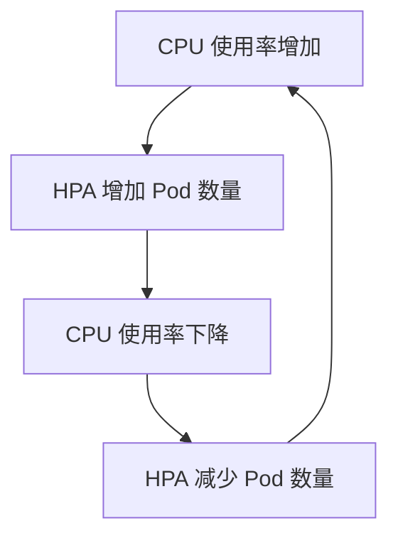

# 自动扩缩容监控

在现代云原生应用中，自动扩缩容（Auto-scaling）是一个关键功能，它能够根据系统的负载动态调整资源分配。通过自动扩缩容，系统可以在高负载时增加资源，而在低负载时减少资源，从而优化成本并提高性能。然而，为了确保自动扩缩容机制的有效性，我们需要对其进行监控。本文将介绍如何使用 Grafana 监控自动扩缩容机制，并通过实际案例展示其应用。

## 什么是自动扩缩容？

自动扩缩容是一种动态调整系统资源的技术，通常用于云原生环境中。它可以根据预定义的规则或实时指标（如 CPU 使用率、内存使用率或请求速率）自动增加或减少资源。例如，当 CPU 使用率超过 80% 时，系统可以自动增加更多的计算资源；而当 CPU 使用率低于 20% 时，系统可以减少资源以节省成本。

自动扩缩容通常与 Kubernetes 等容器编排工具结合使用，通过 Horizontal Pod Autoscaler (HPA) 或 Cluster Autoscaler 实现。

## 为什么需要监控自动扩缩容？

虽然自动扩缩容能够帮助我们优化资源使用，但如果配置不当或监控不足，可能会导致以下问题：

- **资源浪费**：如果扩缩容规则过于宽松，系统可能会分配过多的资源，导致成本增加。
- **性能下降**：如果扩缩容规则过于严格，系统可能无法及时响应负载增加，导致性能下降。
- **系统不稳定**：频繁的扩缩容操作可能会导致系统不稳定，尤其是在资源调整过程中。

因此，监控自动扩缩容机制是确保系统稳定性和性能的关键。

## 使用 Grafana 监控自动扩缩容

Grafana 是一个强大的开源监控和可视化工具，广泛用于云原生环境中。通过 Grafana，我们可以创建仪表盘来监控自动扩缩容的状态和效果。以下是使用 Grafana 监控自动扩缩容的步骤：

### 1. 收集指标

首先，我们需要收集与自动扩缩容相关的指标。这些指标通常包括：

- **CPU 使用率**：用于判断是否需要增加或减少资源。
- **内存使用率**：类似 CPU 使用率，用于资源调整。
- **Pod 数量**：当前运行的 Pod 数量，反映扩缩容的效果。
- **请求速率**：用于判断系统的负载情况。

这些指标可以通过 Prometheus 等监控工具收集，并存储在时间序列数据库中。

### 2. 创建 Grafana 仪表盘

在 Grafana 中，我们可以创建一个仪表盘来可视化这些指标。以下是一个简单的仪表盘配置示例：

```json
{
  "panels": [
    {
      "type": "graph",
      "title": "CPU 使用率",
      "targets": [
        {
          "expr": "rate(container_cpu_usage_seconds_total{namespace=\"default\"}[1m])",
          "legendFormat": "{{pod}}"
        }
      ]
    },
    {
      "type": "graph",
      "title": "Pod 数量",
      "targets": [
        {
          "expr": "count(kube_pod_info{namespace=\"default\"})",
          "legendFormat": "Pod Count"
        }
      ]
    }
  ]
}
```

在这个示例中，我们创建了两个面板：一个用于显示 CPU 使用率，另一个用于显示 Pod 数量。通过这些面板，我们可以实时监控系统的负载和资源使用情况。

### 3. 设置告警

除了可视化，我们还可以在 Grafana 中设置告警，以便在自动扩缩容出现问题时及时通知我们。例如，我们可以设置一个告警规则，当 CPU 使用率超过 90% 时触发告警：

```json
{
  "alert": {
    "name": "High CPU Usage",
    "conditions": [
      {
        "query": {
          "params": [
            "A",
            "5m",
            "now"
          ]
        },
        "evaluator": {
          "params": [
            90
          ],
          "type": "gt"
        }
      }
    ]
  }
}
```

通过设置告警，我们可以在系统负载过高时及时采取措施，避免性能下降。

## 实际案例：监控 Kubernetes HPA

假设我们有一个运行在 Kubernetes 上的应用，并使用 Horizontal Pod Autoscaler (HPA) 进行自动扩缩容。我们可以使用 Grafana 监控 HPA 的状态和效果。

### 1. 收集 HPA 指标

首先，我们需要收集 HPA 相关的指标。这些指标可以通过 Prometheus 的 `kube-state-metrics` 组件收集，包括：

- `kube_hpa_status_current_replicas`：当前运行的 Pod 数量。
- `kube_hpa_status_desired_replicas`：期望的 Pod 数量。
- `kube_hpa_spec_max_replicas`：HPA 配置的最大 Pod 数量。
- `kube_hpa_spec_min_replicas`：HPA 配置的最小 Pod 数量。

### 2. 创建 HPA 监控仪表盘

在 Grafana 中，我们可以创建一个仪表盘来监控 HPA 的状态。以下是一个示例配置：

```json
{
  "panels": [
    {
      "type": "graph",
      "title": "HPA Replicas",
      "targets": [
        {
          "expr": "kube_hpa_status_current_replicas{hpa=\"my-hpa\"}",
          "legendFormat": "Current Replicas"
        },
        {
          "expr": "kube_hpa_status_desired_replicas{hpa=\"my-hpa\"}",
          "legendFormat": "Desired Replicas"
        }
      ]
    }
  ]
}
```

通过这个仪表盘，我们可以实时监控 HPA 的当前和期望 Pod 数量，确保自动扩缩容机制按预期工作。

### 3. 分析扩缩容效果

通过 Grafana 的仪表盘，我们可以分析自动扩缩容的效果。例如，我们可以观察 CPU 使用率和 Pod 数量的变化，判断 HPA 是否能够及时响应负载变化。



通过这种分析，我们可以优化 HPA 的配置，确保系统在高负载和低负载时都能高效运行。

## 总结

自动扩缩容是云原生应用中的重要功能，能够帮助我们优化资源使用并提高系统性能。然而，为了确保自动扩缩容机制的有效性，我们需要对其进行监控。通过 Grafana，我们可以创建仪表盘来监控自动扩缩容的状态和效果，并通过设置告警及时发现问题。

在实际应用中，我们可以结合 Kubernetes 的 HPA 和 Grafana 的监控功能，确保系统在高负载和低负载时都能高效运行。通过不断优化自动扩缩容的配置和监控策略，我们可以提高系统的稳定性和性能。

## 附加资源与练习

- **练习 1**：在 Kubernetes 集群中部署一个应用，并配置 HPA。使用 Grafana 监控 HPA 的状态，并分析扩缩容的效果。
- **练习 2**：在 Grafana 中设置一个告警规则，当 CPU 使用率超过 80% 时触发告警，并观察系统的响应。
- **附加资源**：
  - [Kubernetes 官方文档：Horizontal Pod Autoscaler](https://kubernetes.io/docs/tasks/run-application/horizontal-pod-autoscale/)
  - [Grafana 官方文档：创建仪表盘](https://grafana.com/docs/grafana/latest/dashboards/)
  - [Prometheus 官方文档：kube-state-metrics](https://github.com/kubernetes/kube-state-metrics)

通过这些练习和资源，您可以进一步掌握自动扩缩容监控的技术，并将其应用到实际项目中。