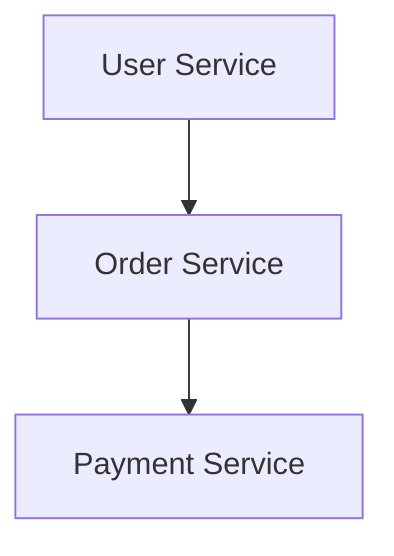

# 微服务监控

在现代云原生架构中，微服务已经成为构建复杂应用程序的主流方式。微服务架构将应用程序拆分为多个小型、独立的服务，每个服务负责特定的功能。虽然这种架构带来了灵活性和可扩展性，但也引入了新的挑战，尤其是在监控方面。本文将介绍微服务监控的基本概念、工具和实践方法，帮助你更好地理解和应用这一技术。

## 什么是微服务监控？

微服务监控是指对微服务架构中的各个服务进行实时监控，以确保系统的健康、性能和可用性。由于微服务架构中的服务数量众多，且彼此之间存在复杂的依赖关系，因此监控变得尤为重要。通过监控，我们可以：

- 实时了解服务的运行状态。
- 快速发现和诊断问题。
- 优化系统性能。
- 确保服务的高可用性。

## 微服务监控的关键指标

在微服务监控中，以下几个关键指标是必须关注的：

1. **请求速率（Request Rate）**：单位时间内服务的请求数量。
2. **错误率（Error Rate）**：单位时间内请求失败的比例。
3. **延迟（Latency）**：请求从发出到收到响应的时间。
4. **资源利用率（Resource Utilization）**：CPU、内存、磁盘等资源的使用情况。
5. **依赖关系（Dependencies）**：服务之间的调用关系及其健康状况。

## 微服务监控工具

在微服务监控中，常用的工具包括：

- **Prometheus**：一个开源的监控和报警工具，广泛用于云原生环境。
- **Grafana**：一个开源的可视化工具，通常与 Prometheus 配合使用，用于展示监控数据。
- **Jaeger**：一个开源的分布式追踪系统，用于监控微服务之间的调用链。
- **ELK Stack（Elasticsearch, Logstash, Kibana）**：用于日志收集、存储和可视化。

### Prometheus 和 Grafana 的集成

Prometheus 和 Grafana 是微服务监控中最常用的组合。Prometheus 负责收集和存储监控数据，而 Grafana 则用于数据的可视化和报警。

以下是一个简单的 Prometheus 配置示例，用于监控一个 HTTP 服务的请求速率和错误率：

```yaml
global:
  scrape_interval: 15s

scrape_configs:
  - job_name: 'http_service'
    static_configs:
      - targets: ['localhost:8080']
```

在 Grafana 中，你可以创建一个仪表盘来展示这些监控数据。以下是一个简单的 Grafana 查询示例，用于展示请求速率：

```promql
rate(http_requests_total[1m])
```

## 微服务监控的实际案例

假设我们有一个简单的微服务架构，包含三个服务：`user-service`、`order-service` 和 `payment-service`。`user-service` 负责用户管理，`order-service` 负责订单管理，`payment-service` 负责支付处理。

我们可以使用 Prometheus 和 Grafana 来监控这些服务的健康状况。以下是一个简单的监控流程：

1. **部署 Prometheus**：在每个服务中部署 Prometheus 客户端，用于收集监控数据。
2. **配置 Grafana**：在 Grafana 中创建仪表盘，展示各个服务的请求速率、错误率和延迟。
3. **设置报警**：在 Grafana 中设置报警规则，当某个服务的错误率超过阈值时，发送通知。

以下是一个简单的微服务架构图：



## 总结

微服务监控是确保云原生应用程序健康运行的关键。通过使用 Prometheus 和 Grafana 等工具，我们可以实时监控微服务的各项指标，快速发现和解决问题。对于初学者来说，掌握这些工具和概念是进入云原生世界的重要一步。

## 附加资源

- [Prometheus 官方文档](https://prometheus.io/docs/)
- [Grafana 官方文档](https://grafana.com/docs/)
- [Jaeger 官方文档](https://www.jaegertracing.io/docs/)

## 练习

1. 在你的本地环境中部署一个简单的微服务，并使用 Prometheus 和 Grafana 进行监控。
2. 尝试在 Grafana 中创建一个仪表盘，展示服务的请求速率和错误率。
3. 设置一个报警规则，当服务的错误率超过 5% 时，发送通知。

通过以上练习，你将更深入地理解微服务监控的实际应用。