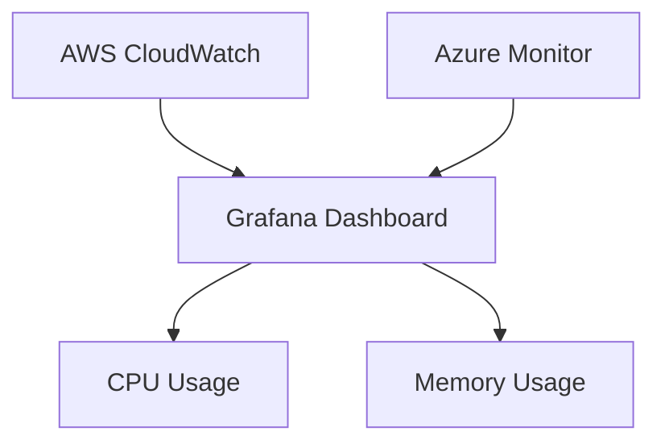

# 多云环境监控

在现代云原生架构中，多云环境已经成为许多企业的标准配置。多云环境指的是企业同时使用多个云服务提供商（如 AWS、Azure、GCP 等）来运行其应用程序和服务。这种架构带来了灵活性和冗余性，但也增加了监控的复杂性。本文将介绍如何使用 Grafana 在多云环境中进行监控，帮助初学者掌握跨云平台监控的核心概念和实践方法。

## 什么是多云环境监控？

多云环境监控是指在一个由多个云服务提供商组成的混合云环境中，对应用程序、基础设施和服务的性能、可用性和安全性进行实时监控和分析。由于不同云平台可能使用不同的监控工具和数据格式，多云环境监控需要一种统一的方式来收集、存储和可视化这些数据。

Grafana 是一个开源的可视化工具，支持多种数据源，能够帮助我们在多云环境中实现统一的监控视图。

## 为什么需要多云环境监控？

1. **统一视图**：多云环境中的每个云平台都有自己的监控工具和仪表盘，使用 Grafana 可以将这些数据整合到一个统一的视图中。
2. **故障排查**：当问题发生时，能够快速定位问题所在的云平台和服务。
3. **成本优化**：通过监控资源使用情况，优化多云环境中的资源分配，降低成本。
4. **合规性**：确保所有云平台都符合企业的安全性和合规性要求。

## 多云环境监控的核心组件

在多云环境监控中，以下几个核心组件是必不可少的：

1. **数据收集**：从各个云平台收集监控数据。
2. **数据存储**：将收集到的数据存储在一个统一的数据库中。
3. **数据可视化**：使用 Grafana 创建仪表盘，展示监控数据。
4. **告警**：设置告警规则，当监控数据超出预设阈值时触发告警。

## 使用 Grafana 进行多云环境监控

### 1. 配置数据源

Grafana 支持多种数据源，包括 Prometheus、InfluxDB、Elasticsearch 等。在多云环境中，我们需要为每个云平台配置相应的数据源。

例如，假设我们使用 AWS CloudWatch 和 Azure Monitor 作为数据源，可以在 Grafana 中配置如下：

```yaml
datasources:
  - name: AWS CloudWatch
    type: cloudwatch
    jsonData:
      authType: default
      defaultRegion: us-east-1
  - name: Azure Monitor
    type: grafana-azure-monitor-datasource
    jsonData:
      subscriptionId: <your-subscription-id>
      tenantId: <your-tenant-id>
      clientId: <your-client-id>
```

### 2. 创建仪表盘

在 Grafana 中，我们可以创建多个面板来展示不同云平台的监控数据。例如，我们可以创建一个面板来展示 AWS EC2 实例的 CPU 使用率，另一个面板来展示 Azure VM 的内存使用情况。



### 3. 设置告警

Grafana 允许我们为每个面板设置告警规则。例如，当 AWS EC2 实例的 CPU 使用率超过 80% 时，可以触发告警。

```yaml
alert:
  - name: High CPU Usage
    conditions:
      - type: query
        query: 'A'
        reducer: 'avg'
        evaluator:
          type: 'gt'
          params: [80]
    notifications:
      - uid: 'notify-1'
```

## 实际案例：跨云平台监控

假设我们有一个应用程序，其前端运行在 AWS 上，后端运行在 Azure 上。我们需要监控整个应用程序的性能和可用性。

1. **数据收集**：使用 AWS CloudWatch 收集前端的监控数据，使用 Azure Monitor 收集后端的监控数据。
2. **数据存储**：将数据存储在 Prometheus 中。
3. **数据可视化**：在 Grafana 中创建一个仪表盘，展示前端和后端的性能指标。
4. **告警**：设置告警规则，当前端或后端的性能指标超出预设阈值时触发告警。

## 总结

多云环境监控是现代云原生架构中的一个重要组成部分。通过使用 Grafana，我们可以实现跨云平台的统一监控视图，提高故障排查效率，优化资源使用，并确保合规性。本文介绍了多云环境监控的核心概念和实践方法，希望能够帮助初学者掌握这一重要技能。

## 附加资源

- [Grafana 官方文档](https://grafana.com/docs/)
- [Prometheus 官方文档](https://prometheus.io/docs/)
- [AWS CloudWatch 官方文档](https://docs.aws.amazon.com/cloudwatch/)
- [Azure Monitor 官方文档](https://docs.microsoft.com/en-us/azure/azure-monitor/)

## 练习

1. 在 Grafana 中配置一个 AWS CloudWatch 数据源，并创建一个展示 EC2 实例 CPU 使用率的仪表盘。
2. 在 Grafana 中配置一个 Azure Monitor 数据源，并创建一个展示 Azure VM 内存使用情况的仪表盘。
3. 为上述仪表盘设置告警规则，当 CPU 使用率超过 80% 或内存使用率超过 70% 时触发告警。