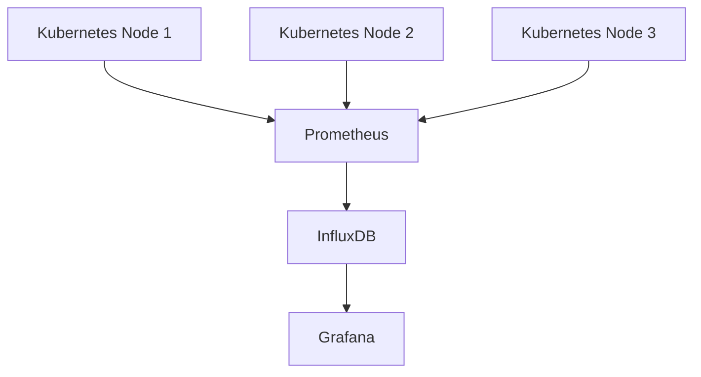

## 介绍

混合云是指将公有云和私有云结合使用的架构模式。这种模式允许企业根据需求灵活地分配资源，但同时也带来了监控和管理的复杂性。为了确保混合云环境的高效运行，制定一个全面的监控策略至关重要。

Grafana 是一个强大的开源监控和可视化工具，能够帮助你在混合云环境中实时监控和分析数据。本文将介绍如何利用 Grafana 实现混合云监控策略，并通过实际案例展示其应用。

## 混合云监控策略的核心概念

### 1. 数据收集

在混合云环境中，数据可能分布在多个云平台和本地数据中心。为了有效监控，首先需要确保数据能够被统一收集。常用的数据收集工具包括：

- **Prometheus**：用于收集和存储时间序列数据。
- **Telegraf**：用于收集系统、应用程序和网络数据。
- **Fluentd**：用于日志数据的收集和传输。

### 2. 数据存储

收集到的数据需要存储在统一的存储系统中，以便后续分析和可视化。常见的存储解决方案包括：

- **InfluxDB**：专为时间序列数据设计的高性能数据库。
- **Elasticsearch**：用于存储和搜索日志数据。
- **Prometheus TSDB**：Prometheus 自带的时间序列数据库。

### 3. 数据可视化

Grafana 是数据可视化的核心工具，它支持多种数据源，并提供了丰富的图表和仪表盘功能。通过 Grafana，你可以轻松创建实时监控仪表盘，展示混合云环境的运行状态。

## 实现混合云监控策略的步骤

### 步骤 1：配置数据收集

首先，你需要在混合云环境中配置数据收集工具。以 Prometheus 为例，以下是一个简单的配置文件示例：

```yaml
global:
  scrape_interval: 15s

scrape_configs:
  - job_name: 'kubernetes-nodes'
    kubernetes_sd_configs:
      - role: node
    relabel_configs:
      - source_labels: [__meta_kubernetes_node_name]
        target_label: __address__
        replacement: $1:9100
```

### 步骤 2：配置数据存储

接下来，配置数据存储系统。以 InfluxDB 为例，以下是如何在 Grafana 中添加 InfluxDB 数据源的步骤：

1. 打开 Grafana，进入 **Configuration > Data Sources**。
2. 点击 **Add data source**，选择 **InfluxDB**。
3. 填写 InfluxDB 的连接信息，包括 URL、数据库名称和认证信息。
4. 点击 **Save & Test**，确保连接成功。

### 步骤 3：创建监控仪表盘

最后，使用 Grafana 创建监控仪表盘。以下是一个简单的仪表盘配置示例：

```json
{
  "panels": [
    {
      "type": "graph",
      "title": "CPU Usage",
      "datasource": "InfluxDB",
      "targets": [
        {
          "query": "SELECT mean(\"usage_idle\") FROM \"cpu\" WHERE $timeFilter GROUP BY time($__interval) fill(null)"
        }
      ]
    }
  ]
}
```

## 实际案例：混合云环境中的 Kubernetes 监控

假设你有一个混合云环境，其中 Kubernetes 集群分布在公有云和私有云中。为了监控整个集群的运行状态，你可以使用以下策略：

1. **数据收集**：在每个 Kubernetes 节点上部署 Prometheus，收集节点和容器的性能数据。
2. **数据存储**：将收集到的数据存储在 InfluxDB 中。
3. **数据可视化**：使用 Grafana 创建仪表盘，展示集群的 CPU、内存、网络等关键指标。

以下是一个 Kubernetes 监控仪表盘的示例：



## 总结

混合云监控策略是确保混合云环境高效运行的关键。通过合理配置数据收集、存储和可视化工具，你可以实时监控混合云环境的运行状态，及时发现和解决问题。

## 附加资源

- [Grafana 官方文档](https://grafana.com/docs/)
- [Prometheus 官方文档](https://prometheus.io/docs/)
- [InfluxDB 官方文档](https://docs.influxdata.com/influxdb/)

## 练习

1. 在你的混合云环境中部署 Prometheus 和 Grafana。
2. 创建一个监控仪表盘，展示 Kubernetes 集群的 CPU 和内存使用情况。
3. 尝试添加其他数据源（如 Elasticsearch），并在 Grafana 中展示日志数据。

:::tip
在配置过程中，如果遇到问题，可以参考官方文档或社区论坛，获取更多帮助。
:::