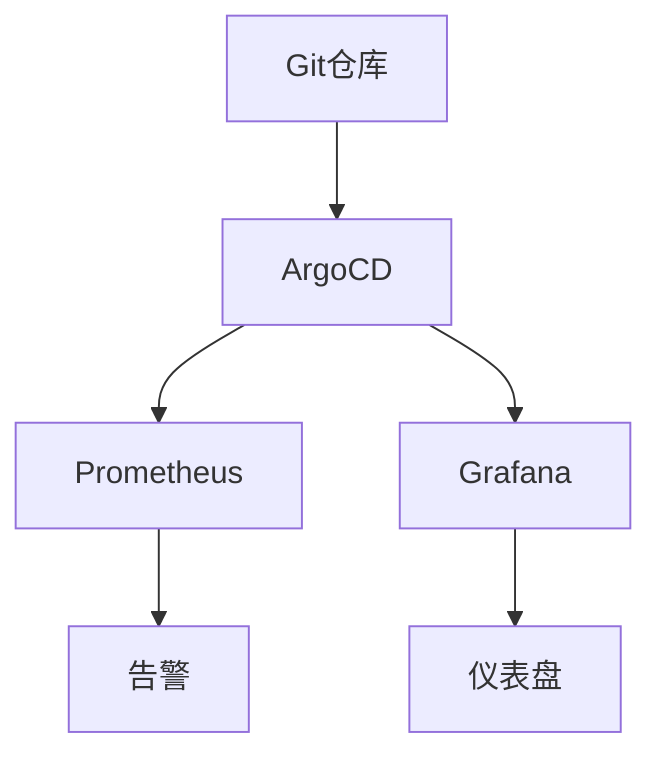

# GitOps监控流水线

在现代云原生环境中，监控是确保系统稳定性和性能的关键。GitOps是一种基于Git的运维实践，通过将基础设施和应用程序的配置存储在Git仓库中，实现自动化的部署和管理。本文将介绍如何利用GitOps构建监控流水线，帮助初学者理解并实践这一概念。

## 什么是GitOps监控流水线？

GitOps监控流水线是一种将GitOps原则应用于监控系统的方法。通过将监控配置（如Prometheus规则、Grafana仪表盘等）存储在Git仓库中，并结合CI/CD工具（如ArgoCD、Flux等），可以实现监控配置的自动化部署和更新。这种方法不仅提高了监控系统的可维护性，还确保了配置的一致性和可追溯性。

## 为什么需要GitOps监控流水线？

1. **一致性**：通过Git仓库管理监控配置，确保所有环境中的监控配置一致。
2. **可追溯性**：所有配置变更都通过Git提交记录，便于追踪和回滚。
3. **自动化**：结合CI/CD工具，实现监控配置的自动化部署和更新。
4. **协作**：团队成员可以通过Git协作，共同维护和优化监控配置。

## 构建GitOps监控流水线的步骤

### 1. 准备Git仓库

首先，创建一个Git仓库来存储监控配置。这个仓库将包含Prometheus规则文件、Grafana仪表盘JSON文件等。

```bash
git init my-monitoring-repo
cd my-monitoring-repo
```

### 2. 添加监控配置

在Git仓库中添加Prometheus规则文件和Grafana仪表盘JSON文件。例如，创建一个名为`prometheus-rules.yaml`的文件：

```yaml
groups:
- name: example
  rules:
  - alert: HighRequestLatency
    expr: job:request_latency_seconds:mean5m{job="myjob"} > 0.5
    for: 10m
    labels:
      severity: page
    annotations:
      summary: "High request latency"
      description: "Request latency is above 0.5 seconds for more than 10 minutes."
```

### 3. 配置CI/CD工具

选择一个CI/CD工具（如ArgoCD或Flux）来自动化部署监控配置。以下是一个使用ArgoCD的示例：

```yaml
apiVersion: argoproj.io/v1alpha1
kind: Application
metadata:
  name: monitoring
  namespace: argocd
spec:
  project: default
  source:
    repoURL: https://github.com/my-org/my-monitoring-repo.git
    path: .
    targetRevision: HEAD
  destination:
    server: https://kubernetes.default.svc
    namespace: monitoring
  syncPolicy:
    automated:
      prune: true
      selfHeal: true
```

### 4. 部署和验证

将Git仓库中的配置推送到远程仓库，并观察CI/CD工具如何自动部署这些配置。部署完成后，可以通过Prometheus和Grafana验证监控规则和仪表盘是否生效。

## 实际案例

假设我们有一个微服务架构的应用程序，需要监控每个服务的请求延迟。通过GitOps监控流水线，我们可以将Prometheus规则和Grafana仪表盘配置存储在Git仓库中，并使用ArgoCD自动部署这些配置。当某个服务的请求延迟超过阈值时，Prometheus会触发告警，并通过Grafana仪表盘展示相关数据。



## 总结

GitOps监控流水线是一种高效、可靠的监控管理方法，特别适合云原生环境。通过将监控配置存储在Git仓库中，并结合CI/CD工具，可以实现监控配置的自动化部署和更新。这种方法不仅提高了监控系统的可维护性，还确保了配置的一致性和可追溯性。

## 附加资源

- [Prometheus官方文档](https://prometheus.io/docs/)
- [Grafana官方文档](https://grafana.com/docs/)
- [ArgoCD官方文档](https://argo-cd.readthedocs.io/)

## 练习

1. 创建一个Git仓库，并添加Prometheus规则文件和Grafana仪表盘JSON文件。
2. 配置ArgoCD或Flux，自动化部署这些监控配置。
3. 在Prometheus和Grafana中验证监控规则和仪表盘是否生效。

通过以上步骤，你将掌握如何构建GitOps监控流水线，并在实际项目中应用这一方法。