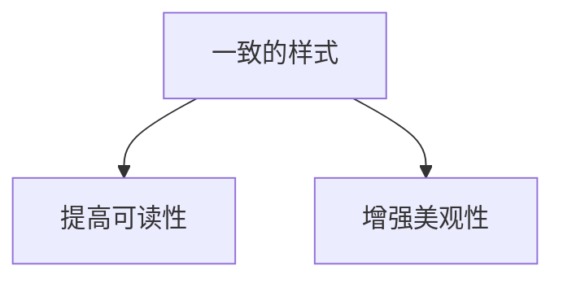

# 仪表盘设计原则

仪表盘是数据可视化的核心工具，它能够将复杂的数据以直观的方式呈现给用户。Grafana 是一个强大的开源工具，广泛用于创建和共享仪表盘。然而，设计一个高效的仪表盘并非易事，需要遵循一些基本原则。本文将介绍仪表盘设计的关键原则，帮助初学者创建清晰、直观且高效的数据可视化界面。

## 1. 明确目标

在设计仪表盘之前，首先要明确其目标。仪表盘的目标是什么？它需要回答哪些关键问题？目标明确后，才能选择合适的指标和可视化方式。

:::tip
**提示**：在设计仪表盘之前，与利益相关者沟通，了解他们的需求和期望。
:::

## 2. 选择合适的可视化类型

不同的数据类型和问题需要不同的可视化方式。以下是一些常见的可视化类型及其适用场景：

- **折线图**：用于显示数据随时间的变化趋势。
- **柱状图**：用于比较不同类别的数据。
- **饼图**：用于显示各部分在整体中的比例。
- **表格**：用于显示详细的数据列表。

:::caution
**注意**：避免使用过于复杂的图表类型，这可能会导致用户难以理解数据。
:::

## 3. 保持简洁

仪表盘的设计应尽量简洁，避免信息过载。每个仪表盘应专注于一个特定的目标，并只显示相关的数据。

:::note
**建议**：使用分组和分层的方式组织信息，确保用户可以快速找到他们需要的数据。
:::

## 4. 使用一致的样式

一致的样式可以提高仪表盘的可读性和美观性。确保所有图表使用相同的颜色、字体和布局风格。



## 5. 提供上下文

数据本身可能不足以传达完整的信息。通过添加注释、趋势线和阈值等上下文信息，可以帮助用户更好地理解数据。

:::warning
**警告**：避免在仪表盘上添加过多的注释，这可能会分散用户的注意力。
:::

## 6. 优化性能

仪表盘的性能直接影响用户体验。确保数据查询和渲染过程高效，避免加载时间过长。

:::tip
**提示**：使用缓存和预计算技术来优化数据查询性能。
:::

## 7. 实际案例

假设我们正在设计一个监控服务器性能的仪表盘。以下是一个简单的 Grafana 仪表盘配置示例：

```json
{
  "panels": [
    {
      "type": "graph",
      "title": "CPU 使用率",
      "targets": [
        {
          "expr": "rate(node_cpu_seconds_total{mode=\"system\"}[1m])",
          "legendFormat": "{{mode}}"
        }
      ]
    },
    {
      "type": "singlestat",
      "title": "内存使用率",
      "targets": [
        {
          "expr": "node_memory_MemAvailable_bytes / node_memory_MemTotal_bytes * 100",
          "legendFormat": "{{instance}}"
        }
      ]
    }
  ]
}
```

在这个示例中，我们使用了折线图来显示 CPU 使用率的变化趋势，并使用单值图来显示当前内存使用率。

## 8. 总结

设计一个高效的 Grafana 仪表盘需要遵循一些基本原则，包括明确目标、选择合适的可视化类型、保持简洁、使用一致的样式、提供上下文和优化性能。通过遵循这些原则，您可以创建出清晰、直观且高效的数据可视化界面。

## 9. 附加资源与练习

- **练习**：尝试设计一个监控网站流量的仪表盘，使用折线图显示访问量随时间的变化，并使用柱状图比较不同页面的访问量。
- **资源**：阅读 Grafana 官方文档，了解更多关于仪表盘设计的技巧和最佳实践。

通过不断实践和学习，您将能够设计出更加高效和直观的仪表盘。祝您学习愉快！