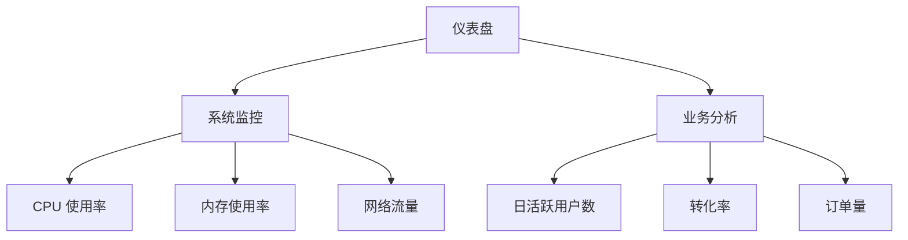
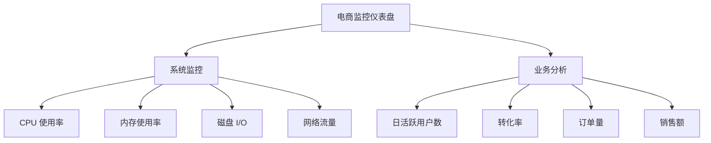

# 信息架构规划

在设计 Grafana 仪表盘时，信息架构规划是至关重要的一步。它决定了数据的组织方式、展示逻辑以及用户如何与仪表盘交互。一个良好的信息架构能够帮助用户快速理解数据，并做出有效的决策。本文将逐步讲解如何为 Grafana 仪表盘设计信息架构，并通过实际案例展示其应用。

## 什么是信息架构？

信息架构（Information Architecture, IA）是指对信息进行结构化、组织和分类的过程，目的是让用户能够高效地找到所需信息。在 Grafana 仪表盘中，信息架构决定了数据的展示方式、面板的布局以及用户如何与数据进行交互。

:::note
信息架构的核心目标是确保数据可视化清晰、易用，并符合用户的需求。
:::

## 信息架构规划的关键步骤

### 1. 明确用户需求

在设计信息架构之前，首先需要明确仪表盘的目标用户及其需求。不同的用户可能需要不同的数据视图。例如：

- **运维团队**：可能需要实时监控系统状态和性能指标。
- **业务团队**：可能更关注业务指标，如销售额、用户增长等。

:::tip
与用户沟通，了解他们的需求和优先级，是设计信息架构的第一步。
:::

### 2. 确定关键指标

根据用户需求，确定需要在仪表盘上展示的关键指标。这些指标应该能够反映系统的健康状况或业务的关键绩效指标（KPI）。例如：

- **系统监控**：CPU 使用率、内存使用率、网络流量等。
- **业务分析**：日活跃用户数、转化率、订单量等。

### 3. 组织数据

将关键指标按照逻辑关系进行组织。通常，可以将相关指标分组展示，以便用户快速找到所需信息。例如：

- **系统监控**：将 CPU、内存、磁盘 I/O 等指标放在一个面板中。
- **业务分析**：将用户增长、转化率、订单量等指标放在另一个面板中。

### 4. 设计面板布局

Grafana 提供了灵活的布局选项，允许用户自定义面板的位置和大小。在设计布局时，应考虑以下几点：

- **优先级**：将最重要的指标放在最显眼的位置。
- **逻辑分组**：将相关的指标放在相邻的面板中。
- **空间利用**：合理利用空间，避免信息过载。

### 5. 选择可视化类型

不同的指标适合不同的可视化类型。例如：

- **时间序列数据**：适合使用折线图或面积图。
- **分类数据**：适合使用柱状图或饼图。
- **单一指标**：适合使用仪表盘或单值面板。

:::caution
选择不合适的可视化类型可能会导致用户误解数据。
:::

### 6. 测试与迭代

设计完成后，邀请用户进行测试，并根据反馈进行调整。信息架构的设计是一个迭代的过程，需要不断优化以满足用户需求。

## 实际案例：电商业务监控仪表盘

假设我们正在为一个电商平台设计监控仪表盘。以下是信息架构规划的示例：

### 用户需求

- **运维团队**：监控服务器性能和系统可用性。
- **业务团队**：监控销售额、用户增长和转化率。

### 关键指标

- **系统监控**：CPU 使用率、内存使用率、磁盘 I/O、网络流量。
- **业务分析**：日活跃用户数、转化率、订单量、销售额。

### 面板布局

### 可视化类型

- **系统监控**：使用折线图展示 CPU、内存、磁盘 I/O 和网络流量的变化。
- **业务分析**：使用柱状图展示日活跃用户数和订单量，使用饼图展示转化率，使用单值面板展示销售额。

## 总结

信息架构规划是 Grafana 仪表盘设计的基础。通过明确用户需求、确定关键指标、组织数据、设计面板布局和选择可视化类型，可以创建出清晰、易用的仪表盘。记住，信息架构的设计是一个迭代的过程，需要不断优化以满足用户需求。

## 附加资源

- [Grafana 官方文档](https://grafana.com/docs/)
- [信息架构设计指南](https://www.nngroup.com/articles/information-architecture/)
- [数据可视化最佳实践](https://www.tableau.com/learn/whitepapers/visual-best-practices)

## 练习

1. 为你的项目设计一个 Grafana 仪表盘的信息架构。
2. 确定关键指标，并选择适合的可视化类型。
3. 邀请同事或朋友测试你的仪表盘，并根据反馈进行调整。