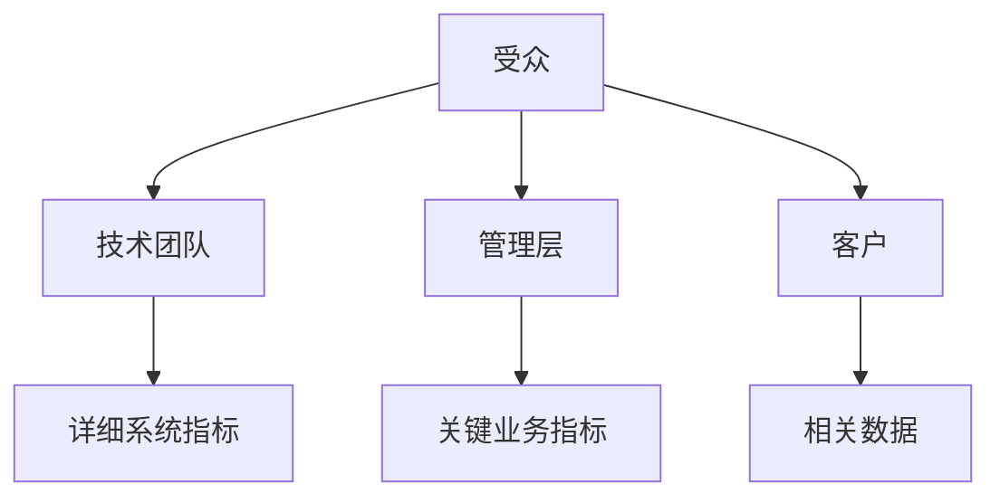

# 针对不同受众设计 Grafana 仪表盘

在设计 Grafana 仪表盘时，了解你的受众是至关重要的。不同的用户群体对数据的需求和理解能力各不相同，因此，设计一个适合所有用户的仪表盘需要考虑到这些差异。本文将逐步讲解如何针对不同受众设计 Grafana 仪表盘，并提供实际案例和代码示例。

## 1. 理解受众需求

首先，你需要明确你的受众是谁。常见的受众群体包括：

- **技术团队**：他们需要详细的系统性能数据和错误日志。
- **管理层**：他们更关注高层次的业务指标和趋势。
- **客户**：他们可能只关心与他们相关的特定数据。

:::tip
在设计仪表盘之前，与你的受众进行沟通，了解他们的具体需求和期望。
:::

## 2. 设计仪表盘布局

根据受众的不同，仪表盘的布局和内容也会有所不同。以下是一些常见的布局设计原则：

- **技术团队**：使用多个面板展示详细的系统指标，如 CPU 使用率、内存使用率、网络流量等。
- **管理层**：使用简洁的面板展示关键业务指标，如销售额、用户增长等。
- **客户**：使用直观的面板展示与他们相关的数据，如订单状态、服务使用情况等。



## 3. 选择合适的面板类型

Grafana 提供了多种面板类型，如折线图、柱状图、饼图等。根据受众的需求选择合适的面板类型：

- **技术团队**：使用折线图和表格展示实时数据和历史趋势。
- **管理层**：使用柱状图和饼图展示高层次的业务指标。
- **客户**：使用仪表盘和状态面板展示关键数据。

:::note
确保面板的标题和标签清晰易懂，避免使用过于技术化的术语。
:::

## 4. 实际案例

### 案例 1：技术团队仪表盘

假设你正在为一个技术团队设计一个监控系统性能的仪表盘。你可以使用以下面板：

- **CPU 使用率**：折线图展示实时 CPU 使用率。
- **内存使用率**：折线图展示实时内存使用率。
- **网络流量**：折线图展示实时网络流量。

```json
{
  "panels": [
    {
      "type": "graph",
      "title": "CPU 使用率",
      "targets": [
        {
          "expr": "rate(node_cpu_seconds_total{mode=\"system\"}[1m])"
        }
      ]
    },
    {
      "type": "graph",
      "title": "内存使用率",
      "targets": [
        {
          "expr": "node_memory_MemTotal_bytes - node_memory_MemFree_bytes"
        }
      ]
    },
    {
      "type": "graph",
      "title": "网络流量",
      "targets": [
        {
          "expr": "rate(node_network_receive_bytes_total[1m])"
        }
      ]
    }
  ]
}
```

### 案例 2：管理层仪表盘

假设你正在为管理层设计一个展示销售数据的仪表盘。你可以使用以下面板：

- **销售额**：柱状图展示每日销售额。
- **用户增长**：折线图展示每月用户增长。
- **市场份额**：饼图展示各产品的市场份额。

```json
{
  "panels": [
    {
      "type": "barchart",
      "title": "每日销售额",
      "targets": [
        {
          "expr": "sum(sales_total) by (day)"
        }
      ]
    },
    {
      "type": "graph",
      "title": "每月用户增长",
      "targets": [
        {
          "expr": "sum(user_growth_total) by (month)"
        }
      ]
    },
    {
      "type": "piechart",
      "title": "市场份额",
      "targets": [
        {
          "expr": "sum(market_share_total) by (product)"
        }
      ]
    }
  ]
}
```

## 5. 总结

设计 Grafana 仪表盘时，了解你的受众是关键。通过明确受众的需求，选择合适的布局和面板类型，你可以创建出满足不同用户需求的仪表盘。希望本文的内容能帮助你更好地设计 Grafana 仪表盘。

## 6. 附加资源与练习

- **练习**：尝试为你的团队设计一个 Grafana 仪表盘，并根据不同受众的需求进行调整。
- **资源**：阅读 Grafana 官方文档，了解更多关于面板类型和布局设计的详细信息。

:::caution
在设计仪表盘时，确保数据的准确性和实时性，避免误导用户。
:::