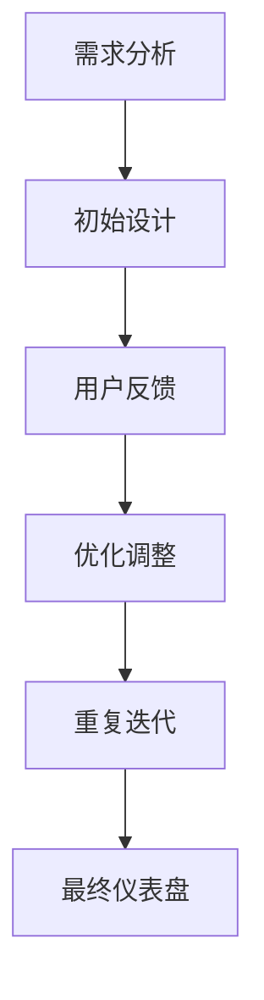

# 仪表盘迭代优化

在 Grafana 中，仪表盘是数据可视化的核心工具。然而，设计一个完美的仪表盘并不是一蹴而就的过程。**迭代优化**是指通过多次改进和调整，逐步提升仪表盘的质量和用户体验。本文将带你了解如何通过迭代优化来改进你的 Grafana 仪表盘。

## 什么是仪表盘迭代优化？

仪表盘迭代优化是一个持续改进的过程，旨在通过多次调整和优化，使仪表盘更加符合用户需求、更易于理解和使用。这个过程通常包括以下几个步骤：

1. **需求分析**：明确仪表盘的目标用户和使用场景。
2. **初始设计**：根据需求设计初步的仪表盘布局和可视化组件。
3. **用户反馈**：收集用户对仪表盘的反馈。
4. **优化调整**：根据反馈进行改进。
5. **重复迭代**：重复上述步骤，直到仪表盘达到预期效果。

## 迭代优化的步骤

### 1. 需求分析

在开始设计仪表盘之前，首先要明确仪表盘的目标用户和使用场景。例如，你的仪表盘是为运维团队设计的，还是为业务分析师设计的？不同的用户群体对数据的需求和关注点可能完全不同。

:::tip
**小贴士**：与目标用户进行沟通，了解他们的需求和痛点，可以帮助你设计出更符合需求的仪表盘。
:::

### 2. 初始设计

根据需求分析的结果，设计初步的仪表盘布局。你可以使用 Grafana 提供的各种面板（如折线图、柱状图、表格等）来展示数据。

```json
{
  "panels": [
    {
      "type": "graph",
      "title": "CPU 使用率",
      "targets": [
        {
          "expr": "rate(node_cpu_seconds_total{mode=\"system\"}[1m])"
        }
      ]
    },
    {
      "type": "singlestat",
      "title": "内存使用率",
      "targets": [
        {
          "expr": "node_memory_MemAvailable_bytes / node_memory_MemTotal_bytes * 100"
        }
      ]
    }
  ]
}
```

### 3. 用户反馈

设计完成后，邀请目标用户试用仪表盘，并收集他们的反馈。用户可能会提出以下问题：

- 数据展示不够直观。
- 某些关键指标缺失。
- 仪表盘加载速度过慢。

:::caution
**注意**：用户反馈是迭代优化的重要依据，务必认真对待。
:::

### 4. 优化调整

根据用户反馈，对仪表盘进行优化调整。例如，如果用户反映数据展示不够直观，你可以尝试更换图表类型或调整颜色方案。

```json
{
  "panels": [
    {
      "type": "bar",
      "title": "CPU 使用率",
      "targets": [
        {
          "expr": "rate(node_cpu_seconds_total{mode=\"system\"}[1m])"
        }
      ]
    },
    {
      "type": "gauge",
      "title": "内存使用率",
      "targets": [
        {
          "expr": "node_memory_MemAvailable_bytes / node_memory_MemTotal_bytes * 100"
        }
      ]
    }
  ]
}
```

### 5. 重复迭代

优化调整后，再次邀请用户试用仪表盘，并收集新的反馈。重复这个过程，直到仪表盘达到预期效果。

## 实际案例

假设你正在为一个电商网站设计一个监控仪表盘，目标是监控网站的实时流量和交易情况。经过多次迭代优化，你最终设计出了以下仪表盘：



在最终仪表盘中，你使用了折线图展示实时流量，使用柱状图展示交易量，并使用单值面板展示当前在线用户数。用户反馈表明，这个仪表盘非常直观且易于理解。

## 总结

仪表盘迭代优化是一个持续改进的过程，通过多次调整和优化，可以使仪表盘更加符合用户需求、更易于理解和使用。关键步骤包括需求分析、初始设计、用户反馈、优化调整和重复迭代。

:::note
**附加资源**：
- [Grafana 官方文档](https://grafana.com/docs/)
- [Grafana 社区论坛](https://community.grafana.com/)
:::

:::tip
**练习**：
1. 设计一个简单的 Grafana 仪表盘，展示服务器的 CPU 和内存使用情况。
2. 邀请同事或朋友试用，并收集他们的反馈。
3. 根据反馈进行优化调整，并重复这个过程，直到仪表盘达到预期效果。
:::