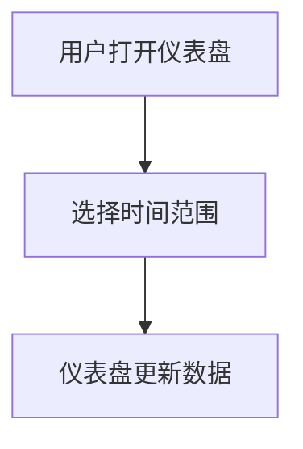
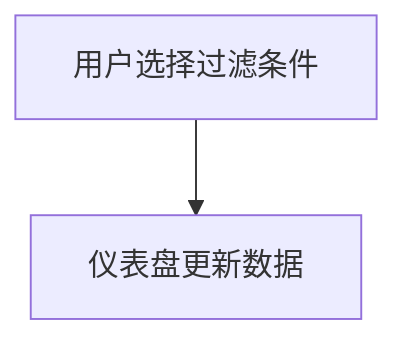
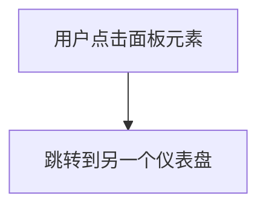

# 交互设计模式

在 Grafana 仪表盘设计中，交互设计模式是指通过特定的设计方式，使用户能够更高效地与数据进行交互。这些模式不仅提升了用户体验，还能帮助用户更快地获取关键信息。本文将介绍几种常见的交互设计模式，并通过实际案例展示它们的应用。

## 什么是交互设计模式？

交互设计模式是经过验证的解决方案，用于解决常见的用户界面问题。在 Grafana 中，这些模式可以帮助用户更直观地操作仪表盘，例如通过点击、拖拽或选择来过滤数据、切换视图或调整时间范围。

:::note
交互设计模式的核心目标是**提升用户体验**，使数据分析过程更加流畅和高效。
:::

## 常见的交互设计模式

### 1. 时间范围选择器

时间范围选择器是 Grafana 中最常用的交互设计模式之一。它允许用户选择特定的时间范围来查看数据。例如，用户可以选择过去 24 小时、过去 7 天或自定义时间范围。



#### 示例代码

```javascript
{
  "time": {
    "from": "now-24h",
    "to": "now"
  }
}
```

在这个示例中，用户选择了过去 24 小时的时间范围，仪表盘会自动更新以显示该时间段内的数据。

### 2. 数据过滤

数据过滤模式允许用户通过选择特定的条件来过滤数据。例如，用户可以选择只显示某个特定服务器的数据，或者只显示某个特定指标的数据。



#### 示例代码

```javascript
{
  "targets": [
    {
      "expr": "up{instance='server1'}",
      "legendFormat": "{{instance}}"
    }
  ]
}
```

在这个示例中，用户选择了只显示 `server1` 的数据，仪表盘会自动更新以显示该服务器的数据。

### 3. 面板链接

面板链接模式允许用户通过点击面板中的某个元素来跳转到另一个仪表盘或面板。这种模式通常用于深入分析某个特定的数据点。



#### 示例代码

```javascript
{
  "links": [
    {
      "title": "View Details",
      "url": "/d/abc123/details"
    }
  ]
}
```

在这个示例中，用户点击面板中的某个元素后，会跳转到另一个仪表盘以查看更详细的数据。

## 实际案例

### 案例 1：监控系统仪表盘

假设你正在设计一个监控系统仪表盘，用户需要能够快速查看不同服务器的状态，并能够深入分析某个服务器的详细数据。

1. **时间范围选择器**：用户可以选择过去 1 小时、6 小时或 24 小时的时间范围来查看服务器的状态。
2. **数据过滤**：用户可以选择只显示某个特定服务器的数据。
3. **面板链接**：用户点击某个服务器的状态面板后，会跳转到该服务器的详细监控仪表盘。

### 案例 2：电商销售仪表盘

假设你正在设计一个电商销售仪表盘，用户需要能够查看不同时间段的销售数据，并能够过滤出某个特定产品的销售数据。

1. **时间范围选择器**：用户可以选择过去 7 天、30 天或自定义时间范围来查看销售数据。
2. **数据过滤**：用户可以选择只显示某个特定产品的销售数据。
3. **面板链接**：用户点击某个产品的销售面板后，会跳转到该产品的详细销售分析仪表盘。

## 总结

交互设计模式在 Grafana 仪表盘设计中起着至关重要的作用。通过合理使用时间范围选择器、数据过滤和面板链接等模式，可以显著提升用户体验和数据分析效率。

:::tip
在实际应用中，建议根据具体需求选择合适的交互设计模式，并不断优化以提升用户体验。
:::

## 附加资源

- [Grafana 官方文档](https://grafana.com/docs/)
- [交互设计模式指南](https://www.interaction-design.org/literature/topics/design-patterns)
- [Grafana 社区论坛](https://community.grafana.com/)

## 练习

1. 设计一个 Grafana 仪表盘，包含时间范围选择器和数据过滤功能。
2. 尝试在仪表盘中添加面板链接，使用户能够跳转到另一个仪表盘以查看详细数据。
3. 思考如何通过交互设计模式优化现有的仪表盘，提升用户体验。
