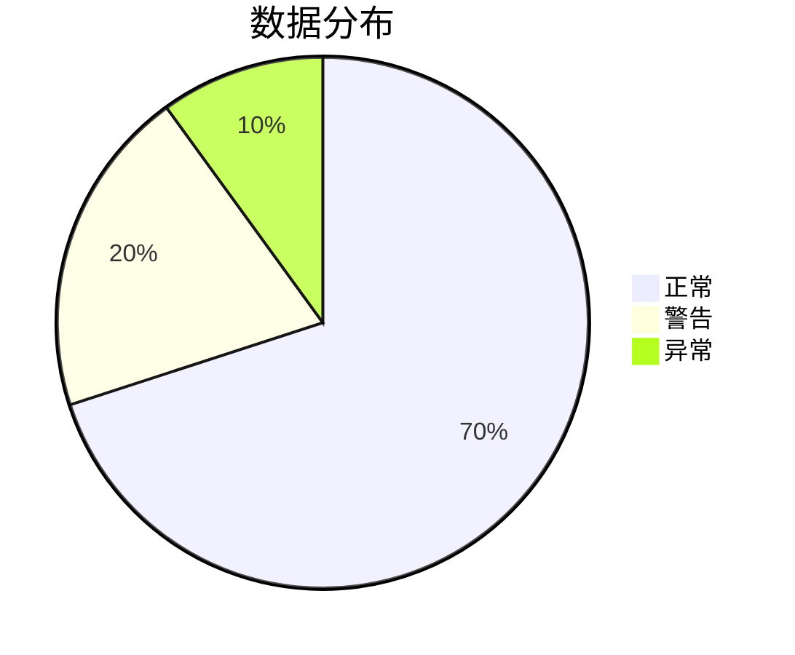

# 数据可视化最佳实践

数据可视化是将复杂的数据以图形化的方式呈现，帮助用户快速理解数据的趋势、模式和异常。在 Grafana 仪表盘设计中，良好的数据可视化实践可以显著提升用户体验，使数据更易于分析和决策。本文将介绍一些关键的最佳实践，帮助初学者设计出高效且美观的仪表盘。

## 1. 明确目标

在设计仪表盘之前，首先要明确可视化的目标。问问自己：
- 这个仪表盘的主要用途是什么？
- 目标用户是谁？
- 他们需要从数据中获取哪些关键信息？

明确目标后，你可以选择最合适的图表类型和布局来传达信息。

:::tip
**提示**：在设计仪表盘时，始终以用户的需求为中心，避免过度复杂化。
:::

## 2. 选择合适的图表类型

不同的数据类型和场景适合不同的图表类型。以下是一些常见的图表类型及其适用场景：

- **折线图**：用于显示数据随时间的变化趋势。
- **柱状图**：用于比较不同类别的数据。
- **饼图**：用于显示各部分占总体的比例。
- **仪表图**：用于显示单个指标的当前状态。

### 示例：折线图

```json
{
  "type": "timeseries",
  "title": "CPU 使用率",
  "targets": [
    {
      "expr": "rate(node_cpu_seconds_total[1m])",
      "legendFormat": "{{cpu}}"
    }
  ]
}
```

**输入**：CPU 使用率数据  
**输出**：随时间变化的 CPU 使用率折线图

## 3. 保持简洁

避免在仪表盘上堆砌过多的图表和信息。过多的信息会让用户感到困惑，难以找到关键数据。遵循以下原则：
- 每个图表只传达一个主要信息。
- 使用颜色和标签来突出重点，但不要过度使用。
- 删除不必要的装饰元素，如过多的网格线或背景色。

:::caution
**注意**：过度使用颜色和装饰元素可能会分散用户的注意力，降低可视化效果的有效性。
:::

## 4. 使用一致的配色方案

颜色在数据可视化中起着至关重要的作用。一致的配色方案可以帮助用户快速识别不同的数据系列和趋势。以下是一些配色建议：
- 使用对比色来区分不同的数据系列。
- 避免使用过于鲜艳或刺眼的颜色。
- 对于警示信息（如异常值），可以使用红色或橙色来突出显示。

### 示例：配色方案



**输出**：一个简单的饼图，使用不同的颜色表示数据的分布情况。

## 5. 提供上下文信息

数据可视化不仅仅是展示数据，还需要提供足够的上下文信息，帮助用户理解数据的含义。以下是一些提供上下文的方法：
- 添加标题和副标题，说明图表的用途。
- 使用图例和标签来解释数据系列。
- 在图表旁边添加注释，解释异常值或重要趋势。

### 示例：添加注释

```json
{
  "type": "timeseries",
  "title": "网络流量",
  "targets": [
    {
      "expr": "rate(node_network_receive_bytes_total[1m])",
      "legendFormat": "{{interface}}"
    }
  ],
  "annotations": {
    "text": "网络流量异常，可能与 DDoS 攻击有关",
    "color": "red"
  }
}
```

**输入**：网络流量数据  
**输出**：带有注释的网络流量折线图，提示异常情况。

## 6. 响应式设计

确保你的仪表盘在不同设备和屏幕尺寸上都能良好显示。Grafana 提供了响应式布局选项，可以根据屏幕大小自动调整图表的大小和位置。

:::note
**提示**：在设计仪表盘时，尽量使用百分比布局，而不是固定像素值，以适应不同的屏幕尺寸。
:::

## 7. 实际案例：监控服务器性能

假设你需要设计一个监控服务器性能的仪表盘。以下是一个简单的设计思路：

1. **CPU 使用率**：使用折线图显示 CPU 使用率随时间的变化。
2. **内存使用情况**：使用柱状图比较不同时间段的内存使用情况。
3. **磁盘 I/O**：使用面积图显示磁盘读写操作的变化。
4. **网络流量**：使用折线图显示网络流量的变化。

### 示例：服务器性能仪表盘

```json
{
  "panels": [
    {
      "type": "timeseries",
      "title": "CPU 使用率",
      "targets": [
        {
          "expr": "rate(node_cpu_seconds_total[1m])",
          "legendFormat": "{{cpu}}"
        }
      ]
    },
    {
      "type": "bargauge",
      "title": "内存使用情况",
      "targets": [
        {
          "expr": "node_memory_MemTotal_bytes - node_memory_MemFree_bytes",
          "legendFormat": "内存使用"
        }
      ]
    }
  ]
}
```

**输入**：服务器性能数据  
**输出**：一个包含 CPU 使用率和内存使用情况的仪表盘。

## 总结

数据可视化是 Grafana 仪表盘设计的核心。通过明确目标、选择合适的图表类型、保持简洁、使用一致的配色方案、提供上下文信息以及确保响应式设计，你可以创建出高效且美观的仪表盘。希望本文的最佳实践能帮助你在数据可视化的道路上迈出坚实的一步。

## 附加资源

- [Grafana 官方文档](https://grafana.com/docs/)
- [数据可视化设计原则](https://www.tableau.com/learn/whitepapers/tableau-visual-guidebook)
- [Grafana 社区论坛](https://community.grafana.com/)

## 练习

1. 设计一个监控网站流量的仪表盘，包含访问量、响应时间和错误率的可视化。
2. 尝试使用不同的图表类型来展示同一组数据，比较它们的优缺点。
3. 为你的仪表盘添加注释，解释数据中的异常值或重要趋势。

通过不断实践和优化，你将能够设计出更加专业和高效的 Grafana 仪表盘。