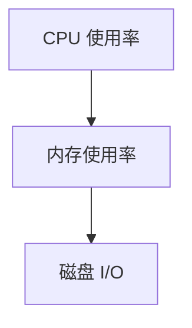
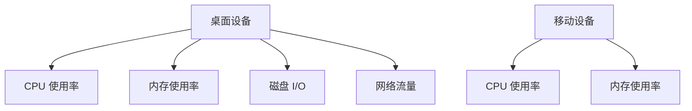

# 布局技巧与响应式设计

在 Grafana 仪表盘设计中，布局和响应式设计是至关重要的。它们决定了仪表盘在不同设备和屏幕尺寸下的显示效果。本文将带你了解如何设计灵活的布局，并实现响应式设计，以确保你的仪表盘在任何设备上都能完美呈现。

## 什么是布局与响应式设计？

**布局**是指仪表盘中各个组件的排列方式。一个好的布局能够使信息更加清晰易读，提升用户体验。**响应式设计**则是指仪表盘能够根据屏幕尺寸自动调整布局和组件大小，以适应不同的设备，如桌面、平板和手机。

## 布局技巧

### 1. 使用网格布局

Grafana 仪表盘默认使用网格布局，这意味着你可以将面板（Panel）放置在网格的任意位置。通过调整面板的大小和位置，你可以创建出整洁有序的布局。

```mdx
:::note
**提示**：在 Grafana 中，你可以通过拖拽面板的边框来调整其大小，或者通过点击面板右上角的“编辑”按钮来精确设置面板的宽度和高度。
:::
```

### 2. 分组相关面板

将相关的面板分组放置在一起，可以帮助用户更快地理解数据之间的关系。例如，将 CPU 使用率、内存使用率和磁盘 I/O 的面板放在一起，可以方便用户监控系统性能。



### 3. 使用空白区域

适当的空白区域可以提升仪表盘的可读性。不要试图将所有面板挤在一起，留出一些空白区域可以让仪表盘看起来更加整洁。

## 响应式设计

### 1. 使用百分比宽度

在 Grafana 中，面板的宽度可以使用百分比来设置。这样，当屏幕尺寸发生变化时，面板的宽度会自动调整。

```mdx
:::tip
**示例**：将一个面板的宽度设置为 `50%`，这样无论屏幕宽度如何变化，面板始终占据屏幕的一半宽度。
:::
```

### 2. 使用自动高度

Grafana 允许你设置面板的高度为自动调整。这样，当面板内容发生变化时，高度会自动适应内容的变化。

```mdx
:::caution
**注意**：自动高度可能会导致面板在不同设备上显示不一致，建议在移动设备上使用固定高度。
:::
```

### 3. 响应式布局设置

Grafana 提供了响应式布局设置，允许你为不同的屏幕尺寸设置不同的布局。例如，你可以在桌面设备上显示更多的面板，而在移动设备上只显示关键信息。

```mdx
:::warning
**警告**：响应式布局设置需要仔细规划，确保在每种设备上都能提供最佳的用户体验。
:::
```

## 实际案例

假设你正在设计一个监控服务器性能的仪表盘。你可以在桌面设备上显示 CPU 使用率、内存使用率、磁盘 I/O 和网络流量四个面板，而在移动设备上只显示 CPU 使用率和内存使用率两个关键面板。



## 总结

通过合理的布局和响应式设计，你可以创建出适应不同设备和屏幕尺寸的 Grafana 仪表盘。记住，一个好的布局能够提升用户体验，而响应式设计则确保仪表盘在各种设备上都能完美呈现。

## 附加资源与练习

- **练习**：尝试在你的 Grafana 仪表盘中实现一个响应式布局，确保在桌面和移动设备上都能正常显示。
- **资源**：阅读 Grafana 官方文档中关于[布局](https://grafana.com/docs/grafana/latest/panels/)和[响应式设计](https://grafana.com/docs/grafana/latest/features/dashboard/)的更多内容。

希望本文能帮助你更好地理解 Grafana 仪表盘设计中的布局技巧与响应式设计。如果你有任何问题或建议，欢迎在评论区留言！