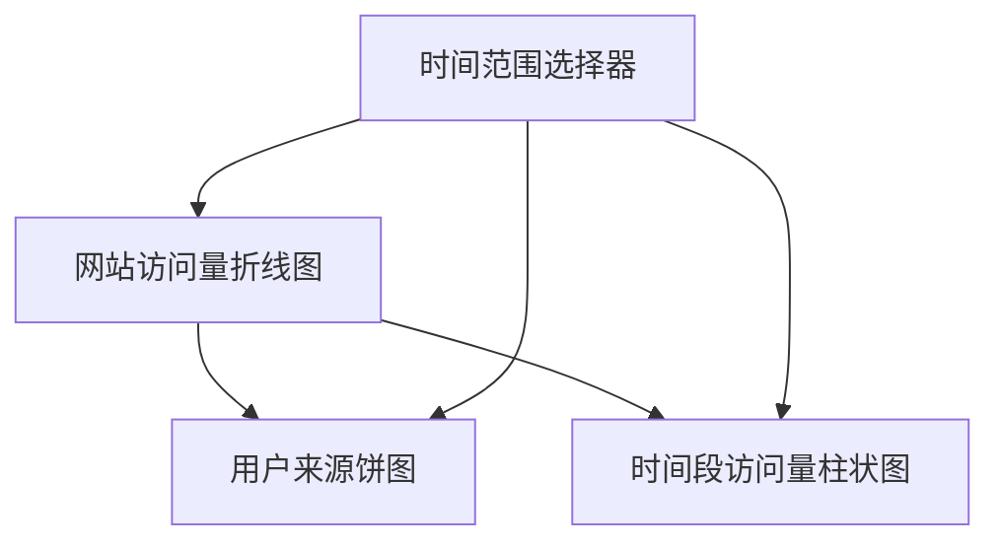

# 仪表盘故事叙述

在现代数据驱动的世界中，仪表盘不仅仅是展示数据的工具，它们还可以用来讲述数据背后的故事。通过精心设计的仪表盘，你可以引导观众理解数据中的关键信息，并帮助他们做出明智的决策。本文将介绍如何使用 Grafana 仪表盘设计来讲述数据故事，适合初学者学习和实践。

## 什么是仪表盘故事叙述？

仪表盘故事叙述是一种通过可视化手段将数据转化为有意义的叙述的过程。它不仅仅是展示数据，而是通过设计、布局和交互来引导观众理解数据中的关键信息。一个好的仪表盘故事叙述应该能够回答以下问题：

- 数据中最重要的趋势是什么？
- 数据中的异常或异常值是什么？
- 数据如何支持或反驳某个假设？
- 数据如何帮助做出决策？

## 仪表盘故事叙述的关键要素

### 1. **明确的目标**
在设计仪表盘之前，首先要明确你想要传达的核心信息。这个目标将指导你选择哪些数据、如何展示数据以及如何组织仪表盘的布局。

### 2. **数据的选择与过滤**
选择与目标相关的数据，并过滤掉无关的信息。过多的数据可能会让观众感到困惑，因此只展示最关键的数据点。

### 3. **可视化类型的选择**
根据数据的类型和你要传达的信息，选择合适的可视化类型。例如，时间序列数据适合使用折线图，而分类数据则适合使用柱状图或饼图。

### 4. **布局与层次结构**
仪表盘的布局应该引导观众的视线，使他们能够自然地从一个数据点过渡到另一个数据点。使用层次结构来突出最重要的信息，并将相关的数据点放在一起。

### 5. **交互与动态更新**
通过交互功能（如过滤器、下拉菜单等），观众可以探索数据的不同方面。动态更新的数据可以让仪表盘保持实时性，确保观众看到的是最新的信息。

## 实际案例：监控网站流量

假设你正在监控一个网站的流量，并希望通过仪表盘讲述网站流量的故事。以下是一个简单的步骤：

### 1. 明确目标
你的目标是展示网站流量的趋势，并识别出流量高峰和低谷。

### 2. 选择数据
选择网站访问量、用户来源（如搜索引擎、社交媒体等）以及访问时间等数据。

### 3. 选择可视化类型
- 使用折线图展示网站访问量的时间序列数据。
- 使用饼图展示用户来源的分布。
- 使用柱状图展示不同时间段的访问量。

### 4. 设计布局
将折线图放在仪表盘的顶部，因为它是最重要的信息。将饼图和柱状图放在下方，作为补充信息。

### 5. 添加交互功能
添加一个时间范围选择器，允许观众查看不同时间段的流量数据。

### 6. 动态更新
确保仪表盘能够实时更新，以反映最新的流量数据。

## 总结

仪表盘故事叙述是一种强大的工具，可以帮助你将复杂的数据转化为易于理解的叙述。通过明确目标、选择合适的数据和可视化类型、设计清晰的布局以及添加交互功能，你可以创建出既美观又实用的仪表盘。

## 附加资源与练习

- **练习**：尝试使用 Grafana 创建一个简单的仪表盘，展示你所在城市的天气数据。选择合适的数据和可视化类型，并设计一个清晰的布局。
- **资源**：阅读 Grafana 官方文档，了解更多关于仪表盘设计和故事叙述的技巧。

:::tip
记住，一个好的仪表盘不仅仅是展示数据，它还要能够引导观众理解数据背后的故事。通过不断实践和优化，你将能够创建出更加出色的仪表盘。
:::