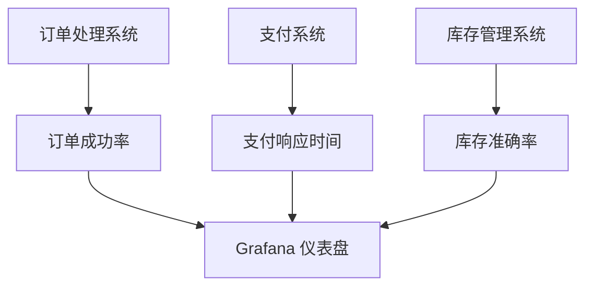

# 业务影响评估

## 介绍

业务影响评估（Business Impact Assessment, BIA）是一种用于分析和评估业务系统或服务中断对组织整体运营影响的方法。通过 BIA，企业可以识别关键业务流程、确定其优先级，并制定相应的恢复策略。在 Grafana 中，业务影响评估通常与监控和告警系统结合使用，帮助团队快速识别和响应可能影响业务的关键问题。

本文将逐步介绍如何在 Grafana 中进行业务影响评估，并通过实际案例展示其应用场景。

---

## 什么是业务影响评估？

业务影响评估的核心目标是回答以下问题：
- 哪些业务流程对组织的成功至关重要？
- 这些流程的中断会对业务造成多大的影响？
- 如何量化这些影响，并制定相应的应对策略？

通过 Grafana，我们可以将业务指标与监控数据结合，实时评估业务健康状况，并在问题发生时快速采取行动。

---

## 业务影响评估的关键步骤

### 1. 识别关键业务流程
首先，需要明确哪些业务流程对业务至关重要。例如，对于一个电商平台，订单处理系统、支付系统和库存管理系统可能是关键流程。

### 2. 定义业务指标
为每个关键流程定义可量化的业务指标。例如：
- 订单处理系统的成功率
- 支付系统的响应时间
- 库存管理系统的库存准确率

### 3. 收集和可视化数据
使用 Grafana 的数据源（如 Prometheus、InfluxDB 或 Elasticsearch）收集相关数据，并通过仪表盘进行可视化。以下是一个简单的 Grafana 查询示例，用于监控订单处理系统的成功率：

```sql
SELECT
  success_rate
FROM
  order_processing_metrics
WHERE
  time > now() - 1h
```

### 4. 设置告警规则
为关键业务指标设置告警规则。例如，当订单处理系统的成功率低于 95% 时触发告警：

```yaml
- alert: OrderProcessingFailure
  expr: success_rate < 0.95
  for: 5m
  labels:
    severity: critical
  annotations:
    summary: "订单处理系统成功率低于 95%"
    description: "请立即检查订单处理系统。"
```

### 5. 评估影响并制定应对策略
当告警触发时，团队需要快速评估业务影响并采取相应措施。例如：
- 如果订单处理系统失败，可能导致收入损失。
- 如果支付系统响应时间过长，可能导致客户流失。

---

## 实际案例：电商平台的业务影响评估

假设我们正在为一个电商平台设计业务影响评估系统。以下是具体步骤：

### 1. 识别关键业务流程
- 订单处理系统
- 支付系统
- 库存管理系统

### 2. 定义业务指标
- 订单处理系统的成功率
- 支付系统的平均响应时间
- 库存管理系统的库存准确率

### 3. 可视化数据
在 Grafana 中创建仪表盘，展示以下指标：
- 订单处理成功率
- 支付系统响应时间
- 库存准确率

以下是一个 Mermaid 图表，展示数据流：



### 4. 设置告警
为每个指标设置告警规则：
- 订单成功率低于 95%
- 支付响应时间超过 2 秒
- 库存准确率低于 98%

### 5. 评估影响
当告警触发时，团队可以快速查看仪表盘，了解问题的严重性并采取行动。例如：
- 如果订单成功率下降，可能需要检查服务器负载或数据库性能。
- 如果支付响应时间过长，可能需要优化支付网关的配置。

---

## 总结

业务影响评估是确保业务连续性和稳定性的重要工具。通过 Grafana，我们可以将业务指标与监控数据结合，实时评估业务健康状况，并在问题发生时快速响应。本文介绍了业务影响评估的关键步骤，并通过实际案例展示了其在电商平台中的应用。

---

## 附加资源与练习

### 资源
- [Grafana 官方文档](https://grafana.com/docs/)
- [Prometheus 查询语言（PromQL）指南](https://prometheus.io/docs/prometheus/latest/querying/basics/)

### 练习
1. 为你的项目识别关键业务流程，并定义相应的业务指标。
2. 使用 Grafana 创建一个仪表盘，展示这些指标。
3. 为关键指标设置告警规则，并测试其触发条件。

通过实践，你将更好地掌握业务影响评估的核心概念和应用方法。