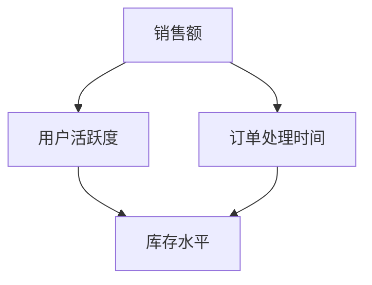

# 执行层仪表盘

在现代业务中，监控和分析关键指标是确保系统稳定性和业务成功的关键。Grafana 是一个强大的开源工具，可以帮助你创建直观的仪表盘，实时监控业务数据。本文将介绍如何创建**执行层仪表盘**，帮助你更好地理解业务执行情况。

## 什么是执行层仪表盘？

执行层仪表盘是一种专门用于监控和分析业务执行情况的仪表盘。它通常包含关键业务指标（KPI），例如销售额、用户活跃度、订单处理时间等。通过将这些指标可视化，执行层仪表盘可以帮助业务决策者快速了解业务状态，并做出相应的调整。

## 为什么需要执行层仪表盘？

1. **实时监控**：执行层仪表盘可以实时显示业务数据，帮助你快速发现问题。
2. **数据驱动决策**：通过可视化数据，决策者可以更直观地理解业务趋势，做出数据驱动的决策。
3. **提高效率**：集中展示关键指标，减少手动分析数据的时间。

## 创建执行层仪表盘的步骤

### 1. 准备数据源

在创建仪表盘之前，你需要确保有一个可靠的数据源。Grafana 支持多种数据源，包括 Prometheus、InfluxDB、MySQL 等。假设我们使用 Prometheus 作为数据源。

```bash
# 示例：Prometheus 数据源配置
datasources:
  - name: Prometheus
    type: prometheus
    url: http://localhost:9090
    access: proxy
    isDefault: true
```

### 2. 创建仪表盘

在 Grafana 中，仪表盘由多个面板组成，每个面板可以显示不同的指标。以下是创建一个简单仪表盘的步骤：

1. 登录 Grafana，点击左侧菜单中的 **+** 按钮，选择 **Dashboard**。
2. 点击 **Add new panel**，选择数据源为 Prometheus。
3. 在查询编辑器中输入 PromQL 查询语句，例如 `sum(rate(http_requests_total[5m]))`，以监控 HTTP 请求速率。
4. 设置面板的标题和单位，例如 "HTTP 请求速率 (req/s)"。
5. 点击 **Apply** 保存面板。

### 3. 添加更多指标

你可以继续添加更多面板，监控其他关键指标。例如：

- **用户活跃度**：`sum(rate(user_activity_total[5m]))`
- **订单处理时间**：`avg(order_processing_time_seconds)`

### 4. 优化仪表盘布局

Grafana 允许你自由调整面板的大小和位置。你可以将相关指标放在一起，形成一个逻辑清晰的布局。

## 实际案例：电商业务监控

假设你正在运营一个电商平台，以下是一些你可能需要监控的关键指标：

1. **销售额**：`sum(rate(sales_total[5m]))`
2. **用户活跃度**：`sum(rate(user_activity_total[5m]))`
3. **订单处理时间**：`avg(order_processing_time_seconds)`
4. **库存水平**：`sum(inventory_level)`

通过将这些指标可视化，你可以快速了解业务的整体状态，并在发现问题时及时采取措施。



## 总结

执行层仪表盘是监控和分析业务执行情况的重要工具。通过 Grafana，你可以轻松创建直观的仪表盘，实时监控关键业务指标。本文介绍了如何准备数据源、创建仪表盘、添加指标以及优化布局。希望这些内容能帮助你快速上手 Grafana，并应用到实际业务中。

## 附加资源

- [Grafana 官方文档](https://grafana.com/docs/)
- [Prometheus 查询语言 (PromQL) 指南](https://prometheus.io/docs/prometheus/latest/querying/basics/)
- [Grafana 仪表盘最佳实践](https://grafana.com/docs/grafana/latest/best-practices/)

## 练习

1. 尝试使用 Grafana 创建一个简单的执行层仪表盘，监控你所在业务的关键指标。
2. 探索 Grafana 的其他功能，例如警报和注释，进一步提升仪表盘的实用性。