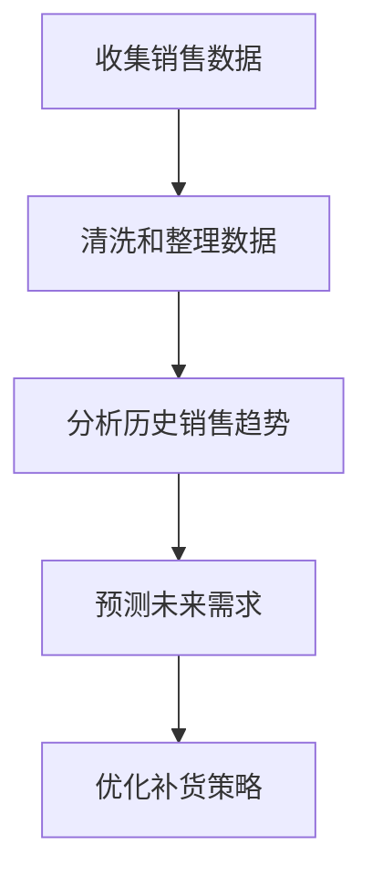

# 数据驱动决策

在现代业务环境中，数据驱动决策（Data-Driven Decision Making, DDDM）是一种基于数据分析而非直觉或经验的决策方法。通过收集、分析和可视化数据，企业可以更准确地了解业务状况，从而做出更明智的决策。Grafana 作为一个强大的数据可视化工具，能够帮助您将数据转化为可操作的见解。

## 什么是数据驱动决策？

数据驱动决策是指通过分析数据来指导业务决策的过程。它依赖于数据的收集、处理和分析，以提供客观的依据，而不是依赖主观判断或经验。这种方法可以帮助企业：

- 提高决策的准确性
- 优化业务流程
- 发现潜在问题
- 预测未来趋势

## 数据驱动决策的核心步骤

1. **数据收集**：从各种来源（如数据库、API、日志文件等）收集数据。
2. **数据处理**：清洗、转换和整理数据，使其适合分析。
3. **数据分析**：使用统计方法或机器学习算法分析数据，提取有价值的信息。
4. **数据可视化**：将分析结果以图表或仪表盘的形式展示，便于理解。
5. **决策制定**：基于数据分析结果，制定业务决策。

## Grafana 在数据驱动决策中的作用

Grafana 是一个开源的数据可视化和监控工具，支持多种数据源（如 Prometheus、InfluxDB、Elasticsearch 等）。它可以帮助您：

- 创建交互式仪表盘，实时监控业务指标
- 通过图表和警报快速识别问题
- 将复杂的数据转化为易于理解的视觉信息

### 示例：使用 Grafana 监控网站流量

假设您正在运营一个网站，并希望通过监控流量来优化用户体验。以下是一个简单的示例，展示如何使用 Grafana 创建一个流量监控仪表盘。

#### 步骤 1：设置数据源

首先，您需要将 Grafana 连接到您的数据源。假设您使用的是 Prometheus 来收集网站流量数据。

```yaml
datasources:
  - name: Prometheus
    type: prometheus
    url: http://localhost:9090
    access: proxy
```

#### 步骤 2：创建仪表盘

接下来，创建一个新的仪表盘并添加一个图表来显示网站流量。

```yaml
panels:
  - title: Website Traffic
    type: graph
    datasource: Prometheus
    targets:
      - expr: rate(http_requests_total[1m])
        legendFormat: "{{handler}}"
```

#### 步骤 3：分析数据

通过 Grafana 的图表，您可以实时查看网站流量的变化趋势。例如，您可能会发现某个页面的流量突然下降，这可能表明该页面存在问题。

#### 步骤 4：制定决策

基于数据分析结果，您可以决定是否需要优化该页面的加载速度或内容，以提高用户体验。

## 实际案例：电商平台的库存管理

假设您运营一个电商平台，库存管理是一个关键的业务挑战。通过 Grafana 与业务集成，您可以实现以下目标：

1. **实时监控库存水平**：通过 Grafana 仪表盘实时查看每个产品的库存数量。
2. **预测需求**：分析历史销售数据，预测未来的需求趋势。
3. **优化补货策略**：基于预测结果，制定更有效的补货策略，避免库存不足或过剩。



## 总结

数据驱动决策是现代企业成功的关键。通过 Grafana 与业务集成，您可以轻松地将数据转化为可操作的见解，从而优化业务流程并提高决策的准确性。无论您是监控网站流量、管理库存还是分析用户行为，Grafana 都能为您提供强大的支持。

## 附加资源与练习

- **练习 1**：尝试使用 Grafana 创建一个简单的仪表盘，监控您的个人项目中的某个指标（如 CPU 使用率或内存使用情况）。
- **练习 2**：分析一个公开的数据集（如 Kaggle 上的数据集），并使用 Grafana 可视化分析结果。
- **资源**：阅读 Grafana 官方文档，了解更多高级功能和使用技巧。

:::tip
记住，数据驱动决策的核心在于持续学习和优化。通过不断实践和探索，您将能够更好地利用数据来推动业务增长。
:::