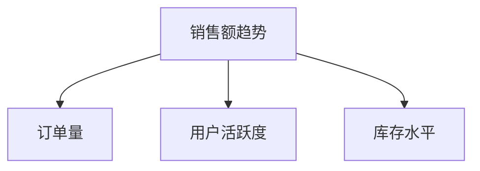

# 经营状况大屏设计

在现代企业中，实时监控经营状况是提升决策效率的关键。通过 **Grafana**，我们可以设计一个直观、动态的经营状况大屏，帮助企业管理者快速了解业务运行状态。本文将逐步讲解如何设计一个经营状况大屏，适合初学者学习和实践。

---

## 什么是经营状况大屏？

经营状况大屏是一种数据可视化工具，用于实时展示企业的关键业务指标（KPI）。它通常以仪表盘的形式呈现，包含多个图表、指标和警报，帮助管理者快速掌握业务动态。Grafana 是一个强大的开源工具，支持多种数据源，能够轻松创建动态、交互式的经营状况大屏。

---

## 设计经营状况大屏的步骤

### 1. 确定关键指标
首先，明确需要监控的关键业务指标。常见的指标包括：
- 销售额
- 订单量
- 用户活跃度
- 库存水平
- 客户满意度

:::tip
选择指标时，确保它们与业务目标紧密相关，并且能够反映业务的健康状况。
:::

### 2. 选择数据源
Grafana 支持多种数据源，包括：
- Prometheus
- InfluxDB
- MySQL
- Elasticsearch

假设我们使用 **Prometheus** 作为数据源，以下是如何配置的示例：

```yaml
datasources:
  - name: Prometheus
    type: prometheus
    url: http://localhost:9090
    access: proxy
```

### 3. 创建仪表盘
在 Grafana 中，仪表盘是展示数据的核心。以下是创建仪表盘的步骤：
1. 登录 Grafana，点击左侧菜单中的 **Dashboards**。
2. 点击 **New Dashboard**，然后选择 **Add Panel**。
3. 在面板中选择数据源和查询语句。

例如，展示销售额的查询语句可能如下：

```promql
sum(rate(sales_total[1m]))
```

### 4. 设计可视化组件
Grafana 提供了多种可视化组件，包括折线图、柱状图、仪表盘等。以下是一个折线图的配置示例：

```json
{
  "type": "graph",
  "title": "销售额趋势",
  "datasource": "Prometheus",
  "targets": [
    {
      "expr": "sum(rate(sales_total[1m]))",
      "legendFormat": "销售额"
    }
  ]
}
```

### 5. 添加警报
为了及时发现问题，可以为关键指标设置警报。例如，当销售额低于某个阈值时触发警报：

```yaml
alert:
  - name: 销售额过低
    conditions:
      - type: query
        query: "sum(rate(sales_total[1m])) < 1000"
        evaluator:
          type: below
          params: [1000]
```

---

## 实际案例：电商经营状况大屏

假设我们为一家电商公司设计经营状况大屏，以下是关键指标和设计思路：

1. **销售额趋势**：使用折线图展示每日销售额变化。
2. **订单量**：使用柱状图展示每小时订单量。
3. **用户活跃度**：使用饼图展示不同用户群体的活跃比例。
4. **库存水平**：使用仪表盘展示当前库存量。

以下是一个简单的 Mermaid 图表，展示大屏布局：



---

## 总结

通过 Grafana，我们可以轻松设计一个功能强大的经营状况大屏，实时监控业务关键指标。本文介绍了从确定指标到设计可视化组件的完整流程，适合初学者学习和实践。

---

## 附加资源与练习

1. **练习**：尝试使用 Grafana 创建一个简单的仪表盘，展示某个业务指标的变化趋势。
2. **资源**：
   - [Grafana 官方文档](https://grafana.com/docs/)
   - [Prometheus 查询语言指南](https://prometheus.io/docs/prometheus/latest/querying/basics/)

:::caution
在实际应用中，确保数据源的稳定性和安全性，避免数据泄露或丢失。
:::