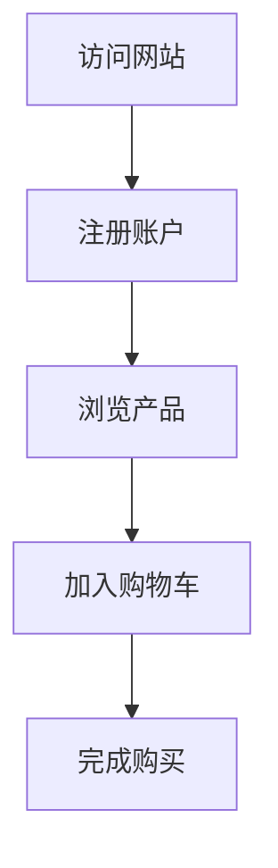

# 客户旅程可视化

在现代业务中，理解客户如何与产品或服务互动至关重要。客户旅程可视化是一种通过图表和仪表板展示用户从初次接触到最终转化的整个过程的方法。通过 Grafana，我们可以轻松地将客户旅程可视化，帮助业务团队更好地分析用户行为并优化用户体验。

## 什么是客户旅程可视化？

客户旅程可视化是指将用户与产品或服务的互动过程以图表或仪表板的形式展示出来。这些互动可能包括访问网站、注册账户、购买产品等。通过可视化这些步骤，业务团队可以更直观地了解用户在哪些环节流失，从而有针对性地优化用户体验。

## 为什么使用 Grafana 进行客户旅程可视化？

Grafana 是一个强大的开源工具，专门用于数据可视化和监控。它支持多种数据源，如 Prometheus、InfluxDB、Elasticsearch 等，能够轻松地将复杂的业务数据转化为直观的图表和仪表板。通过 Grafana，我们可以实时监控客户旅程中的关键指标，如转化率、流失率等，从而快速发现问题并采取行动。

## 如何实现客户旅程可视化？

### 1. 数据收集

首先，我们需要收集客户旅程中的数据。这些数据可以来自网站分析工具（如 Google Analytics）、CRM 系统、或自定义的事件跟踪系统。确保数据包含用户在每个步骤中的行为，如页面访问、按钮点击、表单提交等。

### 2. 数据存储

将收集到的数据存储在 Grafana 支持的数据源中。例如，我们可以使用 Prometheus 来存储时间序列数据，或使用 Elasticsearch 来存储日志数据。

```yaml
# 示例：Prometheus 数据存储配置
global:
  scrape_interval: 15s

scrape_configs:
  - job_name: 'customer_journey'
    static_configs:
      - targets: ['localhost:9090']
```

### 3. 创建 Grafana 仪表板

在 Grafana 中创建一个新的仪表板，并添加与客户旅程相关的图表。例如，我们可以创建一个漏斗图来展示用户在各个步骤中的转化率。



### 4. 配置图表

在 Grafana 中配置图表时，我们可以使用 PromQL（Prometheus 查询语言）或 Elasticsearch 查询来获取数据。例如，以下是一个简单的 PromQL 查询，用于获取用户在某个步骤中的数量：

```promql
sum(rate(customer_journey_steps_total{step="visit_website"}[1m]))
```

### 5. 实时监控与优化

通过 Grafana 的实时监控功能，我们可以随时查看客户旅程中的关键指标。如果发现某个步骤的流失率较高，我们可以立即采取优化措施，如改进页面设计、优化表单填写流程等。

## 实际案例

假设我们有一个电商网站，用户从访问网站到完成购买的旅程包括以下步骤：

1. 访问网站
2. 浏览产品
3. 加入购物车
4. 完成购买

通过 Grafana，我们可以创建一个漏斗图来展示每个步骤的转化率。如果发现“加入购物车”到“完成购买”的转化率较低，我们可以进一步分析原因，如支付流程复杂、物流信息不明确等，并采取相应的优化措施。

## 总结

客户旅程可视化是理解用户行为、优化用户体验的重要工具。通过 Grafana，我们可以轻松地将复杂的业务数据转化为直观的图表和仪表板，帮助业务团队快速发现问题并采取行动。

## 附加资源与练习

- **练习**：尝试使用 Grafana 创建一个简单的客户旅程仪表板，展示用户在某个应用中的关键行为。
- **资源**：
  - [Grafana 官方文档](https://grafana.com/docs/)
  - [Prometheus 入门指南](https://prometheus.io/docs/introduction/overview/)
  - [Elasticsearch 官方文档](https://www.elastic.co/guide/index.html)

:::tip
提示：在实际应用中，确保数据收集的准确性和完整性是成功实现客户旅程可视化的关键。
:::