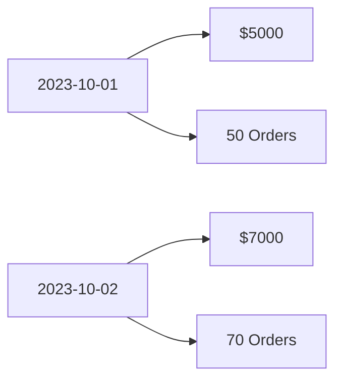

## 介绍

在现代企业中，销售与营销数据的分析是优化业务策略、提高客户满意度和增加收入的关键。Grafana 是一个强大的数据可视化工具，能够帮助你将复杂的销售与营销数据转化为易于理解的图表和仪表盘。通过 Grafana，你可以实时监控销售业绩、分析营销活动的效果，并做出数据驱动的决策。

本文将引导你如何使用 Grafana 进行销售与营销分析，适合初学者。我们将从基本概念开始，逐步深入，并通过实际案例展示如何将这些技术应用到你的业务中。

---

## 1. 销售与营销数据的基础

在开始使用 Grafana 之前，首先需要了解销售与营销数据的类型。常见的销售数据包括：

- **销售额**：一段时间内的总收入。
- **订单数量**：客户下单的总次数。
- **客户数量**：购买产品或服务的客户总数。
- **转化率**：从潜在客户到实际购买客户的转化比例。

营销数据则可能包括：

- **广告点击率**：广告被点击的次数与展示次数的比例。
- **网站流量**：访问网站的用户数量。
- **社交媒体互动**：用户在社交媒体上的点赞、评论和分享次数。

这些数据通常存储在数据库（如 MySQL、PostgreSQL）或数据仓库（如 Snowflake、BigQuery）中。Grafana 可以通过连接这些数据源，实时获取并展示数据。

---

## 2. 设置 Grafana 数据源

首先，你需要在 Grafana 中配置数据源。以下是一个连接到 MySQL 数据库的示例：

```yaml
datasources:
  - name: MySQL
    type: mysql
    url: localhost:3306
    database: sales_data
    user: grafana_user
    password: secure_password
```

在 Grafana 的 UI 中，你可以通过以下步骤完成配置：

1. 登录 Grafana。
2. 点击左侧菜单中的 **Configuration**（配置）。
3. 选择 **Data Sources**（数据源）。
4. 点击 **Add data source**（添加数据源）。
5. 选择 MySQL，并填写连接信息。

:::tip
确保你的数据库用户具有足够的权限来查询数据。
:::

---

## 3. 创建销售仪表盘

接下来，我们将创建一个简单的销售仪表盘，展示每日销售额和订单数量。

### 3.1 查询每日销售额

在 Grafana 中，你可以使用 SQL 查询从数据库中提取数据。以下是一个查询每日销售额的示例：

```sql
SELECT
  DATE(order_date) AS day,
  SUM(total_amount) AS daily_sales
FROM
  orders
GROUP BY
  day
ORDER BY
  day;
```

### 3.2 可视化数据

在 Grafana 中，你可以将查询结果可视化为折线图：

1. 点击 **+** 按钮，选择 **Dashboard**（仪表盘）。
2. 点击 **Add new panel**（添加新面板）。
3. 在查询编辑器中输入上述 SQL 查询。
4. 选择 **Visualization**（可视化）为 **Time series**（时间序列）。
5. 调整图表样式，例如颜色和标签。

以下是一个示例输出：



---

## 4. 营销活动效果分析

除了销售数据，你还可以使用 Grafana 分析营销活动的效果。例如，你可以创建一个仪表盘来监控广告点击率和网站流量。

### 4.1 查询广告点击率

以下是一个查询广告点击率的示例：

```sql
SELECT
  DATE(click_time) AS day,
  COUNT(*) AS clicks,
  COUNT(DISTINCT user_id) AS unique_clicks
FROM
  ad_clicks
GROUP BY
  day
ORDER BY
  day;
```

### 4.2 可视化营销数据

将查询结果可视化为柱状图：

1. 创建一个新的面板。
2. 输入上述 SQL 查询。
3. 选择 **Visualization** 为 **Bar chart**（柱状图）。
4. 调整图表样式以突出显示关键指标。

---

## 5. 实际案例：电商销售分析

假设你运营一家电商平台，希望通过 Grafana 监控销售和营销表现。以下是一个实际案例：

- **目标**：分析每日销售额、订单数量和广告点击率。
- **步骤**：
  1. 连接 MySQL 数据库，提取销售和营销数据。
  2. 创建仪表盘，展示每日销售额和订单数量的折线图。
  3. 添加广告点击率的柱状图。
  4. 设置警报，当销售额低于预期时通知团队。

通过这种方式，你可以实时了解业务表现，并快速做出调整。

---

## 总结

Grafana 是一个强大的工具，能够帮助你轻松分析销售与营销数据。通过本文的学习，你应该已经掌握了如何设置数据源、创建仪表盘以及可视化关键指标。无论是监控销售额还是分析营销活动效果，Grafana 都能为你提供清晰的数据洞察。

---

## 附加资源与练习

- **练习**：尝试连接你的业务数据库，创建一个展示每周销售额的仪表盘。
- **资源**：
  - [Grafana 官方文档](https://grafana.com/docs/)
  - [SQL 入门教程](https://www.w3schools.com/sql/)
  - [数据可视化最佳实践](https://www.tableau.com/learn/whitepapers/visual-best-practices)

继续探索 Grafana 的功能，并将其应用到你的业务中，你会发现数据驱动的决策是多么强大！