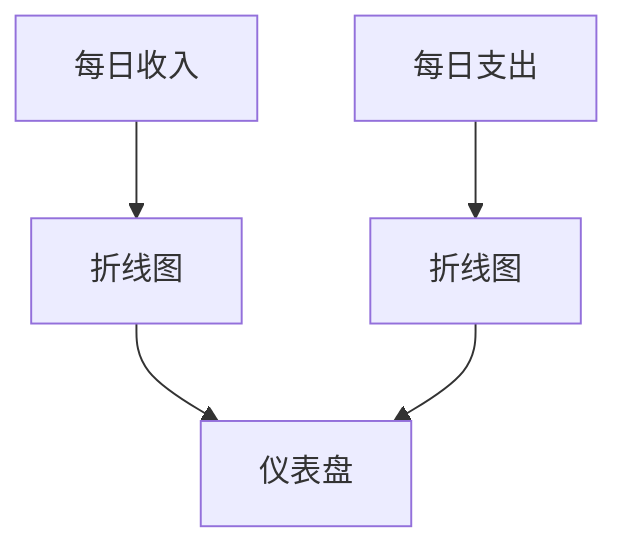

# 财务指标监控

在现代企业中，财务指标是衡量业务健康状况的关键因素。通过实时监控这些指标，企业可以快速发现问题并采取相应措施。Grafana 是一个强大的可视化工具，可以帮助我们轻松地监控和分析财务数据。

## 什么是财务指标监控？

财务指标监控是指通过收集、分析和可视化财务数据，来评估企业的财务健康状况。常见的财务指标包括收入、支出、利润、现金流等。通过实时监控这些指标，企业可以及时发现问题并采取相应措施。

## 为什么使用 Grafana 进行财务指标监控？

Grafana 是一个开源的可视化工具，支持多种数据源，如 Prometheus、InfluxDB、MySQL 等。它提供了丰富的图表和仪表盘功能，可以帮助我们轻松地创建和共享财务指标的监控面板。

## 如何设置 Grafana 进行财务指标监控

### 1. 安装 Grafana

首先，你需要在你的服务器上安装 Grafana。你可以通过以下命令在 Linux 系统上安装 Grafana：

```bash
sudo apt-get install -y grafana
```

安装完成后，启动 Grafana 服务：

```bash
sudo systemctl start grafana-server
```

### 2. 配置数据源

Grafana 支持多种数据源，你可以根据你的需求选择合适的数据源。例如，如果你使用 MySQL 存储财务数据，可以在 Grafana 中添加 MySQL 数据源。

1. 打开 Grafana 的 Web 界面（通常位于 `http://localhost:3000`）。
2. 点击左侧菜单中的 "Configuration" -> "Data Sources"。
3. 点击 "Add data source" 按钮，选择 MySQL。
4. 填写数据库的连接信息，如主机名、端口、用户名和密码。
5. 点击 "Save & Test" 按钮，确保连接成功。

### 3. 创建仪表盘

接下来，你可以创建一个新的仪表盘来监控财务指标。

1. 点击左侧菜单中的 "Create" -> "Dashboard"。
2. 点击 "Add new panel" 按钮，选择你想要展示的图表类型（如折线图、柱状图等）。
3. 在 "Query" 选项卡中，编写 SQL 查询来获取财务数据。例如：

```sql
SELECT date, revenue FROM financial_data WHERE date >= NOW() - INTERVAL 7 DAY;
```

4. 配置图表的显示选项，如标题、单位、颜色等。
5. 点击 "Apply" 按钮，保存面板。

### 4. 添加警报

Grafana 还支持添加警报功能，当财务指标超出预设范围时，系统会自动发送通知。

1. 在面板的 "Alert" 选项卡中，点击 "Create Alert" 按钮。
2. 设置警报的条件，例如当收入低于某个阈值时触发警报。
3. 配置通知渠道，如电子邮件、Slack 等。
4. 点击 "Save" 按钮，保存警报配置。

## 实际案例

假设你是一家电商公司的财务分析师，你需要监控每日的收入和支出情况。你可以使用 Grafana 创建一个仪表盘，展示过去 7 天的收入和支出趋势。



通过这个仪表盘，你可以快速发现收入下降或支出增加的趋势，并及时采取相应措施。

## 总结

财务指标监控是企业财务管理的重要组成部分。通过使用 Grafana，你可以轻松地创建和共享财务指标的监控面板，实时掌握企业的财务健康状况。本文介绍了如何安装和配置 Grafana，以及如何创建仪表盘和添加警报。希望这些内容能帮助你更好地理解和应用财务指标监控。

## 附加资源

- [Grafana 官方文档](https://grafana.com/docs/)
- [MySQL 官方文档](https://dev.mysql.com/doc/)
- [Prometheus 官方文档](https://prometheus.io/docs/)

## 练习

1. 在你的本地环境中安装 Grafana，并配置一个 MySQL 数据源。
2. 创建一个仪表盘，展示过去 30 天的收入和支出趋势。
3. 添加一个警报，当收入低于某个阈值时发送通知。

通过完成这些练习，你将更深入地理解如何使用 Grafana 进行财务指标监控。